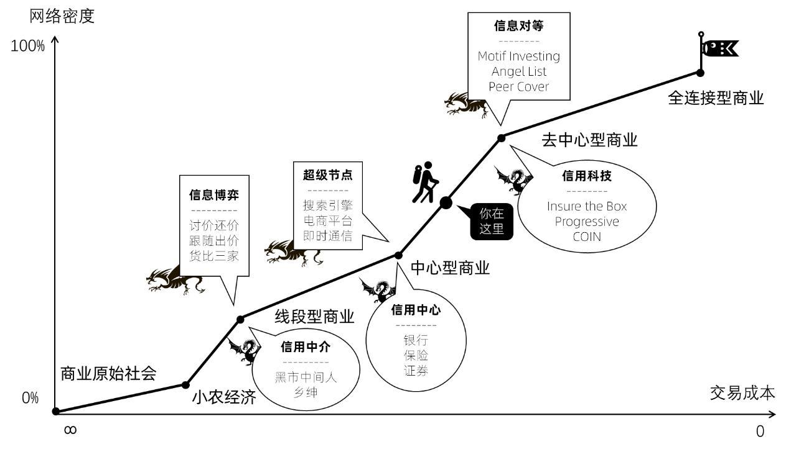
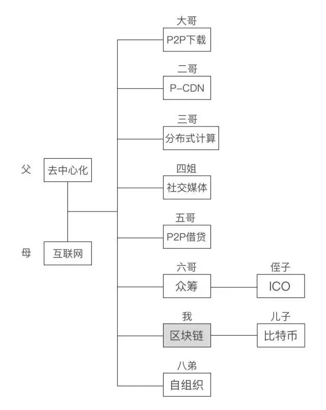
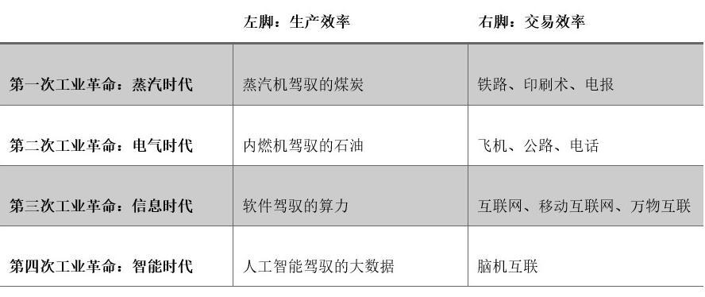

# 商业分析学习笔记

> Notes of [刘润商业通识30讲](https://www.dedao.cn/course/nb9L2q1e3OxKBPNsZZJrgN8P0Rwo6B)

- [商业分析学习笔记](#商业分析学习笔记)
  - [商业是什么](#商业是什么)
  - [商业结构：网络和商业进步方向](#商业结构网络和商业进步方向)
  - [商业分析：商业从哪里来](#商业分析商业从哪里来)
  - [商业去哪里: 未来已来](#商业去哪里-未来已来)
  - [顺势而为：建立护城河](#顺势而为建立护城河)

## 商业是什么

1. Business is Trade
   1. 劳动创造财富，交换积累创造
   2. Value of Business = 信息不对称+信用不传递
2. 交易成本
   1. 购前
      1. 搜索成本
      2. 比较成本（Yelp, 点评，etc）
      3. 测试成本（SGS，效能标识，测评网站——行业标准etc）
   2. 购中
       1. 协商成本
          1. 谈判策略（最终期限/战略延迟，etc）-> 品牌声誉
          2. 事后惩罚：社会监督执法成本，etc （消费者监督）
       2. 付款成本
          1. 担保交易，信用证，支付宝
          2. Credit, risk management, etc, 利益绑定，etc
   3. 购后（成本分析）
      1. 运输成本
         1. 运输：物流/GDP（指标）-> 多种方式运输
         2. 保管：库存周期（turnover rate)
         3. 管理费用：搬运次数
      2. 售后成本
         1. 维修，客服，定制，零件
3. 商业模式——就是利益相关者的交易结构
   1. 网络（社会网络学）
      1. 触点，流量，私域流量
      2. Product, Price, Place, Promotion 4P
   2. 超级节点——现代交易结构
4. 黄金准则：交易成本降低的交易结构
   1. 品牌溢价：售前成本
   2. 证券公司：谈判，过户，信用，风险
   3. 滴滴：搜寻，比较，测试，协商，付款

## 商业结构：网络和商业进步方向

- 商业即网络
  - 生产节点，中间节点，消费节点
  - 连接”的价值，就是把更多的“交易节点”（比如：生产节点，消费节点，或者中间节点），连接到商业世界巨大的交易网络里来，参与交易，甚至因此短路低效连接，重新分配生态位，改变交易结构
  - 越来越顺畅的信息链接 -> 结构性变革
- 空间折叠
  - Sears（19世纪，铁路）-> Walmart (20世纪，公路建设）-> Amazon
  - 麦克莱恩：集装箱（20世纪）->1970确定集装箱标准（ISO）->全球一体化，中国崛起
- 时间坍缩
  - 电报（Morse）
  - 互联网（电商，直播，区块链，去中心化
  - 物联网（智能家居，智能时代，终端（车，家居，公共设施，数字货币））
- 选择vs努力
  - Short circut：绕过中间环节（商业模式—去中介+降成本）: 
    - 360广告杀毒模式
    - Space X回收火箭，绕过传统微信机构接国家和商业需求（商业化）
- 网络密度
  - 网络密度=实际连接数/可能连接数
  - 小农经济-线段商业-中心商业-去中心型商业文明-全连接（p2p)
    - （古代“空间折叠”最主要的工具是车马，所以大理、洛阳、西安（长安）这些内陆城市，成为超级节点，风华绝代。）
    - "圈”“生态”“私域流量”：肖战是谁？张若昀是谁？朱一龙、王一博、李现、杨紫、邓伦、罗云熙、许凯、金瀚，他们分别都是谁？
    - 万物互联，也许是区块链，也许是脑机互联，也许是生物科技、基因科技的重大进步。

## 商业分析：商业从哪里来

- 商业即节点
  - 节点都是谁？生产、消费、分销、运输、etc（key players）
  - Roles：信息和信用
    - 降低成本/信息：采购、分销、代理、etc
    - 信用担保：贸易商、抵押
    - 增值节点
- 线段商业（进化史）
  - 信息博弈：降低成本
    - bargain、拍卖（机制设计）
    - 跟随出价（price discovery）
    - 货比三家（比价平台、工资etc）
  - 信用中介：
    - 中间人、担保；信用中介（credit risk mgmt)；乡绅（担保）
- 中心商业
  - 商业模式改变—disruptors
    - 夫妻店->walmart；百货市场(成本降低+技术ready）-> 网购（淘宝，PDD）/跨境电商
  - 超级节点—消灭信息不对称
    - 人与信息：搜索引擎及入口：2013年央视被百度超过
      - Contextual ads, computational ads,(5到7年的growth）
    - 人与商品：Amazon and LAolibaba（超级平台节点：高密度信息+图片+评论）
      - “顺势而为”的企业家，总是想如何通过消灭信息不对称赚钱；“反清复明”的企业家，总是想如何回到过去的信息不对称时代赚钱。
    - 人与人：LinkedIn, 人脉中介，社交网络
  - 信用中心：信用即财富
    - Trading risk: 超级节点为王的“中心型商业”文明，靠什么战胜“信用不传递”呢？靠另一挺机关枪：信用中心。比如：银行、保险、证券公司。
      - 银行用一套流程，给交易双方做“信用画像”。你家有没有房子可以抵押？你有没有一份收入稳定的工作？把你们家的水电账单给我看看？等等，再查查你的个人征信记录。就和商人把买卖拆开一样，银行把借贷拆开，通过大规模信用画像的方法，生生把自己做成了一个“信用的超级节点”，也就是：信用中心。有了银行这个“信用中心”作为社会信用的基础设施，中心型商业才最终得以爆发式增长。
      - 保险，就是“同质风险分担”，就是把那种发生概率特别小，但发生之后的影响非常大的风险，找一群人分担掉。(3 ways to manage risks)保险公司作为一个超级节点的存在，把“投保”和“理赔”两个行为拆开，成为“信用中心”，为“中心型商业”时代需要大规模陌生人参与的风险管理，提供了基础设施。
      - 证券公司就是权益的交易中心。通过“股票”的方式，拆分“经营权”和“所有权”。这句话是不是很熟？改革开放后，人们没少听这句话，但这是荷兰人在400多年前发明的。股票，是股东的权益凭证。证券交易所和与之伴生的证券公司，因此就成为“第三方的、中心化的信用中介”，成为权益的“信用中心”。

## 商业去哪里: 未来已来

去中心型商业

- p2p保险：阿里相互宝：赔付率91%
  - 保险（平均赔付率22.985% ， 2005年-赔款/总收入，非寿险管理费用40%（2019），寿险类20%）
  - 公众号\卖保险\直播带货（兴趣电商）
  - 抗癌公社, peercover
  - p2p下载 Nepster, 迅雷
- 基础设施（关键节点）阿里，腾讯，移动
- 信息对称：Decentralized Business
  - Financial Disruptors: 基金管理费率（专业壁垒+交易成本）和银行的垄断（天然垄断）
    - VC崛起（80年代）— digging information about risk
    - Motif Investing (closed)
    - Angle List (invested Uber)
- 信用科技
  - InsureBox (个性化数据采集，Usage Based Insurance）
  - Progressive(per mile pricing : 前车距离，急刹车次数，凌晨开车次数）
  - COIN （Risk Control with JP Morgan) 一些小的金融风险公司
  - 区块链：A P2P Based Digital Cash System
    - 分布式记账：货币，选举，不能用于大数据
    - 区块链合约：信用问题
    - 区块链tracking：生产地
    - 信息安全与隐私保护

去中心型商业模式

- 全连接商业：100% 网络密度 + 0 交易成本
  - 定倍率 = 1 （scaling factor?)
  - 信息全透明
  - p2p交易
  - BCO & 3D printing
- 工业革命

## 顺势而为：建立护城河

一句话：不管在哪个商业文明时代，持续获利的方法，都是：用护城河，把时代降临的“红利”，守护为丰厚的“利润”，避免只拿微薄的“工资”

- 什么是红利？红利，就是短暂的供需失衡，是商业进化带来的交易结构改变时，时代凑巧砸在你头上短暂的收益。
- 什么是工资？短暂的供需失衡带来了红利，也必然带来竞争。竞争导致供需重回平衡。这时，你只能赚到“社会平均利润”，也就是“工资”。你以为你在创业，其实你只是在为这个社会打工。
- 什么是利润？利润，来自于没有竞争。只有牢牢守住自己的生态位，让竞争对手望而却步，才能享受真正的利润。
- 顺势而为的正确姿势，必须有至少两步：
  - 顺应商业进化的方向，抓住“红利”；
  - 尽早开始深挖护城河，守住“利润”

四种护城河

- 无形资产：许可和品牌
  - 专利，牌照，reputation，人脉（高管、管理层、私董会、校友圈），代理权，经营权
  - 品牌：信任和偏好（快消，化妆品，奢侈品，理财etc）
  - BOT（Build-Operate-Transfer）
- 交易成本：规模和管理
  - 规模：Cost = Fixed Cost + Variable Cost x Scale
  - 管理：海底捞模式，管理和执行，高效管理（腾讯：概率型vs阿里：积分型）
- 网络效应：用户和生态
  - 网络效应：产品价值随网络规模增大
  - 单边效应-服务升级：
    - 平台、流量入口：阿里，腾讯，字节跳动 （Google, Facebook) vs 移动联通
  - 多边效应-生态和社区：社区运营，交友网站
  - 资本加速：User Acquition Cost, Life Time Value
- 迁移成本：习惯和资产
  - 用户习惯：Apple, Franshise Brands
  - 资产：数据资产-用户账号（微信），数字资产，迁移成本

未来

如果你认为人类历史是一部王侯将相史，权力斗争、朝代更迭，那你就会用军事力量的对峙和国家力量的均衡的视角，预测未来。如果你认为人类历史是一部科技进步史，科学探索、发明创造，那你就会用科技想要什么，我们能做什么的视角，预测未来。如果你认为人类历史是一部基因进化史，物竞天择，适者生存，那你就会用多巴胺、内啡肽、催产素对人的控制机制，预测未来。如果你认为进化的动力是“连接”，商业的本质是“交易”，那你就会用“交易+连接”这副洞察力眼镜，透视商业进化的方向。
们生在气势恢宏的中心型商业文明，和如漫天繁星般的去中心型商业文明的交替时代。在这个交替的时代，旧的交易结构正在断裂，新的交易结构正在形成，到处都是“短暂的供需失衡”。
这样的时代，才是一个需要创业者的时代，一个需要企业家的时代。