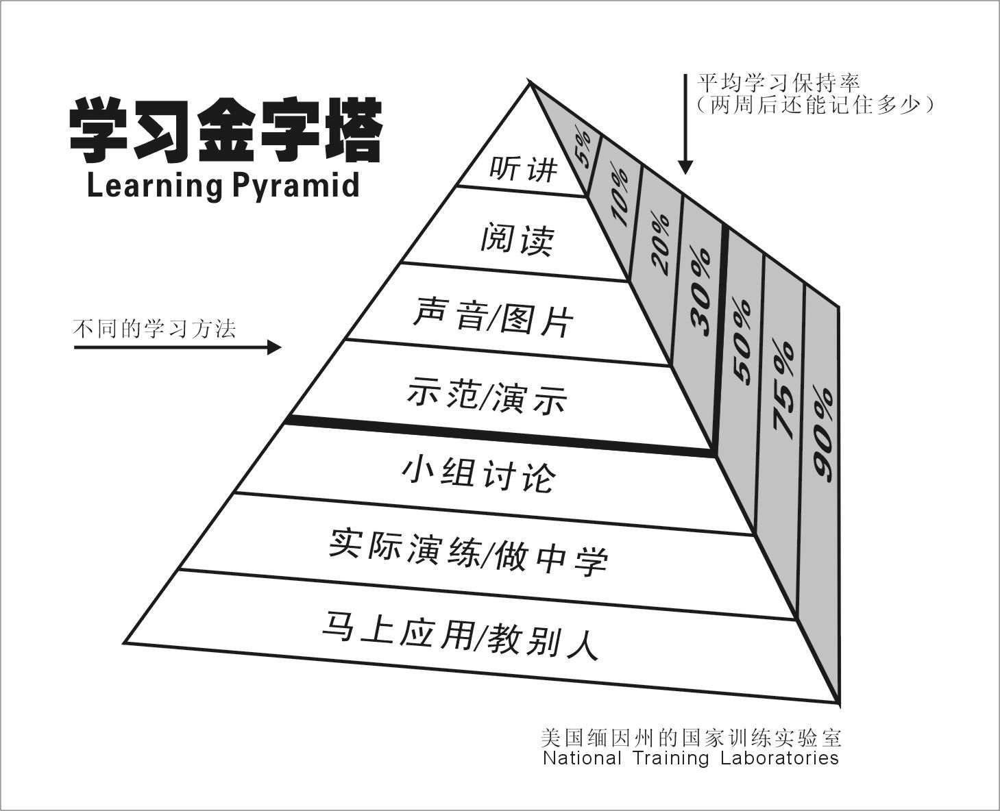

# Learning How to Learn

- [Learning How to Learn](#learning-how-to-learn)
  - [高效学习](#高效学习)
  - [快速学习](#快速学习)
  - [深度学习](#深度学习)
    - [通过阅读构建知识体系](#通过阅读构建知识体系)
    - [系统学习的要点](#系统学习的要点)
    - [刻意练习](#刻意练习)
  - [学习技巧](#学习技巧)
    - [学习环境和仪式感](#学习环境和仪式感)
    - [训练专注力](#训练专注力)
    - [阅读方法](#阅读方法)
      - [泛读技巧](#泛读技巧)
      - [速读法](#速读法)
      - [精读技巧](#精读技巧)
        - [Cyber Learning Method](#cyber-learning-method)
        - [如何读论文](#如何读论文)
    - [记忆方法](#记忆方法)
      - [记忆宫殿](#记忆宫殿)
  - [Reference](#reference)
  - [附录](#附录)
    - [搜索技巧](#搜索技巧)
    - [常用搜索引擎](#常用搜索引擎)
    - [学习平台](#学习平台)
    - [专业期刊](#专业期刊)
    - [拜访陌生大佬的要点](#拜访陌生大佬的要点)
    - [问题清单](#问题清单)

## 高效学习

有效的学习一般包括如下要素

1. 设立学习目标
   1. 有场景：具体可验证的任务来确定学习成果
      1. 讲述（分享）/考试/使用（语言，编程等技能）
   2. 有距离
   3. 有抓手
      1. 开始和结束的时间
      2. 具体的执行动作
      3. 执行结果量化
      4. 执行完成度（和奖励）
   4. 有阶梯
      1. 里程碑和进度打分
      2. 循序渐进，平均用力很难长期坚持
2. 查找学习资源
   1. 搜索
   2. 付费平台，正轨课程/课本
   3. 导师
      1. 入门：了解领域最牛的人和最专业的的书
      2. 进圈：了解领域牛人和前沿在干嘛，有什么活跃community
      3. 拜佛：直接接触大牛，提出好问题
3. 提高效率方法论
   1. 系统性学习方法（一般规则：围绕目标/测试前置）
   2. 阅读方法
      1. 泛读
      2. 速读和精读
   3. 记忆方法
      1. 记忆宫殿
4. 检验和应用
   1. 输出和笔记
   2. [费曼技巧（Feynman's Technique)](https://fs.blog/feynman-technique/)
      1. 
   3. 实际应用

提高效率

- 分类别配置认知资源——常见学习资料的类别（引用自《如何阅读一本书》）
  - 娱乐性的是下坡，越走越舒服；
  - 知识性的是平坡，能开动，但是略微费力；
  - 心智提升类的是爬坡，看起来会很累，但是真的会提升脑力和理解力，理解新观点的速度会加快——也就是我们说的，学习力增强了。
    - 最好的书是三者兼有，不同时间能读出不同功能来的。比如说彼得•德鲁克的《旁观者》、《卓有成效的管理者》，比如《高效能人士的7个习惯》、《穷爸爸富爸爸》，比如文学中的《红楼梦》。
- 分级别阅读：一二手知识比三四手有价值、经典比碎片化有价值、站在知识源头的人和圈子，比知识有价值。
  - 一手信息：知识的源头（论文和专著）：精专领域阅读
  - 二手信息：忠实转述一手信息 （综述，教科书，演讲，科普书）
  - 三手信息：为传播而简化和极端化观点的陈述（畅销书，文章）
  - 四手信息：为各种动机充满个人经验的情绪化表达

## 快速学习

> 如何快速了解一个领域

1. 做好前期研究
   1. 问题一非常重要，很多人却往往会直接略过，这个问题就是：**你是否真的要学这样东西？**
      1. 实际使用，锻炼思维，增长见识，社交
   2. 怎么学？ 人 > 付费课程 > 免费内容。找优秀学习资料方法
      1. 搜索
      2. 专业学习网站/课程平台/大学网站
      3. 导师（人）
   3. 学这项东西的成本究竟有多高？
2. 大量泛读（35%）
3. 模型和笔记整理（20%）
   1. 要把一个复杂技能的学习过程分解成几个相对简单的步骤，不要眉毛胡子一把抓。在分解步骤的过程中，要用理性去思考。
   2. 修正概念，模型间的关联
   3. 形成认知和新的问题
4. 请教老师（10%）
   1. 请教专家/专业人士/调研专业问题
      1. 对于一项新内容、新技巧，我们是门外汉，自己琢磨一小时，抵不上老师指点两分钟
   2. 提出好问题
   3. 花费用(如上课等)
5. 输出（35%）
   1. 理解复述-使用费曼技巧（Feynman's Technique)
      1.** 理解-复述-修改-重复**
   2. 投入实际工作
      1. 实际工作是提高技能最有效的方法
   3. 笔记：笔记=记录+逻辑关系（思考）
   4. 迁移
      1. 和已有知识的关联性，适用范围
      2. 不适用的范围
      3. 和未知知识的关联性，提出新的问题

## 深度学习

> 如何深入了解一个领域

### 通过阅读构建知识体系

（在已经快速了解该领域的基础上）

1. 进入一个陌生领域，首先要从阅读“正统”文献或者作品开始。
   1. 主流认可的文献，教科书，MOOC课程
   2. 该领域经典书籍
   3. 走正统道路的好处在于，便于和专业人士交流。这一点很重要
      1. 区分民间科学家，或者民间高手和专业人士的差别，不在于他们过去所学的专业，甚至不在于是否供职于一个研究机构或者专业机构，而在于他们是否和专业人士经常交流，融入了专业人士的圈子，并且被专业人士认可，比如参加相应的会议和活动，有专业人士背书等等。
2. 权威综述文章
   1. 所谓综述文章，基本上会把一个领域最近十年的成就概括了。
   2. 综述文章一般来自于该领域权威专业期刊
   3. 如果对某一类知识感兴趣，这一类综述文章读5篇左右，就有大致的了解了。
3. 读一些有趣的专著/论文。
   1. 今天的学者发表的学术论著，大部分是专著。既然是专著，讨论的课题范围一般都比较窄，而且观点会非常鲜明，甚至偏激。
   2. 在读这些书之前，我们需要对正统的知识有所了解，不要把标新立异当作主流意见。

分级阅读

- 浏览类的书：快速翻阅，了解结构核心概念，中间快速浏览
  - 阅读的过程中，我在有兴趣的地方做很多记号，以便将来有时间仔细阅读。这么读一遍，我能了解书的轮廓和感兴趣的内容。
  - 对于做了记号，值得关注的内容，我经常直接用剪刀把有用的章节剪下来保存
- 细读的书：浏览后再读一遍的书
  - 会一边读，一边划重点。有时我还会对**重点内容建索引**，以便将来需要，可以找得到。
- 典藏书
  - 参考书：不需要一字不落读完，经常查找使用
  - 优质书：反复阅读的学习（内容，写作手法，思路等）
- 保证阅读量
  - 任何专业人士想做到一流，必须对所在领域有全面的了解。也就是说，既有知识面的宽度，又对某些问题有深度的理解。
  - **每个月都要把所在领域那些顶级杂志全部读一遍**，虽然大部分是浏览，但是至少摘要和结论是要看的，这样才能保证我在想法上的客观中立。
  - 做投资也是如此，只有快速过滤掉那些不值得花功夫研究的项目，才有时间关注最有潜力的项目。
- 通过深度阅读构建知识图谱
  - 深度阅读的一个目的是在把一本书读透之后，用它的内容构建我们整个知识体系和认知的框架。比如读教科书就是这个目的。
    - 好的学习者，合上教科书，闭上眼睛，能把整本书的要点按照一个线索都整理出来。做不到这一点，说明没有吃透。为了做到这一点，遇到不懂的地方，需要花时间搞懂，甚至要看一些参考书。
  - 深度阅读的另一个目的是为了去伪存真。
    - 审查每一个观点是否有依据，信息来源是否可信。
    - 对一些专业的材料，需要做专业的理解，甚至需要专业人士帮助解读，以免自己有错误的理解。

### 系统学习的要点

1. 对于一门课程，找到线索讲知识点和事实串起来，作为学习的抓手
      1. 例如，技术进步的线索是信息和能量
         1. 在信息革命之前，人类的科技成就和发明创造，一多半和能量有关。最初文明开始的前提是人类活动每天获得的能量要能够超过消耗掉的，火的使用，衣服的发明，燧石武器的发明都和它有关。人类早期几个最重要的发明，比如轮子、帆、金属工具、农业技术，都和能量有关。第一次、第二次工业革命，也是围绕着新的能量开始的。历史上很多重大的科学发现，也和能量、信息有关，比如开普勒、牛顿等人描绘天体运动的几条规律，焦耳、开尔文和卡诺的热力学理论，麦克斯韦的电学理论，都和能量有关。
            1. 为了减少因为使用化石能源而产生的污染和温室效应，马斯克要发明电动汽车。当然，电动汽车如果依然使用煤来发电，那么对环境带来的好处就有限，因此他要发展太阳能。为了让发电厂发出的电不浪费掉，他就推广家庭储电设备。虽然马斯克的很多项目远没有他想象的那么成功，比如家庭储能设备，但是大家依然在支持他，因为他的思路清晰合理，大家很容易看懂。
         2. 第二次工业革命之后，大部分重大发明都和信息有关，从电报到今天的移动互联网、基因技术和大家期盼的量子通信、量子计算。古代数学的十进制，后来莱布尼茨的二进制，门捷列夫的元素周期律，香农和图灵的理论，以及近代大约1/3获得科学诺贝尔奖的成就，诸如摩尔根的遗传理论，DNA双螺旋结构，青霉素的结构，3K宇宙背景辐射，CT扫描的算法等，都和信息有关。
      2. 费正清在中国和东亚历史的研究领域享有泰斗的地位，并非因为他某一个具体的历史学发现，而在于他发明了一种全新的研究中国历史的方法，就是从**经济的角度**研究中国历史，同时将每一个历史事件放到一个很大的时空中去考量。这和中国过去历朝历代的史学家都不同，也影响了今天整整一代中国自己的历史学家。
2. 建立一门学科的知识图谱，即用一张关联图，将一门课的内容串联起来，在这张关联图中，有些知识属于先决条件，有些属于自然演绎的结果。
3. 要了解**知识的背景和相关性。**任何一个知识点都需要放到更大的环境中去理解。今天很多创业者和企业家非常如饥似渴地学习很多新概念，他们收看马云、雷军等人的每一次讲话，或者拿着德鲁克、哈耶克的书死磕。但是他们忽略了这些人讲话的场合，时间点和对象。不了解背景和环境，那些知识点就难以应用。这也是我们强调系统性学习的原因。
4. 今天的信息很多，大部分人要做的事情，不是更多地接受信息，而是选择和过滤信息，把所学的知识使用好。此外，学会使用Google查找信息以及讲述知识的视频，也非常重要，要能够在需要使用时手到擒来。千万不要把有限的脑容量用来记忆不常用的信息。
5. 学习的目的不能是为了“解除焦虑”，而是为了**解决你真正遇到的问题。** 很多人莫名其妙地焦虑，然后学了一些热门的新知，一瞬间获得那种“哇，我懂了，我了解了新技术”的廉价快感，但是，这种快感来得快也去得快，焦虑并没有消除，甚至因为知道的东西多了更焦虑了。**学习的目的应该集中在解决问题，并且为了解决问题进行深度思考，直到问题解决。**
6. 系统的学习离不开讨论

### 刻意练习

刻意练习要点1：任务分解

1. 选择学习学习方法：
   1. 一种是自然主义，自然主义是模仿，遇到什么就学什么，学习过程可以是碎片化的，积少成多，注重量的积累。
      1. 语言、乐器、书法这些东西，你可能要用自然主义的学习方法去学习才有效果。
      2. 自然主义注重文本的本身。什么是文本？就是一门知识或者技能它表面上看起来的样子。
   2. 一种是结构主义，结构主义学东西更注重结构，体系化的去学，学会之后的目的是创造。
      1. 经济学，医学，各类科学
      2. 结构主义它侧重对**结构和交互关系的一个认识**，它提倡透过表面的现象去寻求底层的关系。也就是说你要学习的是一套能举一反三的系统，这种诉求为的是什么呢？为的是创造
2. 你选择了正确的学习方法之后，把这个目标拆碎，针对细节进行反复的练习，不要一开始就照顾全局。
3. 挤出时间带着困惑和问题去执行碎片化的学习，最终的效果一定是要把这些碎片给链接起来。
   1. 碎片化学习的真相是碎片化学习一定要基于搜索
   2. 在一段时间内，你的头脑当中应该始终有一个课题，这些碎片它不是满地的落叶，而是我们可以把它比喻成一个打碎的瓷器所产生的碎片。你要有目的的去拾获这些碎片，而不是乱捡。就算碎片化知识是树叶，你也得先有树根、树干和树枝。碎片化学习要的是枝繁叶茂，而不是捡几片树叶回来夹在书里边
   3. 有一种假的碎片化学习叫做收藏。如果你收藏完了不看的话，你不去碰它，它并不是你的。你必须要破除掉这种幻觉。

刻意练习要点2：任务驱动

1. 碎片化必须带有任务考核，可以利用生活或工作环境创造
   1. 做饭,PPT, 完成任务
2. 比较常见的考核标准是分享（教别人，费曼技巧）

## 学习技巧

### 学习环境和仪式感

- 设置反馈和奖励（小步快跑）
  - 方法一：制造文字类反馈，看完重要的东西后写一份摘要。注意不要脱稿写，要照着文本写，要用自己的语言写。
    - 摘要在英文当中叫summary，写summary甚至有一套需要严格执行的流程和标准。我几乎没有在中文环境当中看到有人讲过这个东西。所以，我现在为你大致介绍一下其中两个最重要的写摘要的规则。
    - 找出文本当中的重要事实、陈述和一些观点，这些就是构成你的summary的内容了。除此以外，那些统计数据、人名、引言，不重要的那些细节，一些对比或者比较，还有举的那些例子都不应该出现在你的summary里面
    - 用自己的语言再表达，不要照抄
  - 方法二：制造语音类反馈，给自己录音，不断回放。
  - 方法三：制造肢体类反馈，给自己录像。
- 设置环境场（专门时间地点）
- 记录（日记）每周口述收获
- 分享和社群（学习社群）
- 建立课题库（Problem Set)
- 建立每周操作清单（Checklist)和打卡
  - 对于课题的研究进度
  - 目前的目标（”野鸭清单“）
    - 主战场
    - 目标和对手（如何量化）
    - 战略（方法论）
    - 战术设定和执行（资源）
- 克服拖延症
  - 解决拖延症之前，先认清两点：第一，任何人都有拖延的表现；第二，就算是自认为或者被别人认为有拖延症的人也没有被拖死。
  - 可以给自己设置一个真正严峻的任务，设定小目标，通过做成这件事来突破，然后形成一种惯性。
  - 刚开始建议学一些找到感觉就能掌握的技能，逐渐上升到技巧性强的东西，最后是需要由量变产生质变的事情。

### 训练专注力

1.平常的生活本身不能训练人的专注力，但是可以通过营造仪式感的方法提升注意力。
2.可以通过以下四方面训练专注力：
    1. 购物：如果你学习一样东西需要工具的话，要买贵的，让自己心疼的。
    2. 吃饭：学会一个人好好吃饭，最好能给自己认真做饭。
    3. 工作学习：尽可能使用射灯，给自己营造出身处舞台的感觉。
    4. 睡觉：建议通过运动的方式进入高质量的睡眠。
3. 冥想

### 阅读方法

#### 泛读技巧

- 有目的的阅读
  - 宏观问题：主题思想，作者的态度
    - 阅读目录+浏览：掌握常见的文章结构（对比分析，层层递进etc）
  - 细节问题：特定内容具体信息
    - 围绕内容要素：6W1H问题（Where Who When What Why How Which)
- 笔记整理法
  - 序（Abstract)和目录
  - 标注模型，概念
  - 两次笔记/回顾：概念间的关系

#### 速读法

- 调整书的位置
  - 我们阅读的有效视角只有1度，因此快速阅读时，书不要捧得太近。把书捧得离你习惯的距离远些，养成这个习惯，可以提高30%的阅读速度。
- 指读法
  - 过一段时间的训练，它的速度可以越来越快。你的手指跑多快，你的阅读速度就能有多快。因为它其实在管理你的注意力，给你的注意力一个明确的导向，一次只处理一个信息。有这种高度聚焦的注意力，你的速度会更快，你的理解也可以更到位。
- 多环境输入
  - 语音辅助阅读
  - 音频加速可以逐渐适应
  - 一边听音频，一边看文字，相当于一个信息同时输入了两次，而且是不同渠道的刺激，有效性就高得多。

#### 精读技巧

##### Cyber Learning Method

> From Book *What Smart Students Know: Maximum Grades. Optimum Learning. Minimum Time. Adam Robinson, 1993*

1. 我读这篇文章的目的是什么?
2. 关于这个话题我已经知道什么
     1. 我所知道的/我希望学习的
     2. 与其他课程相关
3.这里的大局是什么
     一、主要观点/主题
         1. 摘要/结论
         2.作者/作者背景
         3.目录
         4.章节小结
     2.重要术语/概念
         2. 片头、字幕
         3. 首尾句
         三、亮点
         4. 图片和表格
     1. 总体结构
     2. 搜索其他来源/参考资料
4.作者接下来要说什么？
     1.挑战-解决方案
     1. 定义-例子
     2. 通用-特殊
     4.陈述-原因
     5.整体-部分
     6.问答
     7.因果关系
1. 什么是“专家问题”？
     1. 数学
     2. 机器学习
     3.统计
2. 这些信息对我提出了什么问题？
     1. 5W1H (who what where when why how)
     2. 那又怎样
     3. 谁说的
     4. 如果……怎么办？
     5. 这让我想起了什么
3. 我如何解释和总结这些信息？
     1. 20-80原则
     2.关注“专家问题”
     2. 聚焦“亮点”和“线索”
4. 我如何组织这些信息
     1.利用记忆，重组
     1. 将表格/图表改为文字
5. 我如何描绘这些信息
     1. 相似内容
     2、内容不同
     三、相关内容
     4.逻辑关系
6.  我记住这些信息的 Hook 是什么？
     1. 图片
     2. 图案
     3.节奏
     4.故事
7.  这些信息如何与我已经知道的相符？
     1. 一页摘要
     2. 教导他人

##### 如何读论文

1. Title/Abstract/Introduction
   1. learn key contributions / problems solved / concepts
2. Read key parts
   1. Conclusion/Discussion (the End)
   2. Method
   3. Experiments
   4. Pictures, Tables
   5. Highlighted words
   6. Summarize key concepts , relationships
3. Deep dive
   1. Formulation
   2. Pros Cons
   3. Limitations
   4. Relationships & Expansions

读三遍

1. 第一遍：标题、摘要、结论。可以看一看方法和实验部分重要的图和表。这样可以花费十几分钟时间了解到论文是否适合你的研究方向。
2. 第二遍：确定论文值得读之后，可以快速的把整个论文过一遍，不需要知道所有的细节，需要了解重要的图和表，知道每一个部分在干什么，圈出相关文献。觉得文章太难，可以读引用的文献。
3. 第三遍：提出什么问题，用什么方法来解决这个问题。实验是怎么做的。合上文章，回忆每一个部分在讲什么。

### 记忆方法

#### 记忆宫殿

> [如何使用记忆宫殿](https://www.zhihu.com/question/40218031)

该部分内容有待了解和专门学习

## Reference

- [跃迁：成为高手的技术，古典，2017](https://book.douban.com/subject/27078435/)
- [怎样成为高效学习的人，脱不花，2021](https://www.dedao.cn/course/article?id=0kzlWERBr6meVb13BwK2j7LD4Od3Zp)
- [如何成为有效学习的高手，许岑，2017](https://www.dedao.cn/course/detail?id=NPLjb1BvMZlX8BPFbvVzgenm2r78Ak)
- [五分钟商学院-个人篇，学习能力，刘润，2020](https://www.dedao.cn/course/article?id=5Yejy8dqoQD9Jo9y7KR1r0xpgmWk3v)
  - [如何用20个小时-快速学习，刘润，2020](https://www.dedao.cn/course/article?id=5Mr9mzb36pP4JLlYRJkWqB2EYNegLD&source=search)
- [超级个体专栏，学习篇，古典，2017](https://www.dedao.cn/course/article?id=rykaNlMY5gn3JqvmMX7EAROW0DLjev&source=search)
- 吴军阅读与写作50讲， 2020
  - [品味：如何全面有效的构建自己的知识体系](https://www.dedao.cn/course/article?id=xzYo2GPNq4W8VEbW2ZJejyRBZbnw0d)
  - [层次：如何兼顾广度与深度](https://www.dedao.cn/course/article?id=zl12vGeNAM0YVpPkB1VdmxjOQBP5oL&source=search)
- 硅谷来信2，吴军，20
  - [系统学习的方法](https://www.dedao.cn/course/article?id=bqzNakylrn9WVazjNJ7DOop10vZwLG&source=search)
  - [如何看待系统学习的重要性](https://www.dedao.cn/course/article?id=a8QZdRM1OmLxVv0RYXG69rgYPjqWpy&source=search)
- 硅谷来信3，吴军
  - [如何快速入门，上手一门新技能](https://www.dedao.cn/course/article?id=7NqeGmE2w4bnK4E88ZVP31lv5WZ9rj&source=search)
- [李自然：如何拜访行业大佬](https://www.bilibili.com/video/BV1ib411H7Ld/?spm_id_from=333.337.search-card.all.click)
- [What Smart Students Know: Maximum Grades. Optimum Learning. Minimum Time. Adam Robinson, 1993](https://www.amazon.com/What-Smart-Students-Know-Learning/dp/0517880857)
- [李沐，如何读论文](https://www.bilibili.com/video/BV1H44y1t75x/?spm_id_from=333.337.search-card.all.click)

## 附录

### 搜索技巧

1. 用关键词。
   1. “”  完全匹配
   2. | 来分隔关键词
   3. A -B  搜索包含A但不包含B的结果（请注意A后面的空格不能省略）
   4. filetype  搜索对应类型的文件。
   5. site  在某个网站内搜索
   6. link 搜索网页中含有某链接的结果，比如搜索：link:http://baidu.com，则结果为包含百度这个链接的页面。
   7. intitle 搜索标题内包含关键词的结果。
   8. inurl 搜索网站地址中包含关键词的结果
   9. related 搜索相关网站
   10. index of 可以突破网站入口下载。
   11. 还有一些，比如allintitle,allinurl，都很少用，主要是前面四个，再加一个通配符*。
2. 使用不同的关键词组合
3. 在用百度、谷歌等搜索引擎的时候，搜索框下面有个下拉菜单，可以选择时间期限内发布的网页。
4. 不同类型的知识，在不同搜索引擎上，能够搜到的信息丰富程度也不一样。你可以根据你要搜索的内容，选择不同的搜索引擎

### 常用搜索引擎

- 商业数据库：主要是国家、行业、行业数据，但是有些需要付费
  - 万得 http://www.wind.com.cn
  - 彭博 http://bloomberg.com
  - 路透 http://cn.reuters.com
  - 锐思 http://www.resset.cn
- 学术数据库：国内外的一二手的期刊、论文等
  - 知网 http://www.cnki.net
  - 万方 http://www.wanfangdata.com.cn
  - 中国国家图书馆 http://www.nlc.cn/
  - 维普 http://www.cqvip.com
  - EBSCO https://www.ebsco.com
  - 数据圈 http://www.shujuquan.com/
  - 台湾学术数据库 http://fedetd.mis.nsysu.edu.tw/
  - 台湾大学电子书 http://ebooks.lib.ntu.edu.tw/Home/ListBooks
  - 外国文献搜索SCI-hub https://sci-hub.se/
  - 科技方面的文献 https://www.sciencedirect.com/
- 网上的共享资源搜索（大量的行业文档、PPT、报告等）
  - 百度文库 http://wenku.baidu.com/
  - 豆丁文库 http://www.docin.com/
  - 爱问共享 http://ishare.iask.sina.com.cn/
  - 道客巴巴 http://www.doc88.com/
  - 360个人图书馆 http://www.360doc.com/index.html
- 另外，还有一些专业小众的内容，比如：
  - 关于大数据方面的信息搜集，用大数据导航：http://hao.199it.com/
  - 当你想搜索花朵或者绿植的品种：花伴侣APP，或者是微信小程序“形色识花”
  - 当你想搜索某个歌曲的乐谱（钢琴、吉他、提琴等），可以使用搜谱APP
  - 当你的孩子题目做不出，可以使用小猿搜题APP

### 学习平台

- 综合
  - khanacademy.org/
  - https://www.coursera.org/
  - https://www.edx.org/
  - https://www.masterclass.com
  - https://www.icourse163.org/
  - https://www.kadenze.com/
- 计算机，机器学习
  - Github Projects
  - Stanford Open Course
  - [MIT Open Courseware](https://ocw.mit.edu/courses/find-by-topic)
  - https://www.csdn.net/
  经济金融
- Others
  - Language
    - [Duolingo](http://www.duolingo.cn/) 
  - Music & Art
    - https://www.kadenze.com/
    - [Dave Conservatorie](https://www.daveconservatoire.org/)

### 专业期刊

- 科学类读著名的《科学（Science）》杂志。它是美国科学促进会的核心会刊，非理工专业的人未必读得懂，不过它会定期推送一些综述，涵盖科学的各个前沿领域。
- 医学进展，看美国医学会的《展望（Perspectives）》在线杂志，这本杂志可以在网上免费订阅（网站：https://nam.edu/，提供自己的姓名和邮箱即可），它也会定期刊登通俗的综述报告，比如我最近看了一篇《人工智能在保健中的应用》，这是一份近300页的报告，读完以后，就有把握和别人谈这个话题了。
- 工程类看美国电子电气工程师协会（IEEE）的《频谱（Spectrum）》杂志。
- 金融领域比理工和医学更受大众关心，也有不少非常通俗的好杂志，我更信赖《巴伦》和《经济学人》。至于名头很响的《福布斯》和布隆伯格的《商业周刊》，其实水平很一般，我觉得不能拿它们的内容作投资指导。

### 拜访陌生大佬的要点

1. 不要问对方有没有时间
2. 邀请出来不要闲聊
3. 如何邀请成功概率
   1. 合适的自我介绍：和对方相关性，准备好
   2. 约见的目的：合作/资源/请教/具体事情
   3. 提前预约：给定一系列可以的时间
4. 说话坦诚
5. 见不到面、就约电话、实在不行就发材料
6. 可以先约个咖位低一点的先练习一下，**最好能获得推荐** （熟人推荐）
  
### 问题清单

1.请问在像您这样的专家心目中，您这个领域公认的大神是谁？
2.我特别遗憾，我一直没有机会系统地去学，您这个领域的知识。我四十多岁了，想从现在开始学起，那在入门阶段，您推荐我读哪本书？
3.老师，我想在大学毕业之后从事投资工作。您是做投资的，您觉得从事这一行业基本能力的要求是什么？我应该从哪开始作准备？
.老师，从事这个行业，您觉得最关键的环节有哪些？您都遇到过哪几个重要挑战？您是怎么过来的？
5.在您这个领域，您觉得一般人和高手之间最大的区别是什么？
6.如果您要带一个徒弟，您会重点教他关注哪几个魔鬼细节？为什么是这几个细节特别重要？ 
7.老师，最近好长时间没见了，最近半年您觉得有什么问题、什么新闻或者哪本书，是对您触动特别大的吗
8.最近你们行业发生了一件XXX大事，您能帮我分析分析，这背后到底是怎么回事吗？ 
9.老师，我现在此时此刻已经在做一件什么事。这个事，我有个难点一直没想明白，能不能请您给我指点一下？
0.假如，此刻是你生命的最后十分钟。你有个机会，可以给这个世界留下一段话，说说你自己这个专业。请问你会说什么？