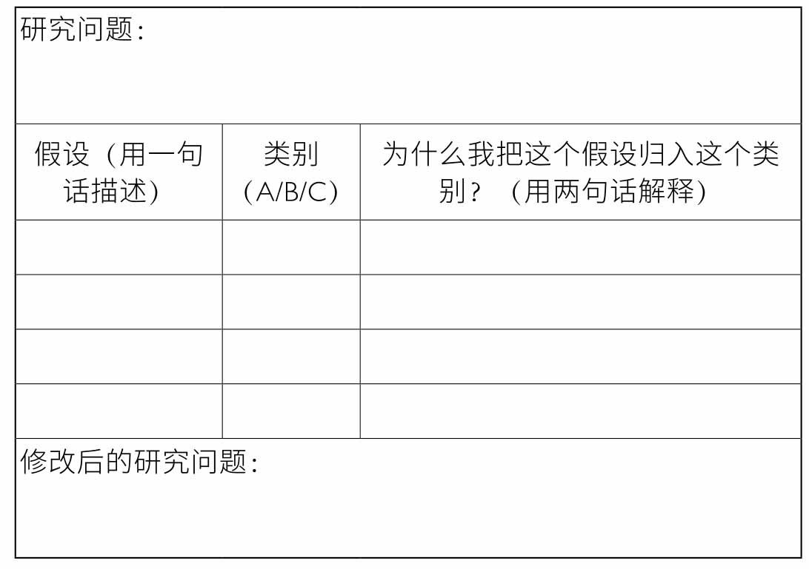

# 研究的方法

> Notes of 研究的方法 by 莫磊宁，雷勤风

- [研究的方法](#研究的方法)
  - [导读](#导读)
  - [关于问题](#关于问题)
    - [问题 vs 话题](#问题-vs-话题)
    - [搜索自己](#搜索自己)
    - [试试看从小处着眼](#试试看从小处着眼)
    - [智囊团：开始构建你的研究网络](#智囊团开始构建你的研究网络)
  - [从问题到难题](#从问题到难题)
    - [对问题进行压力测试](#对问题进行压力测试)
    - [使用原始资料来“调教”你的问题](#使用原始资料来调教你的问题)
    - [让你的假设浮出水面](#让你的假设浮出水面)
    - [识别串联你问题的难题](#识别串联你问题的难题)
  - [Useful Resources](#useful-resources)

## 导读

持续不断地记录下你的观点——创建你的“自我反思记录”；

- 促使你不断对外呈现想法，帮助你记住并寻找合作者；
- 让你通过各种类型的写作实践一步步构建起自己的研究项目，并专注于研究早期阶段的不同方面；
- 让写作成为一种常态化的研究习惯。
  - 好，现在请在下页的空白处写出你目前的想法。你想通过该项目达到什么目的？你感兴趣的话题或问题是什么？对你来说，怎样才算“成功”？你理想的研究成果是什么？记住：没有任何压力。你是在为你自己写作，而不是别人。

## 关于问题

### 问题 vs 话题

- 话题：
  - 在任何研究的初始阶段，它都能起到很大作用。话题提示了研究领域或研究范围。它给予你力量，让你有归属感和使命感。你可以说，我的研究话题是哈林文艺复兴、苏联经济史、进化生物学、实验性诗歌、城市规划，或者环境历史。拥有话题使人内心踏实，充满自信，方向明确。
  - 然而，话题可能具有欺骗性。它们是宏大且抽象的。它们组织起了大学、企业和研究机构——比如某某系、某某研究所。它们塑造了我们对世界的看法。但是对研究者来说，话题的用途却很有限（话题不等同于问题）
- 话题不等于问题，问题一般更加具体：
  - 5W1H： who/which when where what why how

选择话题：如果你想把自己的时间和精力花在值得投入的地方，那么你必须在搞懂做什么和如何做之前，先**弄明白为什么要做**

- 它究竟对谁重要？为什么重要
- 人类知识界存在无数“空白”，为什么非得填补这个特定的空白呢？
- 在研究的最初阶段，我们并不需要外部评判者。相反，此时每个研究者需要回答的都是**关于个人的问题**：
  - 在无数潜在的兴趣话题中，我为什么被这个话题吸引？
  - 猜测一下，我与这个话题的联系在哪里？
  - 为什么它对我如此有吸引力？
  - 你的问题赋予了你责任。你必须提出有自我探究意义的问题，并且不能给出模棱两可或简单重复的答案。
    - 每个人提出的关于世界的问题，其实都是**研究者本人的一种“自我反思记录”**。
    - 研究者为了回答这些问题，会反思自己的思想、情感和个人动机。因为他的目标不仅仅是把自己对某个话题的兴趣表达出来，还必须做出阐释。

实现从话题到问题的转换

1. 让自己显得脆弱
   1. 学生看起来不够老练（他们起初总会担心这一点）其实是件好事
   2. 在早期阶段提出的问题并不是最终成品。生活中有很多事情都在阻碍我们敞开心扉。
      1. 我们想要显得成熟和专业，提问时便十分犹豫，担心提出幼稚的问题。但在这个阶段，我们的问题不需要修饰，甚至不必连贯。只要它们是诚实的，尽可能符合我们知识水平，就可以了。相信你自己。
2. 对话时态度坚定且不随意评判
   1. 无论是研究者还是他们的智囊团，对于他们有关理性的假设都没有给予否定。
      1. 在头脑风暴的阶段，我们很容易因为消极的思维习惯或诸如“你的假设是错误的：非西方的风俗也是理性的”这样的评价而过早地停止探索；或者是使用一些高级语言进行自我打压，比如说：“我对理性的理解显然是被社会建构出来的。”请阻止这类倾向。
      2. 让问题自由发展，无论它们现在看起来有多么不重要、幼稚、零散、不连贯，甚至存在偏见。你做独立研究也好，合作研究也好，这个阶段就只管提出问题。我们稍后再讨论该如何使用这些问题。
3. 把你的想法都记录下来。
   1. 想法也许来得很快，但若不及时记录下来，它也会被遗忘得很快。我们反复强调，在研究的早期阶段，单单思考是不够的，你得把想法写下来，把自己思考的痕迹留下来，以后也许能派上用场。
4. 从内部产生问题
   1. 在上面这场谈话中，基本都是学生在提问，智囊团不需要说什么。你也应该专注于提出由你的知识、假设和兴趣推动的问题。不要试图“由外向内”思考。也就是说，提问时不必迎合某些假想的外部评判者。

问题的作用

1. 问题会带我们朝着不同的方向前进
   1. 走向一个具体的答案
   2. 走向可以回答问题的原始资料
   3. 走向其他研究此类问题的学者（他们的研究成果可视为二手资料）。
   4. 更有可能的是，走向更多、更好的问题。
   5. 问题会迫**使我们进行自我评估**。
2. 问题还有一个用处。每个人提出的关于世界的问题，其实都是研究者本人的一种“自我反思记录”。研究者为了回答这些问题，会反思自己的思想、情感和个人动机。因为他的目标不仅仅是把自己对某个话题的兴趣表达出来，还必须做出阐释。
   1. 你的问题赋予了你责任。你必须提出有自我探究意义的问题，并且不能给出模棱两可或简单重复的答案。比如，“这个话题很有趣，所以我对它感兴趣！”

### 搜索自己

目标：搜索原始资料，利用结果列表确认你对话题的哪些方面最感兴趣，再基于这些方面提出你的问题。

1. 写出任意或所有吸引你的研究话题。尽量宽泛一些，不能只写一个。
2. 从列出的话题中选出一个，然后在至少三个（或更多的）网络数据库中对该话题进行搜索（你可以在whereresearchbegins.com这个网站上找到更多数据库）。
3. 点击几个让你感兴趣的搜索结果，比如五到十个。
   1. 这个阶段不需要在任何资料上停留太久。现在还不到做精读的时候。
4. 你不需要深入阅读这些搜索结果。你的目标是：
   1. 花费大概20%的脑力来快速浏览这个搜索结果列表（有些条目也许需要看一下内容）。
   2. 将剩余的80%脑力用来做自我观察。在阅读这些结果的同时也“阅读”你自己。
      1. 哪些资料让你的心跳加快了呢，即使只是快了一点儿？把它们记下来。哪些对你没有产生任何影响？也把它们记下来（因为过一会儿我们还要清点那些让你感到无聊的内容）。任何东西——你都可以确定，这里肯定存在一个问题，即便你还不知道它是什么。学着去留意这些线索，再根据它们的提示寻找你的问题，你很快就会从宽泛的话题阶段进入更精准也更高效的问题阶段。
   3. 密切观察你的大脑和身体对这些结果做出的不同反应：哪些结果会立刻引起你的注意？哪些结果让你的目光多停留了几秒？哪些让你有心跳加快的感觉，即使只是快了一点儿？
5. 写下至少十个吸引你的结果，不必费心去思考它们吸引你的原因。
   1. 把让你有所触动（无论多么细微）的搜索条目，都圈出来或打上星号。
6. 根据这十个结果来回答后面的三个问题，以生成你的自我反思记录。
   1. 请花费大概半小时的时间，就其中的每一个条目（感兴趣的或感到“无聊”的题目）都向自己提出以下三个问题，然后把你的答案写下来：
      1. 它让我想到了什么？
      2. 大胆猜测一下，我为什么会注意到它？
      3. 当我看着它时，我的脑海中出现了什么问题？
7. 把记录放在那里不管（至少搁置二十四小时）。
8. 回来看你写出的那些答案，并向自己发问：如果我不知道是谁写下的这些答案，是谁给这些搜索结果标注了“有趣”，我会对这个研究者做出什么样的推测？关于研究者的关注点和兴趣点，这份自我反思记录提供了哪些信息？
   1. 现在用全新的眼光来看这份列表。把它想象成陌生人写的东西。如果只有这样一张表，
       1. 你可以从中看出研究者的关注点在哪里吗？
       2. 如果你不了解他们的话题，你能猜出他们最关心什么吗？
       3. 鉴于你知道话题是什么，这份“关注列表”所提示的话题，你了解的相同吗，还是稍有不同，抑或是完全不同？
       4. 它们的关注点是否包含在话题之中？
       5. 如果是，那涉及话题的哪个方面呢？
       6. 还是说话题只是另一个问题的案例或者载体？把你的所有想法都写在纸上。
9. 写下你对这些问题的看法，尽量多写一些。

### 试试看从小处着眼

目标：在深入研究之前，先根据你的话题提出一些具体的、基于事实的问题。这些问题会引导你走向更大的问题。
现在，你可以从话题阶段迈向问题阶段了。你已经就以下两个问题做好了记录：

1.关于你的话题，你注意到了哪些资料，你为什么会关注它们？
2.在与你的话题看似“明显相关”的各方面内容中，哪些让你感觉无聊，原因是什么？

把这些都当作激发灵感的材料，并延续之前的做法，试着把想法都写下来。

随着你的想法不断涌出，请写下至少二十个与你的话题相关的问题。重点是，这些问题必须描述得尽可能详尽

- 关于这个话题，你希望了解哪些方面的事实？
- 若要满足好奇心，你可能需要关于该话题的哪些数据或信息？
- 关于这个话题，有可能存在什么样的具体说明，你能想象出来吗？

首先，只有通过这些小问题，你才能在自己脑中或笔记本上勾勒出关于该话题核心基础的图景。你还不了解全部事实，更无法对事实做出分析，所以在这个阶段，尝试回答关于“意义”和“重要性”的深刻问题有些为时过早。相反，你对这场军事审判的实际场地了解得越多，对评审员、律师、目击者、观众、媒体、家属，以及其他到场人员的身份信息越熟悉，你就会对自己的研究话题有更好的掌控力。等时机成熟后，你才能问出那些更大也更深刻的问题。

其次，在那些小问题背后，可能潜伏着一个让你意想不到的问题，当你大声念出它时，你的研究会立刻被转到一个全新的方向。比如，当你提出“谁支付了所有目击证人的住宿、餐饮及交通费用”这样一个简单的问题时，你也许会尝试从一个新的角度来研究国际法庭的历史——不是从庭审内容本身，而是从城市历史的角度切入，提出类似这样的问题：“纽伦堡、东京和南京这些城市是如何处理战争罪行审判的？这些因战争而满目疮痍的城市，是如何处理交通、住宿、安全等重要事项的？”

### 智囊团：开始构建你的研究网络

截至目前，你已经独自完成了很多工作。你思考了话题和问题，并完成了三个帮助你从感兴趣的话题中找到问题的练习。
现在正是用你提出的问题与你认识的人探讨项目的好时机。开始建立你的研究网络——一个可以让你在研究过程中咨询和寻求建议的人群。

- 列出一份你认为有意愿且有时间与你定期讨论想法的老师、同事、学生和同行的名单。有些学者大部分时间都是做独立研究，但一个可靠的智囊团可以成为研究的催化剂。
- 在你的潜在智囊团名单上圈出几个名字，再选出几个你在阅读本章时提出的问题，安排一次与他们的会面来讨论这些问题。保持思想的开放性。你要做的不是让智囊团直接说出哪个问题“最好”。告诉他们你还没有最终确定自己的研究问题，目前还处于探索阶段。你的目的是引起他们的关注，并开始试着口头表达出自己的研究想法——因为你已经写了一些东西。
- 你可以提前将问题发给他们，但要尽量让你们的谈话轻松随意。不要问他们“我的问题好吗”，而要问他们“这些问题让你想到了什么”“这些问题让你联想到哪些其他问题”。花点时间与他们一起提出关于你的话题的更多问题

## 从问题到难题

回答问题并不是你的重点，调教你的问题才是。

到目前为止，你提出的这些问题大多数都还不够成熟。这与你作为研究者的能力没有关系。相反，这正是现阶段研究的一个部分：问题尚未成熟是因为你还没开始对你的研究对象展开研究。这是意料之中的事情。

你需要做许多研究才能找到正确的问题。而为了回答这些问题，你需要做更多的研究，随后生成更多的问题。和很多人想象的不同，**研究早期阶段的目标并不是找到答案，而是完善你现有的问题，并生成新的（并且更好的）问题。**

如何区分一个难题和一系列随机产生的好奇呢？如果它每天、每周或每个月都在变化，那么它很可能是转瞬即逝的好奇；如果它持续很长时间，那么它很可能是一个难题。你的难题是存在于你内心的一个困惑，它打扰你，让你迷惘和不安，但同时也吸引着你、迫使你不断回想起它。它在你脑海中引发问题，无论这些问题看起来多么千差万别，与外界多么不相关，你也知道它们以某种方式相互联系着，哪怕你说不清原因。你的难题会一直跟随着你。要**确保你的问题确实是由你的难题驱动的。**

对于研究者而言，难题有以下几个功能：

- 它激发你对自己的话题提出问题；
- 它决定你提出哪些问题；
- 它界定你参与什么话题，以及为什么/何时/如何参与；
- 它指引你找到探索的路径；
- 它决定你以何种方式传播你的研究发现。

本章提供的几个步骤可以帮你：

- 改进已经生成的问题；
- 利用资料找到那个促使你生成问题的难题；
- 利用你的难题生成更新、更好的问题

### 对问题进行压力测试

你已经生成了大量问题——理想的话，都是关于事实的小问题——现在你还需要对它们做一次压力测试，进一步完善它们。你会删去那些钻入了死胡同的问题，改进余下的问题，同时添加一些能够促进研究的问题。

重写一遍你的研究问题，并特别关注以下几点：

1. 标点符号
   1. 你的问题是否在结尾处标有问号？你的描述中是否使用了比较宽泛而模糊的术语，比如“这是对……的一次考察”“我计划探索……”，或者“我的项目研究的是关于……的问题”？如果你发现自己将问题表述为“我打算考察……是如何发生的”，那么它很可能不是个真正的问题，而是伪装成问题的话题。问题必须比这更具体，并标上问号。
2. 形容词和副词
   1. 你的问题是否使用了过于宽泛、通用、不精确或概括性的形容词，诸如“现代的”“传统的”“西方的”？是否使用了类似“科学地”“理性地”“有效地”这样的副词？试试把这样的形容词和副词全都删掉吧。
3. 集体性名词
   1. 你的问题是否使用了集体性名词，比如“亚洲人”“法国人”“学生”“女性”或“北美人”？如果用了，请尽量把它们替换成更精确的人口分类词汇：哪个年龄段的女性，生活于何时何地的学生，来自什么背景、社会经济地位如何、什么种族、家庭状况如何的北美人？你不需要把所有可能存在的人口统计变量都考虑进去，但要尽可能覆盖一切会对你的项目造成影响的变量。
4. 动词
   1. 你的问题是否包含了例如“影响”“改变”“塑造”或是“产生影响”这样的动词，又是否包含类似“受到影响”“回应（responded to）”“应对（reacted to）”这样的被动结构？如果存在这种情况，你的提问方式极有可能让你对一系列潜在的答案和结果视而不见。请重新组织语言，避免那些会导致确认偏差的假设。

在这个流程结束时，你的问题应该符合以下几点标准：

- 它们应该清晰、精确，并且不使用行业术语。
  - 如果你的问题让你的同事或导师感到难以理解，说明是你（而不是他们）还没有搞懂你的难题到底是什么。也许是你简略的表达隐藏了重要的细节。同样，如果你表述这个难题时用的是行业术语——那些用来彰显“聪明”和“重要性”的词——请用清晰而脆弱的语言把它们替换掉。要让你和你的目标读者都能明白你的研究目的是什么，即便这意味着措辞可能不像你想的那样清晰、精炼和简洁。
- 它们应该建立在可验证和可证伪的数据基础上。
  - 你的研究问题应该诚实可靠。这意味着激发它们的应该是事实，而不是猜测、偏见或观点。哪些事实激发了这些问题？这些事实可否被验证？在哪里可以被验证，如何验证？你自己是否验证过它们？
- 它们应该不偏向任何结果。
  - 最好的研究问题是开放的、不可知的、无偏见的。换句话说，一个研究问题不应预设某个特定的答案。如果你的问题做了预设，那么请你重写一遍，消除预设。
- 它们应该有明确的研究对象。
  - 你的问题不应该依赖于宽泛的身份类别，比如“学生”“女性”“欧洲人”“巴西人”“基督徒”等。根据以上建议，尽可能具体地描述你问题中那个“谁”是谁。
- 它们应该是原始的和不被限制的。
  - 至少目前应该是这样。虽然我们鼓励你将列表中的每个问题都问得尽可能精确、详细和切合实际，但是请记住，总体来说，你的问题列表在这个阶段不需要过于精练或连贯。如果你觉得这些问题问得比较随意，就让它们保持随意。如果它们看起来互不相关，就让它们保持不相关

### 使用原始资料来“调教”你的问题

你在上一个练习中所做的语言诊断只是第一步，它会帮你在提出问题时避免一些常见的错误。而这一个练习将要求你回到自己的特定主题，回到自己的原始资料。

- 在这个搜索原始资料的最初阶段，你的主要目标其实不是开始回答问题，而是通过你找到的资料去发现更多你原先不知道的新的关键词。你
- 可以将这些词用到自己的研究中，以便解锁更多、更好的资料，找到更多、更好的关键词。最重要的是，你能提出更多、更好的问题。
- 现在你的目标是找出搜索词中有哪些疏漏，以便把那些假性的结果排除掉。从宏观角度来看，通过消除盲点，你将更好地把握自己的话题。
- 每次做关键词搜索时，都不妨问问自己：我是否应该使用其他搜索词？现有的搜索词是否存在不同的拼写方式？
  - 你必须尽最大可能确保，**你的搜索结果代表了大部分可获取的原始资料，而不是小范围搜索或粗略搜索的副产品**。如果你的搜索结果集中在一个很窄的时间范围内（类似上面的例子），或者只来源于少数几个地方，由少数几个人撰写，这很可能是因为你的搜索方式不对

关键词搜索的艺术和科学：一些小技巧

- 你找到的大多数原始资料都包含“当前流行的关键词”，比如“人工智能”“非裔美国人”“香港（Hong Kong）”等，却不包含你需要找到的其他关键词
- 充分利用类别搜索
  - 在某些数据库里，你会幸运地发现资料配有元数据，在这种情况下，你可能会找到一条包含了术语“人工智能”的资料，然后发现它在数据库中也被“标记”了相同的关键词。通过点击标签，你可以访问该数据库中其他所有被做了同样标记的原始资料，包括那些根本不包含“人工智能”这个术语的资料！想从仅包含你搜索的关键词的资料，跳转到另一条不包含你的关键词的资料，这是方法之一。
  - 数据也是语境的产物，不能把它当作确定性的东西。任何分类，包括那些由图书管理员和档案管理员创建的分类，都是一种文化结构，因此不能被当作某个主题的最终定论。
- 在搜索完成并获取了一些结果后，按时间顺序整理好这些结果，然后只研究那些发表于某些年代之前之前的资料——也就是在你的初次搜索中看似消失了的那部分内容。在快速浏览这些资料的标题时，请留意它们使用了哪些术语。如果可以在线阅读这些资料，请看一下它们的目录、前言、简介和检索部分。它们使用了哪些词汇和术语？如果把这些词和短语用于数据库搜索，是否能帮你搜出用之前的关键词找不到的一些资料？它们就是你的新关键词。把它们写下来
- 寻找自述式资料
  - 在某些情况下，你可能会幸运地找到这样一类原始资料（比如一本历史词典），它明确地说明了资料所涉及的话题在名称上的变化，为你概述出一个特定的观点、地区、社区、实践或其他事物在不同时代和地理环境中的不同命名方式。这样的时刻让人感到惊喜，因为它们打开了无数道门，研究者只需要走进去就可以了！
    - 即使有这样的原始资料，你也要记住，任何原始资料都有其自身的局限性。没有任何一份资料可以把有助于搜索的所有术语变形都记录下来。没有任何一份资料（正如我们下面所解释的那样）可以被当作该主题的最终定论。始终需要由你来确定该资料是否具备实证准确性。每份资料都有它自己的立场、世界观和视角。但你当前要做的是寻找更多具备后续联想力的关键词。就这个意图而言，无论资料的数据或结论是否正确，它对你来说都有价值。所以，你可以暂时搁置在上述问题上对它的判断。当前的目标，是确定该资料是否能引导你找到你原本无法搜索到的更多原始资料。
- 记录你的关键词和搜索
  - 当你发现并尝试搜索越来越多的关键词时——即便是一个小规模的项目，也可以生成几百个关键词——你很容易被大量资料淹没，对它们失去掌控。因此，这个阶段的另一个重要方面就是单调乏味的资料记录工作。错失资料的可能性是真实存在的，因为数据库在不断地更新和扩大，而有些项目要花几个月甚至几年的时间才能完成。你可以想象自己会浪费多少时间在重复搜索已经搜过的资料上。
- 用一个表格来记录你所有的搜索结果（见表2）。具体做法分为三步：
  - 在表格最左侧那一列输入你打算用来搜索的关键词。
  - 在表头行输入你准备搜索的数据库或图书馆目录的名字。
  - 在每一格中记录下每次搜索的具体时间。输入搜索的日期，也可以加上搜索结果的数量。
  - 这样做的好处是能省下大把时间，也能取得更好的研究结果：因为你只需要看一眼表格，就能知道哪些关键词已经搜过，哪些还需要搜索。

随着你不断使用原始资料来“调教”你的问题，会出现两种对你有利的情况：

1. 第一种是，通过搜索，你回答了一些问题
2. 第二种是，你发现一些问题实际上并不值得回答。也就是说，你发现你起初的一些问题可以被删去。这正是你想要的结果。

这个过程是奇妙的。通过对自己的问题进行压力测试，你对自己的研究对象也有了更多了解。随着获得的信息越来越多，**你对于该主题的直觉能力也在不断增强**。因为在“调教你的问题”的同时，你也调教了自己的直觉能力。

### 让你的假设浮出水面

目标：了解你对你的研究项目所持的假设，并用它们来识别激发出你的研究问题的那个难题。

1. 假设应该浮出水面，并因此保持脆弱。
2. 假设不应该被污名化、被消音，或被驱逐到阴暗的角落，因为你一定想不到，这么做只会让你对它们产生更多的执念。
3. 假设是用于消耗的燃料。利用假设，你可以实现两个目标：
   1. 你将朝着一个新的方向迈进，并在这个过程中消耗自己原有的假设（意味着你将需要新的燃料）。“假设”是你航行路上的风，你需要驾驭它，来保证自己在正确的航线上航行。正因有了假设，某些搜索结果才吸引了你的注意。正因有了假设，你才注意到了某份资料中的某个细节。
   2. 正因你的假设与真实的世界之间存在差异，你才能提出那么多具体的研究问题。你的假设塑造了你对现实的期待。当那些期待没有得到满足时，你就该多加注意了。

所以，让我们来帮假设浮出水面并保持脆弱吧。下面是具体做法：

1. 回顾你制作的最新一份问题列表，并问自己，就每一个问题而言，哪个部分必须是真实的，我才会先提出这个问题？
2. 列出引起你注意的小问题/小事件，把你最初注意到它们时持有的假设写下来。
3. 制作一份假设清单，列出你对某个具体问题持有的全部假设，并将它们按照下面的几项进行归类：
   1. 你目前想使用的假设
   2. 你想马上抛弃的假设
   3. 你不确定或犹豫不决的假设
4. 对于每一条假设，写两行说明，解释你为什么把它归入某个类别。
5. 现在回到你的问题列表，找到所有包含A类假设的问题。由于你在评估之后认为这类假设可以留下，那么，基于这些假设的问题也是可以留用的好问题。
6. 可是潜在假设归属于类别B的那些问题怎么办？先别抛弃它们，尽管你也许很想这么做！如果你发现它们建立在不令人信服的、含有偏见的或没有根据的假设之上，试着重新组织一下语言，或许结果就不一样了。它们可以被修改得更可靠、更不设限吗？试着在抛弃它们之前先做一些改进。
7. 那些建立在C类假设之上的问题，则处于上述两种情况之间。你很可能想把它们保留在列表里，但也许你得给它们做个标记，提醒自己保持对它们的关注，等研究更深入时再来重新判断一下。

重点是，不要用负面的方式将你的假设“揭露”出来。你要做的只是让那些看不见却影响了你思考方式的念头浮出水面。

### 识别串联你问题的难题

目标：识别出潜藏在你多个拟研究问题之下的那个难题。

现在你需要再搜索自己一次，但这一次请带上更多的自我反思记录。截至目前，你已经完成了好几个小练习，并生成了大量与你的研究项目有关的事实性问题。你现在需要弄明白的是，**将这些问题串联起来的难题是什么？**

请尝试进行随意但积极的思考。

- 你到目前为止提出的各种问题和记录下的各种片段，彼此之间存在什么样的关系？
- 是什么激发你去搜索这些事实？
- 关于这个话题，你本来可以提出其他一些问题——为什么最后提出的是这些？哪些问题看起来是最重要的（而哪些看起来不那么重要）？

把这些都搞清楚，你就会实现重大突破：你会发现一个潜在的模式，能将你的所有（或大部分）问题串联成一个连贯的整体。也就是说，你会找到你的难题。

试着按照下面这几个步骤来做：

1. 把你的所有问题都列出来。
2. 先别试图回答这些问题，而是问问自己：这些问题是否有共同的关注点？如果有，是什么？
3. 跳出你自己的身份。如果以别人的眼光来看这些问题，你认为把这些小问题串联在一起的深层问题是什么？
4. 把这些深层问题写下来。
5. 有必要的话，可以根据问题的具体程度或笼统程度确定其优先级，比如中级或高级。这些深层问题应当比你之前提出的那些具体的事实性问题要笼统一些。

高级的问题不一定能被整合在一起。不要强迫它们彼此串联。但你要在这件事情上花点时间，并且发挥一些创造力。能将两个或两个以上问题串联起来的那个总类目是什么？它们之间的关联不是立马就能找到的，寻找的过程也许需要你进行反直觉的思考。

## Useful Resources

- https://whereresearchbegins.com/
- WorldCat: www.worldcat.org
- HathiTrust: https://www.hathitrust.org
- Trove: https://trove.nla.gov.au
- Online Archive of California （OAC）: www.oac.cdlib.org
- Archives Portal Europe: http://www.archivesportaleu-rope.net
- Collaborative European Digital Archive Infrastru-cture（CENDARI）:www.cendari.eu
- Consortium of European Research Libraries（CERL）:https://www.cerl.org/resources/main