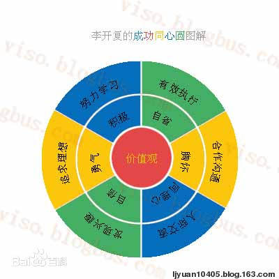

# Be Your Personal Best

> Notes of Book 《做最好的自己》by Kaifu Li

- [Be Your Personal Best](#be-your-personal-best)
  - [成功同心圆](#成功同心圆)
  - [态度：对内掌控](#态度对内掌控)
    - [价值观](#价值观)
    - [积极主动Be Proactive](#积极主动be-proactive)
    - [同理心](#同理心)
    - [自信](#自信)
    - [自省](#自省)
    - [勇气](#勇气)
    - [胸怀](#胸怀)
  - [行为：对外影响](#行为对外影响)
    - [追寻理想](#追寻理想)
    - [发现兴趣](#发现兴趣)
    - [努力学习](#努力学习)
    - [有效执行](#有效执行)
    - [人际交流](#人际交流)
    - [合作沟通](#合作沟通)
  - [完整与均衡](#完整与均衡)

## 成功同心圆

- 多元化成功
  - 多元化成功的视角下，衡量成功的标准有很多种，可以是财富，也可以是一个人的创造力或影响力，可以是一个人对他人的帮助或者贡献，也可以是一个人在自身基础上的提高和超越。
  - 最基本的衡量标准是该行为是否对社会、自己或者他人有一，是否让一个人在自主选择的过程中不断超越自己，由此获得最大的快乐
  - 社会越发达、人才体系和成功标准越多元化，每个人更能发挥自己的特长，两者互为因果
- 做最好的自己
  - 让自己每一天都有收获和新的提高、”做最好的自己“是通过多元化成功的必然路径，只有一元化成功才会强迫人们复制他人的成功模式
  - 追逐自己的兴趣、爱好，善于发现并发掘自身潜力的人们相比迫于家长或社会的压力的人更容易获得名利和财富。
  - 在多元化陈宫模型中，只要主动选择，每个人都有成功的机会
- 成功同心圆
  - 价值观是指导态度和行为的根本因素
  - 有了正确价值观的引导，可以完善自己的人格，端正人生态度。态度是行动的前提，是为人处世的基本原则
  - 人生态度体现在最基本的行为方式，通过正向的行为来寻找通往成功的道路。
  - 完整的原则来培养自己的各个方面，均衡的原则是根据自己的目标和实际情况，走不偏激不极端的路线，在对立统一中选择最佳状态
  - **有勇气来改变可以改变的事情，有胸怀来接受不可改变的事情，有智慧分辨两者的不同**

  
## 态度：对内掌控

### 价值观

- 价值观对人的行为和生活有不可估量的影响
  - 美好的价值有很多种，”诚信”、“善良”、“仁爱”、“勇敢”、“自由”、“活力”、“创造”、“和谐”、“平等“、”正直”，每个人可以选出自己认为最重要的几项价值
  - 李开复倡导“诚信”（诚实守信）是大部分人和企业价值观中共同的一部分。
    - 诚信是建立长期合作的先决条件，是企业盈利的前提、是信息社会的基础
  - 自律性诚信在现代社会越来越重要

### 积极主动Be Proactive

积极主动

- 中国文化强调群体意识，推崇“从上”“从众”，这些思想潜移默化影响者一代又一代青年。现行教育体制下，学生习惯处处听从父母和老师安排，遇到问题可以从父母和老师那里获得帮助，养成了被动的习惯。父母和老师也习惯于越俎代庖，帮助孩子和学生设计人生，导致他们忽略了真正的性格和兴趣。
- Proactive是心理学家维克托-弗兰克介绍给大众的。他说，在极端恶劣的环境里，人也会拥有选择自己态度的自由。
- 积极主动的人
  - 相信自己有选择的权利
  - 相信人可以主导事情的进展
  - 遇到问题独立思考
  - 遇到困难积极进取，不怨天尤人。
  - 相信一切靠自己，自己可以做的更好。
  - 问自己可以放弃哪些不重要的事，做重要的事

积极主动的7步

- 拥有积极的态度，乐观面对人生，有勇气改变可以改变的事情
- 原远离被动，从小事做起
  - 不要盲目听信人言，应该冷静辨析，积极求证
  - 不要让事情找你，要主动对事情施加影响
  - 有主见，不要习惯性同意或追随别人
  - 不要说“我办不到”，尽力去尝试
  - 语言训练
    - 不要抱怨环境和他人
    - 赋予自己选择的权利，“我选择”“我要”“我情愿”“我打算”
- 对自己负责，掌控自己的命运
  - 做有意义、负责任的选择，并主动承担后果
  - 不表达“但愿”“我不得不”
  - 接受自己的挫折，辨析自己可以改变的部分
- 积极尝试，邂逅机遇
  - 给自己设置有挑战性，但并非遥不可及的目标
  - 珍惜每一次尝试，尽力而为
- 充分准备，把握机遇
  - 事事用心、事事尽力
  - 客服苦难和挫折，把挫折转化为行动力
  - 不要在需要立即行动的时候犹豫不决
- 积极争取，创造机遇
  - 除了时刻准备，要主动做事情，为自己创造机遇
- 积极推销自己
  - 发现自己的优点，善于展示自己

### 同理心

同理心

- 同理心是人际交往中，体会到他人情绪和想法，理解他人立场和感受并站在他人角度思考和处理问题的能力
  - “推己及人”，“己所不欲勿施于人” （Whatever is hurtful to you, do not to any other person)
- 同理心是人际交往的基础
  - 同理心是信任的基础，信任是人际交往的基础

6点

- 我怎样对待别人，别人就怎样对待我
- 想要得到他人的理解，就首先要理解他人
  - 当别人表达意见，要理解他的立场和感情，还要设法让对方明白你已经完全了解了他的想法
  - 如果对方有错误，武断的否定效率远不如引导他从自己的立场认识到自己的错误
  - 理解的价值
    - 增加知识
    - 增加说服力
    - 豁达心胸
    - 赢得Buy-in。（诚意）
  - 如何更好理解他人？
    - 从关心别人，体量别人的角度出发
    - 主动反省自己
- **别人眼中的自己才是真正存在的自己**
  - 一个人了解另一个人，更多是凭直觉而非思考做出判断，这种判断往往比较准确
  - 别人眼中即使只反映了你在某方面的表现，也是真实、可信的。
- **只能修正自己，不能修正别人**
  - 如果被吴杰，别怪听众，你才是传达信息的人
- 真诚坦白的人，才是值得信任的人
  - 不介意让别人知道自己的缺点和动机，更容易赢得对方的信任
  - 言行如一，一诺千金，言出必行
  - 坦白地承认自己的错误，并为错误道歉
- 真情流露的人，才能得到真情回报
  - 尽量敞开心扉，说出自己心中的话

### 自信

- 自信是在认识自己的基础上充分相信自己，**相信自己可以在面对困难和挑战的时候，将自己的潜能释放出来**，相信自己可以在理想和兴趣下坚定不移的走向成功
  - 自信是对自身能力的正面评估，并形成坦然面对艰难险阻的心理状态
- 自信来源于成功的暗示，自卑来源于失败的暗示

获取自信

1. 尊重自己，鼓励自己
   1. 相信自己有足够的潜能，“天生我才必有用”
2. 赞美自己，从潜意识做起
   1. 用具体的事例反复训练大脑，相信自己是值得信任的，并且为自己自豪。
3. 用言行激发自信
   1. 正确对待他人的看法
   2. 有自己的想法和逐渐
   3. 表达自己的想法
   4. 自信的表达方式
      1. “我”“我认为”“我希望”“我要求”
      2. 目光接触，声音清晰
      3. 不让他人打断
      4. 拒绝沉默
      5. 为表达和沟通做好充分准备
4. 从成功获得自信，从失败增加自觉
   1. 成长性思维，坚信做好事情的能力
   2. 不要自负，自信与自我偏执，不允许自己犯错和自我中心、失去客观立场绝不等同
   3. 不要畏惧失败，明确自己不能接受的最坏结果。从失败中学习，提升对能力边界的认知
5. 制定具体目标，由自觉达到自信
   1. 不会过度自我批评，也不会盲目乐观，能够客观评价自己。坦诚面对自己能力基线，不会轻易地接受能力范围外的工作和设置不合理的目标
   2. 对自己和他人同样坦诚，坦诚面对失败会得到他人的新来
   3. 培养自信的目标要可行，可度量
6. 发挥优势，放飞自我
   1. 客观评估、采纳他人反馈中可行性较高的建议或目标
   2. 自信和积极主动是相辅相成的
   3. 自信的关键在于认识并且发觉自身的优势。发现优势比弥补劣势更重要。

### 自省

- 用于承认错误，主动接受批评和自我批评
  - 认真反省，保证不犯同样的错误
  - 不掩饰错误，客观评价自己
  - 复盘和自我批评
- 不断追求进步，足够好是不够的（Good enough is not enough）
- 虚心听取他人意见和接受批评，寻找mentor
  - 学会倾听
  - 用积极切实的行动改正错误
- 事后认真反省，努力改变自己
  - 哪些事情可以做得更好，哪些事情团队可以做得跟高
- 培养自省的习惯
  - **每个月和目标总结自己的成功和失败之处**
  - 每个月有改进计划

### 勇气

勇气是在挑战面前勇往直前，勇于接受挑战的力量

- 不畏失败，敢于尝试
  - 进取的冒险精神是勇敢的体现
- 承认错误，从失败中学习
  - 不要惧怕失败，冷静的分析原因
- 远离恐惧，挑战困难
  - “唯一值得恐惧的是恐惧本身”“实现明天理想的唯一障碍是今天的疑虑”
  - 正视现实，有勇气迎接挑战。
- 用于放弃已经获得的东西
  - 为了谋求新的发展空间，要抛弃成功的障碍
  - 对他人的要求和过高的预期也学会说“不”
- 有智慧的勇气
  - 抛开眼前的利益得失，最大限度的追求成功的同时不要陷入偏激、愚勇的死胡同

### 胸怀

- 务实
  - 接受自己无法改变的人和事，不要怨天尤人
  - 父母、环境（喜欢vs应该做的事，困难等）、天赋、经历
  - 接受自己：不活在别人的价值观里，善于发现自身的兴趣和特长，正确对待缺点和局限
- 宽恕
  - 以责人之心责己，以恕己之心恕人
  - 做事避免斤斤计较和零和思维
  - 告诉自己“未必如此”发现他人的合理性
  - 告诉自己“人难免会” 体谅对方的处境
  - 不要为别人的过失不快乐
- 自律
  - self regulation， 包括自我控制和自我调整的能力
  - 认知自己的潜能、素质。
  - 认知自己的感情、态度。（不会爆发也不会压抑）
  - 善于和自己对话
- 尊重
  - 尊重不同见解的权利。“我不同意你，但我支持你”
- 涵养
  - 有容德乃大，无求品自高
  - 天行健，君子以自强不息；地势坤，君子以厚德载物
  - 把我人与自然，人与社会，人与人的关系；做到宠辱不惊，得失置之度外

## 行为：对外影响

### 追寻理想

- 一个人拥有对自己，对家庭，对社会的理想和责任，他就更容易形成自己的价值观。 “人不必问自己，生命的意义是什么，而必须认识到，自己才是被生命诘问的人”（维克多-弗兰克）
- 理想是引领人生的瞪大，没有理想，就没有坚定的方向，没有方向，就没有充实的生活。每一个成功的人都有对理想的责任感和对人生的使命感。
- 理想源于自我，理想源于个性，理想应当是最适合自己的人生目标。

如何追寻理想

- 人生目标要尽量有价值
- 人生目标要尽量拜托名利羁绊
  - 人生的财富：积极的精神 > 良好的体格 > 和谐的人际关系 > 脱离恐惧、未来成功的希望 > 信念的容量 > 与他人分享幸福的愿望 > 热爱自己的工作 > 对事物开放的胸怀 > 严于律己 > 理解他人的能力 > 经济保障的能力
- 人生目标要成为自己的智囊
  - 用愿景指导目标和决策
- 人生目标可以让自己从心底感动
  - Follow your heart
    - 闭上眼睛，记录最先浮现在脑海里的理想记录下来
    - 回顾过去，最快乐和有成就感的时光是否有某些共同点
    - 十五年后，达到完美的人生状态下，你将会处在何种环境？
    - 如果你只剩六个月生命，你会做什么？
    - 幻想一下五年后达到理想状态的你——在哪里？在做什么？和谁在一起
- 人生目标要既富有挑战性，又不脱离实际，及放眼未来，又明确、具体。
  - 尽量放开思路，站在更高的起点上
  - 评估和调整目标：保证不要过于困难，凭自身条件不可能实现

### 发现兴趣

- 激情是成功的原动力和必要前提
  - “我是否愿意为了这个目标全身心投入？是否会像热爱爱人一样热爱他？”
- 

### 努力学习

### 有效执行

### 人际交流

### 合作沟通

## 完整与均衡