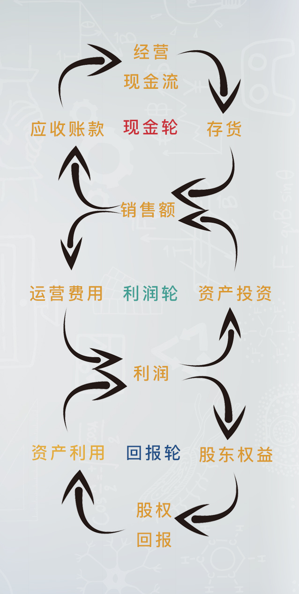
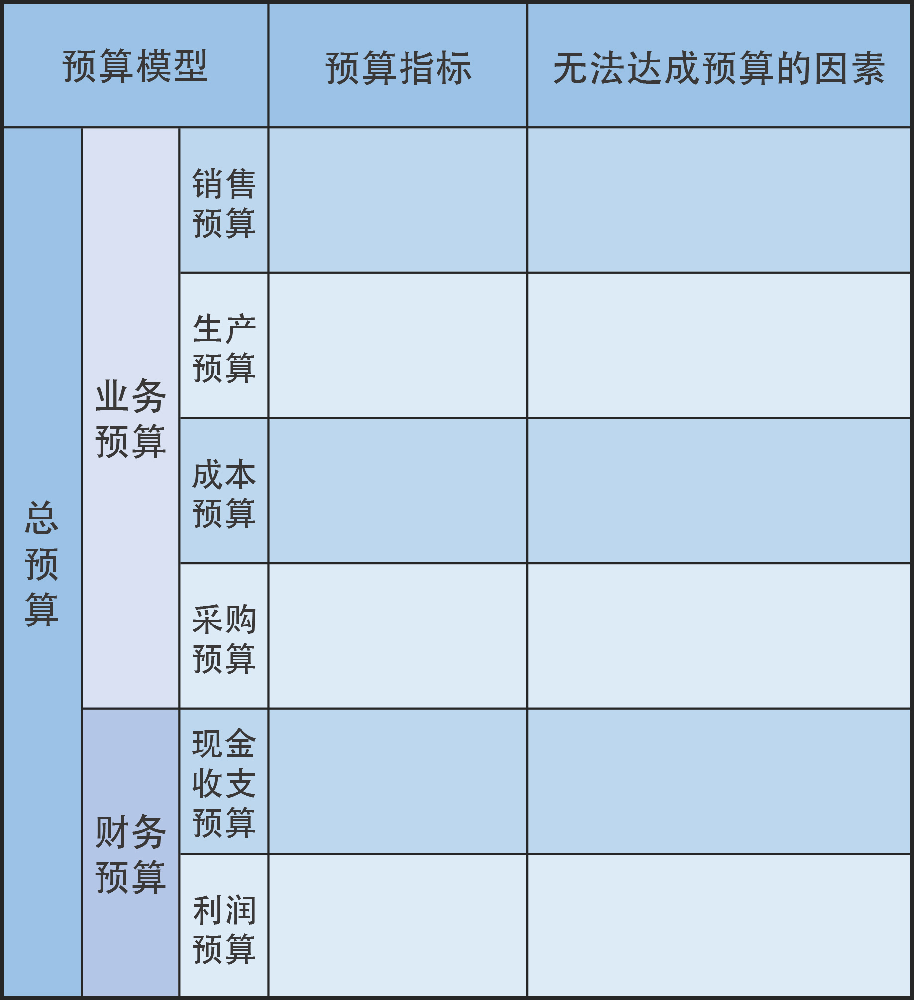

# 宁向东的清华管理课

> Notes of [宁向东清华管理课](https://www.dedao.cn/course/article?id=vWbYRP1mxqd2VG1xnXQjM096EBkr85)

- [宁向东的清华管理课](#宁向东的清华管理课)
  - [前言](#前言)
  - [01 导论：破局的智慧](#01-导论破局的智慧)
    - [科学管理](#科学管理)
    - [把握趋势， 识别机会窗口](#把握趋势-识别机会窗口)
    - [业绩文化和关系文化](#业绩文化和关系文化)
  - [09 竞争战略](#09-竞争战略)
  - [10 计划与变化](#10-计划与变化)
    - [最简单的计划：7行表单](#最简单的计划7行表单)
    - [三轮模型](#三轮模型)
    - [预算](#预算)
    - [创业者的计划：现金平衡和利润平衡](#创业者的计划现金平衡和利润平衡)
    - [创新者的计划](#创新者的计划)
  - [推荐阅读](#推荐阅读)

## 前言

德鲁克有本书，叫《卓有成效的管理者》，是当代最伟大的管理学著作之一。在这本书里，德鲁克提出了每个人都可以追问自己的三个问题：

1）不做当下这件事，又会怎样？
2）这件事，别人做，会不会更好？
3）有哪些事情，就是交给别人做，也毫无意义？

你有没有想过，解答了这三个问题，你的生活会大不一样？

哈佛商学院现在最贵的教授是克里斯滕森，他最擅长的工作，是教人通过“颠覆性创新”来实现弯道超车，挣到大钱。在克里斯滕森的管理课中，他总是请学生思考这样的问题：

如何乐在工作？
如何与家人朋友长保幸福？
如何坚持原则、保持正直？

## 01 导论：破局的智慧

- 局：完成目标过程中，资源相互作用的关系
- “ 破局 ” ，本质上就是调整资源的性质，正的变成负的，负的变成正的，然后变换资源和你之间的相互关系，让自己能够走得通。

管理学是一个分析、权衡和决策的学问，分析、权衡和选择的目的是什么？就是要破局而出。破局，其实就是解决问题。课程里面隐含了一个重要的概念：目标。没有目标，其实就没有管理学存在的意义。所以，有时会被问题所困，因为不知道你想要什么，也就不知道该怎样找寻方法。所以，请大家记住，要想有效地使用管理学的智慧，**首先，要建立清晰的目标。**

破局的三种思路

- 第一种，就是寻找那些先前没有进入你视野的资源，我把它叫做“无关资源”，然后通过正负资源和无关资源的整合、加减，就可以完成对负资源的转化，给自己找到路
- 第二种破局思路，就是对 “ 资源 ” 进行重新定义，找到新的出路。
  - 711和“7家银行”
- 第三种破局的思路，就是要重新定义自我，敢于把自己碎掉。
  - 很多负资源实际是搬不走的，但是它有缝隙，所以，只有敢于把自己碎掉，化整为零，你才能用很细小的力量从负资源的缝隙里钻出去，出去之后再重新聚合，成为新的自我

### 科学管理

在100年前企业主要办个工厂，买来设备，请来工人，完全不知道该怎么管，产品一天能生产多少，该生产多少，完全没有概念。这是当时所有企业主共同面对的一个困局。今天的课，我们就来回顾一下人类靠效率破局的过程，我们将花很多时间来讲述。因为今天我们所面临的困局是上一个困局的延续，所以要想解决今天的问题，我们就必须清晰地了解上一个困局。等你听完我的课，你就会发现，今天很多管理者虽然知道要建立人力资源部了，但骨子里还是100年前的观念。

破掉100年前困局的是两个人——福特和泰罗（Taylor，一译泰勒）。泰罗第一节课已经提过，福特就是福特公司的创始人，本期内容的封面图画的就是他。那福特和泰罗做了什么呢？就是提出了今天所谓的“科学管理”。科学管理听着艰深，其实核心就两条：

1. 把要管理的事情按照作业链条分成若干个程序上的细节；
2. 把每一个细节的效率提到最高。

福特和泰罗的共同努力，最后都体现在福特工厂的装配线上。一条生产线让工人实现了彻底的分工。每个人都以最有效的方法从事他的工作任务，不用连续的弯腰，不用做任何无关的动作，不用关注旁边的人。工人甚至不用思考，只需要凭下意识就可以工作了，这样的工作形式，必然促使效率的大幅提高。所以在19年的时间里，福特公司的T型车在美国销售了1550万辆，仅福特一家厂的总产量就占了全世界轿车总产量的一半。

后来有学者研究，因为科学管理的出现，生产一辆汽车的工作时间减少了三分之二，而且质量还有保障。

**新的困局：脑力劳动者的管理**

德鲁克说，脑力劳动者，或者知识工人的生产效率在20世纪不仅没有改善，反而还下降了，这将是21世纪管理学最重大的问题之一。

这就是我们今天创业为什么会面临更加困难的管理问题，生产线的出现，把人变成了机器的一部分，机器运行的速度和节奏代表了一种强制性的力量，由此可以管人、控制人、提升管理的效率、提升工人工作的效率。人类通过关注效率把100年前不知道怎么管理工人的局破了，但是，在现在这个时代，人的创造力在企业产出中占的比例大了，而对人的创造力的管理用秒表是没用的，所以如果你丧失了人心，机器、流水线可以提高效率，但是效率会从另外一方面偷偷地损失掉。

，在新的时代，每一个管理者都需要寻求一种效率上的平衡，就是来自于人心的效率和来自于外部强制力的效率这两者之间的平衡，这需要更高的管理境界，值得每一个人去思考。

### 把握趋势， 识别机会窗口

如何把握趋势，关键在四个词：**审视、准备、辨识和行动**。先审视局势，然后做准备，辨识“机会窗口”，最后再行动。这有点像鱼鹰抓鱼，要抓到最佳的时机，讲求的是准和快。前面都先蓄积力量，然后静静地等待，在最好的时点上出手，抓住机会、有效切入，最后取得成功

最经典的例子就是乔布斯，乔布斯重回苹果之后，他先是扭转了公司业绩下降的颓势，但之后的几年，他一直处于一种蛰伏的状态。有人问乔布斯为什么没有动作？乔布斯回答说，我在等机会做下一件大事，现在时机不到。这就是等待“机会窗口”的来临。所以，乘势而起、破局而出，关键是要赶对节奏。在机会窗口出现时，要能够把所有的资源都恰到好处地利用起来，及时出击、一举成功。

### 业绩文化和关系文化

费孝通先生，他是上世纪一位大社会学家。费老最有名的一本书叫做《乡土中国》，在这本书里他把中国人的社会关系比作一种“涟漪效应”。费孝通先生认为，中国人的社会关系，就是这样一圈圈围绕着一个中心展开的。所以，这种现象就叫 “ 涟漪效应 ” 。而位于中心点上的，就是每一个活生生的人。从某种意义上说，中国人是一人一涟漪。中国人想事情都是以自己为中心的，考虑一切事情的出发点都是自己。所以，每个人都是引发涟漪效应的中心，每个人都有自己的涟漪，有自己远近不同的圈子。远近不同，也就意味着亲疏关系不同。我们有时候讲，“亲戚有远近，朋友有厚薄”，说的就是这个意思。总之，涟漪效应是对中国人关系一个很好的概括。

在中国人的组织里，下属会强调领导对你好不好，领导也会格外去辨别哪些是亲信，哪些是外人。

这会导致两种情况：

- 上级对下属的评价会因为是不是亲信而有所区分。就像我们常常说的：说你行，不行也行；说不行，行也不行。为什么评价会差异化？就是因为亲疏不同；
- 在用人和分配资源上，信得过的人和信不过的人在机会和待遇上是不一样的。亲信通常会被分配到更多、更好的资源。

比如，你问一个经理人，企业里如果到处都是亲情关系，对企业的长远发展是不是有利？回答一定是否定的，他会说当然不利，企业就应该任人唯贤，而不能任人唯亲。但在实际行动中，每个人都会倾向于选择自己比较熟悉和信任的人。因为用所谓的“亲信”做事，会有更好的感受，从某种意义上来说就是一种安全感。所以很多头一天自己做下属时还非常反感的事情，第二天自己做了上级又都会立刻亲手去做。

这就是我们的关系文化导致的结果。这种关系文化，为领导者和老板设置了一个非常难以破掉的困局

那么，怎么破掉这个局呢？有一位西方管理学者总结说，要识别和防止出现三种非常有害的亲信。

1. 叫做“应声虫”下属。这种下属会不断去揣摩上意，然后事事呼应你，你稍稍有点想法，他马上就歌功颂德，让你感觉自己很了不起。
2. 叫做“隔离者”下属。他会有意让你脱离群众，把你和下面的真相隔离开。你只能听到那些对他有利的信息，而所有对他不利的东西，他都不希望传到你的耳朵里，也就是说，你能得到的信息是被他过滤过的。
3。 叫做“夺权者”下属。这样的下属，目标是夺权，他看着是在执行你的命令，但暗中却在培养自己的亲信，一方面讨好你，一方面在拉拢别人，然后等待时机、夺取权力。

那如何防止出现这三种下属呢？我不像西方管理者这么乐观，我的建议是尽量树立 “ 业绩文化 ” ，来对冲掉 “ 关系文化 ” 。因为关系文化也不是毫无价值，它在某种程度上，能帮助你提高信任度，提高组织的效率。当然也会形成很多问题，怎么处理这些问题？可能最有效的方法就是多一点业绩文化。

## 09 [竞争战略](https://www.dedao.cn/course/article?id=BQe6EGjvO7zRKZ2MRKnDrkMLPgAp9y)

## 10 [计划与变化](https://www.dedao.cn/course/article?id=rykaNlMY5gn3Jq6lMX7EAROW0DLjev)

当一个企业确立了战略发展的基本方向之后，有效地制订计划，是保证战略实施的必要手段。

通过计划过程，企业一般要解决三个问题：

1. 就是要把已经确定的经营战略转化成一个可以创造价值的、详细的行动方案；
2。 企业需要评估，是否有足够的资源来实施既定的战略计划。我们这一周讲了预算，预算做得好，对资源统筹安排就要事先地考虑。一个计划要可行，就必须要有足够的资源保障，进行这个方面的研究，也是核实一个战略是否可行的过程。对于资源上缺乏保证的计划，企业必须要进行相应的调整，否则计划很有可能会失败；
3. 通过计划可以将战略实施过程体系化，将关键的投入指标、过程指标和产出指标体现为**业绩目标**。

### 最简单的计划：7行表单

计划不是告诉你明天做什么，而是告诉你今天做什么。有了一个详细的计划，你才知道那个目标是不是一个真目标，你每天的行动是不是朝向这个目标努力，向这个目标前行。计划不是靠一个数字，显示着一个终极目标；相反，计划是一连串数字，要显示出你每一天的行动和结果。

计划管理的背后逻辑是什么呢？我用三个概念来概括这个逻辑：

- 一种预想力；
- 一种反推力；
- 一种数字力。

最简单的六步计划法。请你注意，这只是一个基本的例子，复杂企业里的计划涉及到方方面面，绝不局限在这样几个环节上。

- 第一步，需要确立一组明确的目标。
  - “快速确定”并且“斩钉截铁地提出”目标，倒是最重要的，因为提出目标，反映了领导者的决心。
  - 决断力里面还包含着一种补救力。所以，老大在制定目标时，拍脑袋拍得如果非常狠，那么，以后就一定要有及时调整的准备和办法
  - 组织决定效率，效率决定数字。当一个**组织在数字上没有达到预想目标的时候，反思出数字背后组织上的深层原因** （复盘），是一个关键动作。
- 第二步，就是根据目标数字，先建立业务计划。
  - 最简单的四象限图。这个四象限图中，一个维度是客户，分为原有客户和新客户；一个维度是业务，分为原有业务和新业务。这个四象限图，可以帮助你在制定业务计划的时候，把事情想得更细致、更清楚。
- 第三步，就是要根据业务计划，来考虑“利润计划”。因为利润等于收入减去成本费用。
  - 在做“利润计划”的时候，其实，“成本费用计划”也就随之完成了，“成本费用计划”是利润计划的一个副产品。
  - 成本费用计划，是企业发展中非常重要的计划，很多企业现在都讲求成本节约，但一些企业都是在现有的成本费用数字上加百分比生砍，他们不能根据企业发展的实际情况去做文章，不能动态性地处理收入和成本费用之间的关系，所以，成本费用的计划不能做得更科学、更合理。说到底，这是利润计划和业务计划没有做好。
- 第四步，是非常重要的，就是在利润计划已经有了大致眉目之后，需要做“投资计划”
  - 有一个辨证关系。是先赚到了钱，再花钱；还是先把钱花了，最后再赚到钱。做过企业的人都知道，这是一个比较难掌握的问题，处理不好，企业就会亏损，甚至现金流会断。
  - 所以，有一个比较良好的利润计划，是非常重要的。当你盘算清楚了可以赚多少钱的时候，其实你就知道该花多少钱了。而且在一个动态的过程中，能够处理好花钱和赚钱的平衡问题。
  - 你一定要有一个非常好的利润计划，这非常重要。这个利润计划做得越好，你不仅越容易赚钱，你也越敢去花钱，甚至你也敢去融资。
- 第五个重要的计划“融资计划”。
  - 你是为了创造利润而去花钱，而不是有了利润才去花钱。
  - 们在融资的时候，需要给投资者讲清楚的是什么？本质上，就是将来的利润是多少，利润是以怎样的节奏被我们赚到。
- 最后一行，是关于组织、人员的发展和变革计划，一个具体行动的计划。
  - 比如，根据上面的计划，在市场上面，我们需要对客户做哪些动作，在几月份做，达到什么效果，有怎样的业绩指标来表明我们达到了预期的目的？
  - 同时，我们该进行怎样的员工发展，招聘什么样的员工，招聘哪些岗位上的新员工，该如何去组织这些员工？

### 三轮模型

回报轮

- 保证随着企业规模不断做大的同时，还能得到源源不断的投资，最基本的逻辑就是能够用好这些资金，把它们都配置到合理的位置上，然后获得经营利润，要保证**经营利润大于资本成本**。
- 经营利润不能满足投资者的回报要求，也就是无法保证股东权益的时候，就没有人愿意再投你
- 企业由小到大，每天做的事情很多，但根子上就是要解决回报轮的问题。

利润轮

- 企业要有一个经营目标，这个目标最后就是要体现在销售额上，销售额扣除成本费用，就是“利润”。取得利润之后，利润有两个流向，一个是用于**再投资**；还有一个就是给股东分红。
- 绝大多数的管理者，都是“利润中心”的负责人。对于这样一些企业，或者业务单元来说，考核的最核心的内容，就是利润。
- 企业的计划类型可以有几十种，什么生产计划、采购计划、人力资源计划、销售计划等等。不过，这些纷繁复杂的计划，都涉及局部问题，只有**利润计划才是牵一发而动全身的核心**，是考核管理者的最后底线。

现金轮

- 在三轮模型中，如果利润轮是钟表上的时针，那么，现金轮就是钟表上的秒针。你记住一句话，企业可以不盈利，但现金绝不能断。现金就相当于水对于生命。饭可以几天不吃，但如果人几天不喝水，那必死无疑。
- 企业的现金流出问题，主要是两大原因：第一，就是企业的**产品卖不出去**，所有的经营现金全部都变成“库存”了；第二，就是企业的产品卖出去了，但是**钱都没收回来**，变成“应收账款”了。
  - 接过财务报表，就会下意识地先看应收账款和存货这两项，看看它们的增长率如何
- 管理者要时时判断自己的经营计划，预判着**现金流会不会出现断流的风险**，如果发现现金流有问题，就要提前考虑融资安排。

### 预算

- 预算的目的，是为了让一个人的生命在多数时间里处于一种说得清的稳定状态。这样，人才会有精力去对付那些少数的、突发的意外。一个人的行动边界才会大。
- 有助于通过财务数字的变化，推断出行动，进而看到数字背后的行为。“好的财务人员，是能够通过财务数字，看到一线市场的硝烟，听到战场炮火的人”，就是这个道理。

预算，可以说，就是一种数字化、精细化的计划。预算过程，就是一种计划过程。预算提供了非常详细的指标体系，规定了什么时候要花多少钱，能挣多少钱。由于预算在很多时候都伴随着大量的财务数字，包括收入预算、支出预算、重大投资预算等等，所以，很多人一提预算，想到的往往都是财务预算。但实际上，**预算还应包括对于各项投入资源的全面预算。**

，越大型的组织，预算体系越重要，预算越是一个有效的工具，可以让多部门、复杂结构的组织中各个单元都有效地运作起来。预算体系，实际上扮演了分配资源、指导业务工作，进而实现组织目标的指南针。

**预算的问题**

在很多大型跨国公司里面，预算的时间可能会花费大半年，甚至有些公司全年都在进行滚动的预算。预算在组织的各个层级依次展开，实现计划的功能。不仅如此，在很多大型公司里，预算是一项重要的管理活动，预算的结果形成了整个企业的财务结构和财经纪律。只要没有列入预算的事情，都没有相应的资源来支持，也是大家不愿意去想、去做的事。于是，这样就形成了一个双刃剑。

- 一方面，有很多事情，企业应该做，但却没有列入预算。
- 而另外一方面，很多事情在原来该做，但是因为环境变化了，事实上已经不该做了，但企业却还有资源去做。而且，预算做起来几上几下，耗费心力，所以，很多管理者都不喜欢财务预算的过程。在他们看来，预算非常地消耗时间，一旦定下来，就非常不灵活，而且有时候会带来低效率。

所以，很长时间以来，关于如何**改进预算的方式，让预算更有针对性**，很多企业都在探索，并形成了一些经验。如果你的公司预算活动还没有开展，或者预算水平偏低，有这样几招也许值得你去试一试：

- 多做**部门间的沟通**，通过沟通可以解决部门预算之间的矛盾和冲突，优化预算过程；
- 追求预算的灵活性和针对性。在一些环境变化比较快的公司，每月、每周的计划会议，会根据具体情况进行调整，以保证**预算指标与实际情况相吻合。**

利润来自于变化的管理，而不是来自于僵化的预算。

**三种预算方法**

最后，我和你讨论一下预算目标的拍脑袋问题。由于预算的本质，是关于未来的计划。所以，有多种制定预算的方式，很难说哪一种更有效，或者更有道理。因为每一种方式，都有它成功的案例，从理性上，我们也能发现它有价值的地方。

1. 第一种预算方式，可以叫“粗暴式预算”，完全就是最高领导者拍脑袋。在市场环境是靠着一种勇气，就有可能取得优势的大背景下，这种不要命的拍脑袋方式，说不定是一种好方式。
2. 第二种方式，教科书上的正式说法叫做“**参与式预算**”。就是在预算的过程中，下边的人有更多的机会参与到编制预算的过程中。毫无疑问，当基层对于市场情况更了解，也拥有比较多的信息的时候，参与式预算就会有比较好的效果。但是，参与式预算的问题，是在给了下属参与权利和机会的同时，如何解决参与的质量问题。
3. 第三种方式，就是现在大型公司普遍采用的“几上几下、反复沟通”的预算方式。大型公司一般都处于一个**相对稳定、各方竞争势力比较均衡**的市场上，这个时候，企业就有可能用一种从容的心态，按照行业研究的结果，**对于一个行业未来发展进行比较科学的成长预估**，然后由此来确定预算的目标。

最后，我要强调一下今天课程中一个隐藏着的观念，就是“数字的力量”。这里面有一个逻辑，企业的发展规划需要一种“预见力”，但是，我们不能通过预见力来打仗，我们需要让预见力越具体越好，唯一的办法就是把**它转化为数字。**

### 创业者的计划：现金平衡和利润平衡

1. 利润=销售收入-总固定成本-总变动成本
   1. 这是一切企业经营的逻辑。我们关于黎明和天亮的底线思维，都是来自于这个公式。所谓“**天亮**”，就是这个公式可以得到正的利润
2. 销量=固定成本/单位边际贡献
   1. 这时候所获得的利润就是“净利”。如果我们再假定当期所生产出来的产品全部都卖出去的话，产量等于销量，而所谓“**黎明**”（销售收入可以和当期的所有变动成本和费用打平），就是单位售价一定要等于单位变动成本，企业运营不能亏现金。

黎明之前

- 你最担心的就是现金流不要断了，所以，要不断地储备资金、储备力量进行押注。这时，企业的战略判断和具体的运营计划就变得非常之重要。
- 在这个黑暗的阶段，创业者一方面要不断通过试错，以最小成本换取最大战果；另一方面，也要把十二万分注意力都放在企业的现金控制上，防止在黎明到来之前倒下。

黎明之后，天亮之前

- 业务稳定，在企业经营中，是一个转折点到来的重要标志。与之相伴的，你已经有本钱来做我们前面所说的业务规划、利润规划了
- 越过了这个点，可以说，你的创业就算初战告捷了。不过，这个时候还不是天亮，因为你的固定性投资还拿不回来。不过，没问题。这时你基本已经进入到安全区了。从特征上说，**你的产品可能被一批稳定的客户所接受，你的市场势力也逐渐形成，你的业务基本稳定了。**
- 早期企业和业务稳定了的企业，在做业务考核的时候，关注的重点应该完全不同。在我看来，创业还没有稳定的企业，是没有本钱来做业务计划的，因为你还处于一种混战期，最需要的素质是企业的反应能力和反应速度。而当企业的业务稳定了，你的经营计划才变得更重要，也才有必要性。
- 形成了一批忠诚的客户，有了稳定销售量的产品和服务，业务开始稳定，是一个重要的转折点。这时，配合财务上的数据，除了达到现金平衡，还可以达到利润平衡。如果现金平衡，我们称之为黎明的话，利润平衡可以被称之为天亮。

### 创新者的计划

案例：微软

- 1975年退学创办的公司，1981年开发出IBM兼容机的DOS系统，1985年Windows1.0版本上市，1995年发布Windows95，掀起一场世界范围的计算机操作浪潮。微软在90年代的发展非常之猛，很像今天的谷歌或者苹果，一直到新世纪的前几年，比尔•盖茨都是能见度极高的新企业家的代表。
- 2005年之后，微软在高科技行业的领先优势一点点在丧失，危机逐渐积累。在网络高速发展的时代里，微软的速度逐渐放缓。最令我震惊的是，2012年7月，微软公布了第二季度的财务报告，公司成立30多年来，第一次单季度巨亏，亏损额高达5亿美元。当时亏损的原因很简单，就是2007年微软收购了一家网络公司，一共亏了62亿美元，在这个季度的报表中一次性注销了这个亏损。
- 微软的主业营业收入在这一年仍是保持在很高水平的，在微软主营业务操作系统和浏览器之外，它在网络业务上的一系列投资都以亏损结束。在很多领域，微软都是起了一个大早，却赶了个晚集。
- 在微软主营业务操作系统和浏览器之外，它在网络业务上的一系列投资都以亏损结束。在很多领域，微软都是起了一个大早，却赶了个晚集。
  - 微软在1998年进入搜索引擎，成立了MSN部门，同年Google成立，但是谷歌今天如日中天，但MSN却早已关门
  - 1998年，也是微软最早进入的电子书阅读器领域的一年，时间甚至比Amazon的Kindle早了9年，但是，后来的几大电子书都使用Google的Android系统，而没有用微软的操作系统。
  - 1998年，微软同样布局的还有车用电脑领域，推出车用电脑操作系统AutoPC，但是，在今天自动驾驶的未来大市场里，微软能处于什么样的地位，你想都想象得出。
  - 电视、平板电脑和手机，这些大家都要争夺的三块屏，也是微软战略布局的重点。微软在2000年开始正式进入智能电视领域；2002年开始正式进入智能手机的操作系统领域，比Android系统早了5年，后来微软甚至收购了诺基亚的手机部门。2002年，也是微软进入平板电脑系统的元年。这个时间比苹果的iPad整整早了8年，但是，今天大家都看到了竞争的结果。
  - 其它的线上领域，微软的动作也是非常早的。2004年，微软开始进入到网络电影领域，这比YouTube早了一年。而在社交平台领域，微软是一个跟随者，它在2005年Facebook推出一年之后，建立了Wallop网站。但是，3年之后，Wallop业务停止运营。

有技术方面的原因，但更大程度上，在于微软的管理控制体制，它的运行逻辑已经不适合管理创业型企业，它缺少必要的灵活性。微软的很多竞争对手都是从“车库”创业的年轻人，与这些对手的灵活性比起来，微软就略显僵化。

- 微软公司建立了一个“market intelligence”部门。这个部门负责在全球进行市场调查和数字分析，大市场一年四次，小市场一年两次。这个部门的工作之细，连一个业务人员的客户满意度下降，它都可以通过数字发现出来，然后，公司的计划部门就用这些数字来制订计划，按照财务年度设定目标，然后与业绩考核、激励政策紧密挂钩
- 微软的经理人们会按照月度、季度、半年度、年度收到业绩考核报告。厚厚的几页纸、十几页纸，甚至几十页纸，密密麻麻全部都是各项计划指标、目标已经完成情况的数据。大指标被拆解为小指标，不合格的指标在报告上会显示为红色，就像医院的体检报告是一样的。如果完成了指标，下面会有更高的目标在等待你去突破，如果严重完不成指标，就要走人。
- 你不仅要靠工作、靠指标说话，你还要面对面地向高层去解释工作，就是每一个团队的主要负责人在财务年度结束后都要去西雅图述职。述职的过程就像学校的学生答辩。完成工作，还要讲出为什么完成了工作，是不是可以干得更好。有时候，虽然某某人完成了计划指标，但被总部判断为还可以干得更好，你就被认定是不合适的，就只能走人了。你只要看看最近十年来，微软中国的主要负责人，从吴士宏开始，到现在换了多少人，你大约就能理解我说的话了。

面提到的那些企业，有些是微软自己创立的，有些是从外面并购进入微软的。但是，它们在微软的管理“高墙”之下，常常被微软的管理方式捆住手脚，因为微软考核的，都不是个性化的指标，而是成型公司的指标逻辑，而经理人也在意计划部门的人员怎么看企业，判断企业。

对于创新性企业的考核和规划

- 对于在新的行业，有创业性质的企业，打法多数都没有成型，在这个时候，计划性就比不上适应性更重要。团队需要更关注市场变化，关注商业模式创新，关注对于客户的理解。这需要一整套的与传统战略方式、传统计划方式不同的管理哲学和运作方式。
- 对于创新型企业来说，不要过度重视销售额，关注利润这些传统的财务指标，而应该把重心放在另外两个方面：
  - 是满足客户需求的状况是不是显著改善；
  - 就是公司现金流的状况是不是稳定并且处于健康状态。
- 另外，对于创新型企业来说，很多重要的指标是非财务的，如果进行计划管理，一定要想办法把非财务指标明确化。

## 推荐阅读

- 《时机问题》是一位美国专家的开创性著作，后面我会向大家推荐这本书。每个人借什么势，情况会不同。但是，使用方法去辨别机会窗口是重要的，管理学就是要教给大家这样的思考。《时机问题》是2014年的新书，反映了管理学界最新的研究水平。