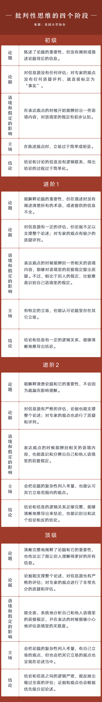
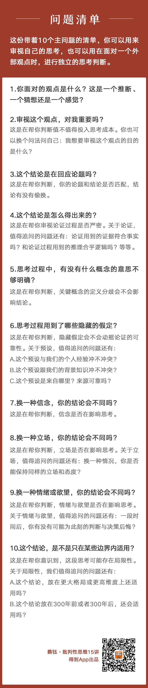

# 批判性思维

> Notes of [批判性思维课程](https://www.dedao.cn/course/article?id=bqzNakylrn9WVaZ8rEJ7DOop10vZwL)

- [批判性思维](#批判性思维)
  - [总论](#总论)
    - [思考自由度](#思考自由度)
    - [批判性思维的四个阶段](#批判性思维的四个阶段)
  - [思考的信息结构](#思考的信息结构)
    - [论题](#论题)
    - [结论](#结论)
    - [论证](#论证)
    - [概念](#概念)
    - [假定](#假定)
  - [思维框架](#思维框架)
  - [审视批判性思维：思考公正性 （思维倾向）](#审视批判性思维思考公正性-思维倾向)
    - [信念](#信念)
    - [立场](#立场)
    - [情绪和欲望](#情绪和欲望)
  - [审视批判性思维：思考破局（局限性）](#审视批判性思维思考破局局限性)
    - [时代局限和思维局限](#时代局限和思维局限)
    - [批判性思维的不完备性](#批判性思维的不完备性)
    - [批判性思维的checklist](#批判性思维的checklist)

## 总论

### 思考自由度

思考自由度，受两件事限制。

1. 第一是知识面局限。（每个领域单独的概念、认知体系和认知工具：美学、物理学、工程学、各类职业...）
2. 第二是思维方式局限。
   1. 我们来问一个问题：假设一个姑娘26岁，你有没有办法瞬间让她变成16岁？一种思路是：对她的年龄改用二十进制。
   2. 当局者迷，限制了你的思考自由度。每分每秒都在思考，这带来的坏处就是你很少会有意识地觉察：我在思考，就像你很少意识得到你正在呼吸。**意识不到在思考，当然也就意识不到思考的局限。**

批判性思维是对思考本身的思考。批判性思维所批判的对象不是某个人，而是一个观点背后的思考过程，去审视这个思考多缜密、多系统。审视一段思考，能让你意识到它的不足之处在哪，你所看懂的思考层次越丰富，你也就越是一个更独立、更明智的思考者。

破除知识面限制：两种学习者

1. 海绵式思考者有他们的强项，那就是能快速完成海量的信息积累，拓宽眼界。但如果从始至终只秉持这种单一思维方式，副作用是，**没有能力批判和拣选信息**。这可不是轻微的副作用，这其实是向世界割让了我们自身知识体系的构建权。世界在强势地塑造你，各种信息泥沙俱下，不论它们是真的假的，高效的低效的，有意义的无意义的，适用的不适用的，统一的冲突的，都在灌输你、塑造你。因为缺乏反思能力，他们可能都意识不到他们的知识体系在低效和摇摆。
2. 淘金式思考者
   1. 他们会在信息获取过程中不断提问，不断甄别信息的**真假和有效性**，然后再决定是不是用它来充实自己。
   2. 淘金式思考者用批判精神来拣选知识，从而让自己的知识体系更可靠。如果说，海绵式思考者追求的是见多识广的话，那么，淘金式思考者就是在见多识广的基础上追求“不惑”，不受迷惑。

破除思维方式局限：思我们的思维局限，评价我们的思维质量，就是批判性思维

- 这比搭建有效的知识体系更难。为什么？因为前面说的，当局者迷。只要醒着，我们就不断被延绵涌现的各种想法拽走注意力，也就很难跳脱出这些想法，去审视它们的生成机制。尤其是，当你作判断的速度太快，以至于你都没意识到自己已经完成了思考的时候，你可能产生了一个观点，说出了一段话，写下了一句文字，而形成这些东西的那个过程已经结束了。
- 旁观者身份，其实就是一种更清醒、更置身局外的洞察者身份。你也可以做自己的旁观者，第一个你在思考，第二个你在观察第一个你的思考。怎么能训练这种自我分裂的能力，自己来当自己的旁观者呢？两种手段可以训练。
  - 第一种是练习冥想，这是练习旁观我们内在的体验和感受。冥想要求你不要评判自己的体验，只是单纯去感受它。
  - 第二种就是训练批判性思维，这是练习旁观我们的思考过程。批判性思维却要求你像检察官一样，不断检验和评判自己的思考，从而提高思考的质量。

核心：从结论出发

- 批判性思维，不是要求你从一开始，就建立完备的思考过程去推导出完美的结论，而是自己当自己的苏格拉底，带着问题意识，面对一个结论去倒推，用一套环环相扣的关键问题，去检验这个结论是否立得住。
- 面对我们涌现的念头，如果我们能审视它的形成结构，检查它可能存在的偏差，和它的言外之意，我们就是在不断地训练自己给自己当旁观者，追求更高的思考自由度。

### 批判性思维的四个阶段

> 对思考本身复盘

美国大学协会（AAC&U）有一个大学学习评估项目，里面有一个表格，非常充分地把批判性思维分成了四个阶段。

- 批判性思维的批判性体现在批判一个观点背后的思考和论证过程。批判性思维，是对思考这件事进行再思考、再评判。换句话说，它不会直接告诉你，你的想法对不对，也不会直接否定你的观点来源，它只是评判你的思考质量高不高。
- 思考和批判性思维的关系，有点像“心理咨询师”和“心理咨询师的督导”之间的关系。
- 适用性
  - 不带判断的表达，没法用批判性思维来审视。
  - 一个判断的根据如果是个人感受或者个人偏好，也没法用批判性思维来审视。如果有人用个人感觉去替更大的群体下判断，你就要小心了
  - 适用于带有严谨思考过程和充分确定性的**推断**。（推断=结论+论证过程）
    - 当我们想要表达一个观点、一个主张的时候，我们经常会说“我认为……”。但“我认为”往往语义模糊，你得先搞明白它到底是感觉、猜想，还是推断。

## 思考的信息结构

> 评判这段思考里的关键要素是不是完整，每一个要素是不是成立和互相匹配；如果要素们符合要求，那么整段思考就是自洽的。

### 论题

当面对一段带有思考、带有判断的话，你这个检察官应该先问出的第一个问题是：你的论题、结论和论证部分分别是什么？（完整的思考=论题+论证+结论。）
  
- 结论：结论就是立论者希望证明、也希望你接受的观点。
  - 批判性思维从结论出发，前提是结论已经存在。
- 论题，就是引起立论者思考的问题或者分歧。有了论题的存在，后面的思考才会发生。
  - 常见的论题有两种：事实判断和价值判断。（is vs should be
- 论证：是从论题到结论的证明过程。

对于论题的审视

1. 找出论题。方法：根据结论来倒推。论题和结论一定是严格对齐的。（互相寻找）
2. 检查是否和结论是否完全对齐。
   1. 寻找、明确论题最重要的一个价值，是在帮我们训练一种意识：不走题的意识。让思考的起点和终点始终对标的意识。（发言之前，在心里给这段思考明确起点和终点，锚定论题和结论。）
   2. 有的时候，抛出论题和给出结论的人，并不是同一个人。这种时候如果你没有好好审题，那就很容易答非所问。

### 结论

1. 结论必须有论证支撑的观点
   1. 结论是一种总结性的判断，是要经过推导和论证才能得出的。而观点和判断，却不一定带有论证支撑。
   2. 非要去评判一个没有经过论证的观点，局面很可能会变得像小朋友吵架，只能不停重复观点和反观点
2. **结论有没有被偷换？**
   1. 用一个相关性很强的结论来偷换掉正面回答问题的结论。这其实是在审视“结论和论证是不是匹配”。
      1. 常见偷换结论用到的隐含假设：二选一假设/非黑即白
3. 你有没有结论先行，再想办法论证它是合理的？
   1. 人一旦先作了决定，他接下来给出的理由就并不是用来推导这个决定，而是想办法维护这个决定。（可能有偏差且无法证伪）那这种情况下，我们面前的这段思考，可能就没有进一步评判的必要。
   2. 在作一些决定和选择的时候，搞明白：影响自己作决策的到底是理性判断还是别的什么。

### 论证

论证必须包含结论。（论证=前提+推理+结论）

1. 前提成不成立。
   1. 识别前提
      1. 有的时候前提很好找，只要你看到一些句子的开头有特定的前提指示词，像“因为”“鉴于”“由于”“根据”之类，后面的句子一定就是前提了。
      2. 因为放置法：没有这些明显的前提指示词的时候怎么办？有一个办法特别好用，就是你试试把“因为”这个词套到每个句子的开头，如果套进去的时候，你觉得逻辑舒服，那么这个句子也就是论证的前提。
      3. 前提也分为事实判断和价值判断（观点）
   2. 前提有效性
      1. 这个前提陈述跟我们的个人经验冲不冲突？
      2. 这个前提陈述跟我们的背景知识冲不冲突？
      3. 这个陈述的信息来源可靠吗？
2. 从前提导向结论的推理有没有效。
   1. 演绎推理 vs 归纳推理：前者一定得出肯定性结论，后者一定得出可能性结论
   2. 推理过程是否存在逻辑跳跃（完整性）
3. 区分论证和解释
   1. 解释是指，我们双方都已经承认事实已经是这样了，试图说明为什么事实是这样的，这叫解释。
   2. 论证呢？论证是我还没相信或者认同你，你得证明你的判断。如果识别前提的时候，发现把一个推理论证变成了事实解释，那你就要提醒自己，你没有找对这个论证真正的前提。

### 概念

1. 思考过程中，论题、论证和结论里出现的概念、定义是一致的吗？如果思考者对某个概念的前后定义不一致，这就是偷换概念（例如、马云针对”996“的讲话）
   1. 概念是否有歧义（多义性）
      1. 是否因使用者不同而改变
      2. 标准是否改变（”好不好“）
   2. 关键概念的定义够精确吗
      1. 精确=可量化程度
2. 在思考当中，需要时对概念做出定义。

### 假定

假定 = “立论者直接假设它成立的定论”。

- 很多语境下，结论要成立，你还必须接受一些其它的、没有说出来的预设。
- 隐藏假定上的分歧，通常就是不同代际、不同世界的人无法互相理解、互相认同的原因。
- 假定分位两类
  - 事实假定
    - 吃鸡蛋补充蛋白质，假定鸡蛋蛋白质含量高
  - 价值判断假定（“应该”）
    - “大家都这么做”“老祖宗的智慧”

审视假设

1. 识别假定
   1. 我必须得持有什么样的观念，才能把已知的前提和结论从逻辑上完成无缝衔接？这个问题的答案，其实就是这段思考当中的隐藏假定。可以站在两种角度来尝试回答这个问题：
      1. 假设你自己是这个观点的反对者，想想你会怎么**反驳这个结论**
      2. 假设你自己是无关的第三方，想想有没有**其它可能性和其它路径**，也能推导出这个结论
2. 评判假定：和普通前提一样
   1. 这个假定跟我们的个人经验冲不冲突？
   2. 这个假定跟我们的背景知识冲不冲突？
   3. 这个假定是来自哪里？消息来源可靠吗

识别假定的意义

- 洞察思考背后的隐藏假定，不但是批判性思维的重要一环，而且，是一种独立的自我洞察和自我穿透能力。它其实是在帮你理解你自己的思维是怎么发展的，因为你每个推断背后的假定，组成了你的**世界观和价值观体系。**
- 自我洞察能力的重要性不比批判性思维少。
- 人类所有的思维本质都是推断性的。所以，我们每天根据各种信息快速作判断的背后，其实反映了我们的潜在观念。当你不断去进行这种思考的洞察和穿透的时候，你就会越来越清楚自己面对世界的基本观察视角是什么，你自己偏好什么、追求什么。 而意识到这种种，你也就能看到更大的世界和更完整的自己

## 思维框架

批判性思维的价值观

- 质量大于速度
  - 我们从小接受的教育，就是要快速回答问题、快速完成任务。响应速度越快，你在别人的眼中就越聪明。如果有哪个孩子出于认真和谨慎，放慢了回答问题的速度，往往就被认为输掉了考试、输掉了比赛。日久年深地，我们心里就被栽下了一个潜移默化的价值偏好：准确重要，但快更重要。
  - 追求决策速度这种价值偏好，在真实世界里并不适用，它甚至是有害的。真正的人生里我们面对的重要问题都很复杂，想要解决好这类复杂问题，并不需要你反应快，反而需要你细心观察积累、勤奋地做功课、扎实地研究。
  - 在速度偏好影响下，我们可能明明有很长的时间可以筹划和准备，也会拖到最后时刻才草草决定。**草草决定的背后，要么是粗糙决策，要么是放弃思考。**
  - 这就是为什么，在批判性思维的价值观里，追求思考的质量，比追求决策速度要重要得多。为了成为一个更明智的人，请你在日常，有意识地花更多的时间来进行思考。把“花足够时间来思考”这件事，变成你的习惯和仪式。
- 形成思考框架
  - 要成为更高质量的思考者，除了肯主动花大量时间进行思考，你还应该逐渐形成自己的思考框架，并不断优化和修正它。
  - 什么是思考框架呢？简单来说，就是你遇到问题时，**处理问题的一套相对通用的分析和处理回路。**你的思考框架越明确，你的思考就越有章法，你也就越容易检查思考当中有没有陷阱和漏洞。
  - 思考框架都会有三个必备要素：**知识储备、思考技术和思维倾向**
    - 知识储备是我们手头的食材，思考技术也就是我们的刀和灶台，思维倾向则是我们做中餐还是做法餐这类偏好。
- **批判性思维还是承担一个检察官的角色。它不负责帮你构建你的思考框架，而是帮你去逐级评判，整个框架的每一层是不是有足够的质量，是不是能让整个框架足够牢固。**
  - **思考技术**有很多种，最基础也最通用的模型就是我们前面讲过的三步：论题、论证、结论。
    - 我们前面的课程，其实就是在运用批判性思维审视这个基础模型。你的论题明确吗？概念清楚吗？证据成立吗？推演合乎逻辑吗？经过了这些检验的模型，就是自洽的模型。
  - 可以帮你判断你的**思维倾向**是不是在影响你的思考公正性。
  - 可以帮你意识到你的**知识储备**可能会导致哪些思考上的局限。
  - 在自洽的基础上，追求思考的公正和不受局限，这就是更高质量的思维的进阶方向。

## 审视批判性思维：思考公正性 （思维倾向）

### 信念

- 信念是一种你信奉，并且会践行的观念，也是引导你作出选择和行动的一种精神动力。在我们的思考过程当中，信念是一种最为**坚固的隐藏假定**。
  - 信念在思考当中其实就是某种假定，但它跟一般假定的区别在于它更稳定，对我们的影响也更隐秘
- 在人类社会里，但凡是被上升到“主义”层面的观念，对信奉者来说就算信念。他们会以此为信仰，并不自觉地被它指导行动。
  - “乐观主义者”都相信生活可以，也应该变得更美好，所以他们不太恋旧。
  - “保守主义者”也会坚信保持现状才更稳妥。这都是思维倾向。
  - 有些信念很明确，我们清楚地知道自己在遵照它来思考和行动，eg 重商主义学派。
    - 但不是所有的信念都那么宏大，都变成了某种主义。我们每个人在日常生活中，意识层面都沉淀着这样那样的信念，如果不是被某次思考触发，你可能根本都意识不到自己已经形成了某个信念。有些信念的存在本身，以及对思考和决策的影响都很容易被我们忽略。
  - 信念是脱离于具体情况、具体问题而存在的。（不太容易遭到动摇）
- 信念主要的形成方式有这么四种：
  - 第一种，生物本能。
    - 你本能地就会相信趋利避害是天经地义的，这个信念已经变成了你身体的一部分，甚至所有人、所有生命的共识。
  - 第二种，每个个体，在成长过程中都会有一些不断被确认的个体经验，这也可能形成信念。
    - 成长经历的影响形成的信念和潜意识
  - 第三种，不断被灌输的社会共识也会形成信念。
    - “好好学习，天天向上”
  - 第四种，想象力构建起来的信念体系
    - 宗教
- 如何识别信念
  - 一种方法叫“抵触情绪排查”法。简单来说就是，当你持有的某个观点，遇到别人的反对时，请你问自己这样一个问题：这个观念遭到反对时，我有没有从内心深处产生抵触和愤怒？
    - 情绪上，人们非常容易把对信念内容的否定等同于遭到人身攻击。
  - 第二个问题：你有没有意愿或者冲动，想要把这个观念变成所有人都认可和尊崇的原则？
  - 第三个问题：你自己在遵照这个观念来行动，甚至作出重要的人生选择吗？
- 找出一个信念之后，把它当作普通观点，运用批判性思维审视它，看看你自己能不能动摇或颠覆掉它。
  - 信念可能来自本能、经验，来自社会共识，来自想象，它们可能并没有经过理性思考，或者没有基于事实判断，这样得来的信念未必是对的
  - 最有效的办法其实是： 不要把你的个人认同建立在某个信念内容本身上，而是建立在这个信念的推导过程上。不是认同任何信念的具体内容，而是认同这个信念的具体推导方式。只要这个推导方式是有证据支撑、经过理性思考的，那信念的内容当然也就是可信的。这样一来，面对我们自己的每一个信念，我们都可以把它当作普通观点，用这门课讲过的批判性思维的方法，去拆解和评判它。某个信念如果被质疑、被否定，这代表的不是你这个人被质疑和否定，而是你获得了一次思考能力的进化机会。那么，原来我们人生最大的恐惧，现在就变成了可以帮你不断精进的正向力量。

### 立场

明确立场的意义

- 约束观点的作用边界。
  - 明确：我在以什么立场和态度讨论问题？
  - 你讨论问题时的立场和身份不同，那么面对同样一个信息，你抱持的态度可能不同，关注的重点可能不同，得出的结论也可能截然相反。
- 明确立场的第二个意义是：评估一个判断有没有被立场背后的利益所绑架。
  - 你的对手立场是什么？
  - 严肃思考这个领域，如果忽视了对手立场有没有受到利益伤害，那这个观点很可能就是不公正的。
  - 切换一下立场，其实是帮我们在更大的视野半径下看问题，也就能作出更公正的判断。
  - 问题：换位思考你能接受现在的结论吗？
- 问题：换成别的人或别的事，你的这个态度能保持一致吗？
  - 立场一致性，代表了一个人的价值观稳定。 这是我们建立思考框架的原点

### 情绪和欲望

情绪和欲望

- 情绪，是我们在遇到各类事情的时候，在心理和生理上的感受，比如喜怒哀乐、惊慌、嫉妒、羞愧、自豪，这些都是我们的情绪反应。
- 欲望呢，是我们想要达成某种目的的本能要求。想买个包包，困了想要睡觉，想被爱，想占有更多资源，想不被打扰，都是欲望。
- 它俩跟信念和立场相比，除了感性程度更高之外，还有一个很重要的区别：它们更应激、更不稳定
- 情绪和欲望是跟着具体场景、具体问题走的

思考背后的情绪。我们可以问这么三个问题：

- 第一，我对这件事的情绪是什么？
- 第二，如果一个怀有相反情绪的人来面对这件事，他的结论会不会跟我不同？
- 第三，一年后，我会不会后悔基于这个情绪作出的判断？
- 附加问题：如果一件事让我有强烈的情绪反应，那么它是不是已经动摇到了我的某个信念？
。

如果说情绪是“我感到怎样”，那欲望就是“我想要怎样”。怎么识别我们的判断背后有没有欲望在影响呢？问两个问题：

- 第一个，我想通过这个观点和主张，得到什么？
- 第二个，如果有个平行宇宙，在那里我已经拥有了我渴望的东西，我还会持有这个主张吗？

我们借助这些问题不断地练习，在各种场景、各种问题之下去识别我们的情绪和欲望是怎么样影响思考的，这个练习还会带来一个自我觉察的价值：你其实就会越来越清楚，你人生中最在意、最想追求的东西是什么。再跟你的信念系统一结合，恭喜你，**你比别人更清楚自己的人生目标。** 接下来，批判性思维又要发挥一次重大作用了： 它不是去评判你的人生目标好不好，而是去帮你评判，**在你的整个人生和每一个中短期阶段里，你该重点思考哪些问题。**

作为一个高质量的批判性思考者，你应该花更多的时间去思考、成体系地思考，思考你该怎么有效地实现自己的人生目标。换句话说，你可以运用批判性思维去审视：

- 关于我的人生目标，我应该思考哪些问题？
- 有没有一些指标，可以用来判断我遇到的新问题是否跟我的人生目标相关？
- 我应该怎么面对人生主线之外的信息吸引力？我应该爱惜自己的思考力，提醒自己避开那些东西，还是在某些情况下，允许自己的大脑放放假？
- 等等等等

你的情绪、欲望是什么，怎样对待它们，其实已经是人生观问题，没有标准答案。你愿意在自己的人生主线目标上投入多少，在副线上投入多少，也没有标准答案。但批判性思维能让你用一个更明智、更开放思考框架来思考它们，而且你能清醒地意识到你进行了负责任的思考，不是只作直觉判断。这就是我们说的“思考自由度”。

## 审视批判性思维：思考破局（局限性）

### 时代局限和思维局限

时代局限

- 我们的思考框架里有一些信念，是有强烈时代烙印的。这些信念在当下、在我们所处的时代可能适用，但放到其他时代背景下就未必了。
  - 父辈们爱囤东西，是因为他们的童年和青少年时期大多是在一个资源相对匮乏的环境里度过的。他们在成长时期形成的一个信念是，“物质是匮乏的，东西要囤积起来，以备不时之需”。这跟心理学里的“补偿”这种防御机制很像。
- 你可以这么问自己：这个结论，如果往前或往后放3年、30年，还会适用吗

格局局限

- 格局局限指的是，世界上还存在其他你完全不知道的维度，知道了你也不关心，因为那个维度的重要问题你没概念，不在你的优先级序列里，你所能接触和感知的世界就是你的格局边界。用一句有点绕的话来说就是，“我们没法知道我们不知道什么”。
- 格局局限，无论发生在同一维度上还是其他维度上，我们有办法可以识破吗？很遗憾，没有直接解法。最有用的办法听起来非常鸡汤：多看世界、多接受信息，保持好奇，多学东西。
- 格局局限很难破除，除非你亲自经历了另一种格局，获得那种格局之下的体感。但批判性思维能做到的是，帮我们意识到我们可能存在某些格局局限。
- 可以这样问自己：
  - 如果我站在更大的格局上，或者变成更微观的当事人，我还会这么想吗？
- 这是两个非常难突破的局限。但正如乔布斯的那句话，“保持饥饿，保持愚蠢”，为什么我们大家都很喜欢这句话，就是因为它展示了一种开放心态和自我完善的欲望，这也是我们每一个追求更高思考质量的人每天在不断践行的。

### 批判性思维的不完备性

这个不完备体现在，批判性思维只能评判思考，没有能力构建新的思考。

- 批判性思维的化身是一个检察官，只负责评判一段思考有多扎实，但你想要评判一段思考，你首先得产生一段思考。而批判性思维，恰恰不能让新观点产生，不能解决思考的从0到1，这就是批判性思维最大的局限。
- 某种思维体系的不完备，是整个系统的无知。只要我们身在系统之内，我们和整个系统都只能眼睁睁看着这些悖论或者无解问题摆在那里，无情地碾压我们。
- 有没有什么办法可以试着冲破这种系统局限呢？有，那就是用局外意识，去审视我们现有的系统，拓展现有的规则边界，去观察当前看不到的事实，去思考当下理解不了
  - 成长性思维和创造性思维都是构建和探索能力。一个是构建自我，一个是探索世界。如果你训练批判性思维有了一定进展，还想追求更高质量的思考，我非常建议你继续拓展这两种思维能力。

不要走到另一个极端，事无巨细地滥用你的思考能力。

- 最直接的原因是你的思考有成本。你的时间、精力，甚至思考用到的意志力，都是成本。作为一个追求思考质量的人，请珍惜你的思考成本。
  - 这个世界本来已经很复杂，而且它还在不断进化。你作为其中一员，需要思考和判断的事情太多了，你的时间、精力都是有限的资源。我们已经说过，在学会批判性思维这套思考技术之后，你最值得用它来评判的问题，显然是“什么是你的人生最重要的事，怎样做能不断地接近乃至实现它”。
- 有些决策和行动，相信本能、相信主流经验、相信专业就够用了，我们没必非要重新发明轮子。尤其是这些本能、经验和专业能力被反复验证过了的时候。在俗话里，它们叫常识。
  - 常识跟知识的区别在英文里体现得更明显——常识叫Common sense，知识叫Knowledge。Sense其实是体感、手感，是我们在日常积累下来的经验。
  - 塔勒布《反脆弱》，里面有一个比喻非常精妙，叫“教鸟儿飞行”。什么意思呢？鸟儿本来就会飞，但把飞行技能理论化、知识化的却是知识专家们。如果你本来就是鸟儿，向你的本能学习飞行，其实已经是最优策略。飞行是你的本能，是一手的common sense，而知识专家们整理出来的飞行技术，其实是二手的knowledge。

### 批判性思维的checklist

评估思维技术：

1. 论题
   1. 识别论题
   2. 检查论题是否和结论对齐（思考起点和终点）
   3. 论题重要性评估
   4. 论题完整性评估
   5. 完整传达让别人理解的信息
2. 论据
   1. 前提
      1. 识别前提（因为放置法）
      2. 前提有效性（经验、背景知识、可靠性）
         1. 信息源评估：信息来源是否可靠
         2. 专家观点是否有质疑、批判和评估
   2. 推论
      1. 推论有效性和完整性
      2. 区分推理与解释
3. 语境和假定影响（论证的前提和语境识别：分析自己和他人语境中的假定，表达时评估语境关联度）
   1. 概念
      1. 概念准确性（二义性）
      2. 概念精确性（量化）
   2. 假定
      1. 识别假定：反对方反驳结论，第三方推导其他可能性
      2. 评判假定（经验、背景知识、可靠性）
4. 立场
   1. 是否考量论题复杂性
   2. 考量其他立场观点
5. 结论
   1. 结论和信息的逻辑关系评估
   2. 识别相反的结论
   3. 证据和观点的优先级分层论述

评估思维倾向：

- 思维框架=知识储备+思维倾向+思考技术
- 信念识别
  - 这个观念遭到反对时，我有没有从内心深处产生抵触和愤怒？
  - 你有没有意愿或者冲动，想要把这个观念变成所有人都认可和尊崇的原则？
  - 你自己在遵照这个观念来行动，甚至作出重要的人生选择吗？
- 立场
  - 我在以什么立场和态度讨论问题？
  - 换位思考你能接受现在的结论吗？
  - 换成别的人或别的事，你的这个态度能保持一致吗？
- 情绪和欲望
  - 我对这件事的情绪是什么？
  - 如果一个怀有相反情绪的人来面对这件事，他的结论会不会跟我不同？
  - 一年后，我会不会后悔基于这个情绪作出的判断？
    - 如果一件事让我有强烈的情绪反应，那么它是不是已经动摇到了我的某个信念？
  - 我想通过这个观点和主张，得到什么？
  - 如果有个平行宇宙，在那里我已经拥有了我渴望的东西，我还会持有这个主张吗？

