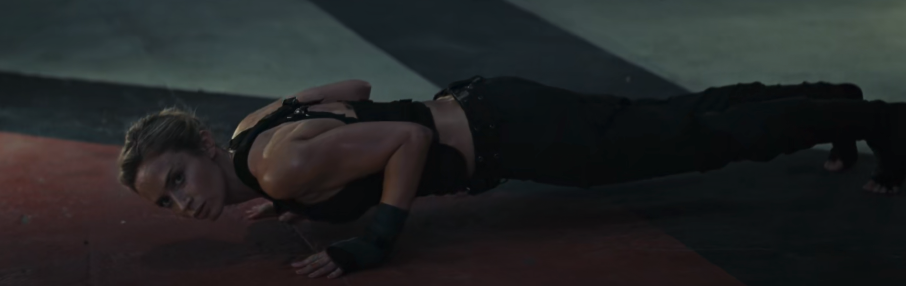

# Physical Training

## reference

- 减肥课
- 精力管理课

## Training

Lesson 1  第一次课 小肌群 后束

- 重点：肩膀后束 斜方肌 菱形肌 （背部中束）
- 热身：壶铃行走
- 全身拉伸 经常性自己拉伸
- 肩胛拉伸
    - 弹力带前后
    - 平侧拉伸
    - 招财猫
- 超人 superman 三组 手脚分开
- 训练 小肌群 16-20 x 5组
    - 龙门架面拉 
        - 头高度 眉弓 注意后束发力
    - 蝴蝶机 后向飞鸟
        - 身体前倾 手臂平 张开 手肘居高
    - 耸肩 40 x 3 哑铃或杠铃辅助

Lesson 2  第二次课 背

- 热身：壶铃行走
- 拉背 背部拉伸
    - 背部下拉
- 背部放松-泡沫轴
- 背部激活： 划船激活  （弹力带）superman热身

背部

- 高位下拉 
    - 先手背
    - 三个指头
    - 与肩同宽
    - 12 8 6
- 正位下拉
    - 手放宽
    - 下拉后仰
    - 超级组 20/15 …12 8 五组
- 钢线反握划船
    - 后仰注意姿势
    - 手肘加紧加紧 
    - 超级组
- 山羊俯身/罗马椅 - 锻炼竖脊肌 90一组
    - 注意背部拉直
    - 一节节拉起脊柱 屁股收紧
- 引体向上 分开握 两组极限组 

Lesson 4 1-26 练腿

腿部拉伸

- 弓步拉伸 走
- 放松腿 泡沫轴

- leg extension 6-8组 40 加重量 超级组 阻抗组
    - 分开并拢
    - 8半8全
    - 勾腿
- 哑铃深蹲 - 拿一个哑铃
    - 10 15kg 5组
    - 不收臀 在完全提起来前坐下去
- 杠铃深蹲 
    - 姿势正确 屁股收进去
    - 杠铃放在 斜方肌后侧  
    - 手拉平 瘦臀
- 颈前深蹲 史密斯机
    - 腿放前 
    - 用力下蹲

——————————

Lesson 8 练肩

肩前中后束分开

前束

- 坐姿推肩 对齐 屁股往前坐 使用杠铃
- 15个起 加重量 6到8组

后束

- 面拉 间歇时间短
- 一直加重量

中束

自由器械 - 难

- 坐姿推肩 
    - 往后 不要锁死
- 飞鸟
    - 网上顶 学习
- 俯身飞鸟 
    - 卡点 
    - 动作比较难 要仔细学

——————————

Lesson 7 胸

胸

- 热身 拉伸三动作
- 前束放松

- 胸推
    - 弓腰 肩往下 
    - 鼻子 手灯框 小小腿
    - 5组最后一组极限
    - 快速推 休息够

- 上斜卧推 开始20
- 落到肋骨位置

胸厚了再夹胸

——————————

Lesson 6 1-28 腿后侧 股二头肌

放松

- 行走
- 腿部拉伸 弓步 
- 腿部放松

腿部练习

- 俯身腿弯举30 20 35kg 4-10 6组
- 直腿硬拉 股二头 5kg
    - 腰挺直
    - 沿一条线往上伸
- 夹腿 5-6 加阻抗 20-15-12 加重量

前后腿可以一起练 锻炼不要挠痒痒

Lesson 5 1-27 二头肌

- 二头拉伸
    - 旋转手臂

练习

- 阿诺德二十一 http://www.360doc.com/content/19/0113/22/49804219_808662656.shtml
    - 靠墙
    - 手肘不要动 靠近墙
- 哑铃弯举 2.5kg
    - 手肘不要动 收紧不要借力
    - 一边5 + 两边15
- 哑铃侧弯举 靠器械 20 一组 5组 
- 肱肌 手反面 和弯矩一动作 小肌肉 多练
- 杠铃弯举 6-8 大重量 加阻抗
    - 收握在收缩处

——————————

Lesson 3 1-25 硬拉

全身拉伸

- 腿
    - 90度 趴
- 胸
- 大小腿 竖脊肌横卧
- 下趴
- 手肘

放松 - 泡沫轴 非常重要
- 下背 下上分开
- 上背 手触底
- 胸 趴着
- 侧面 大圆肌 - 痛
- 大小腿
    - 腿侧面
- 屁股
- 腿内侧 趴下

硬拉

半程硬拉

- 辅助 双手握棍子下趴 背挺直练习
- 三种硬拉 推荐半程硬拉 直腿硬拉
- 屁股先动
- 正反握技巧 85kg
- 腰带保护-同宽腰带
- 85kg

直腿硬拉-锻炼腿后面 （股二头肌）

- 哑铃 腿伸直
- 沿一条直线起落

