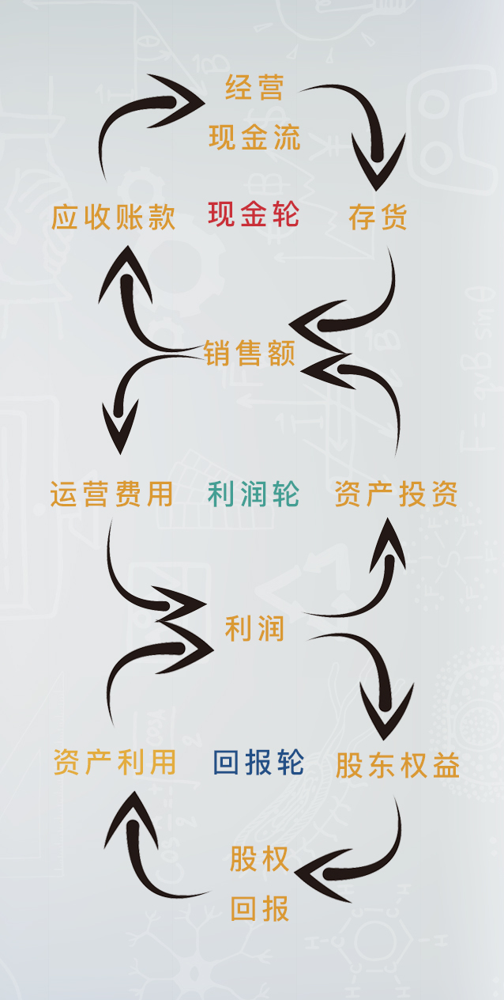
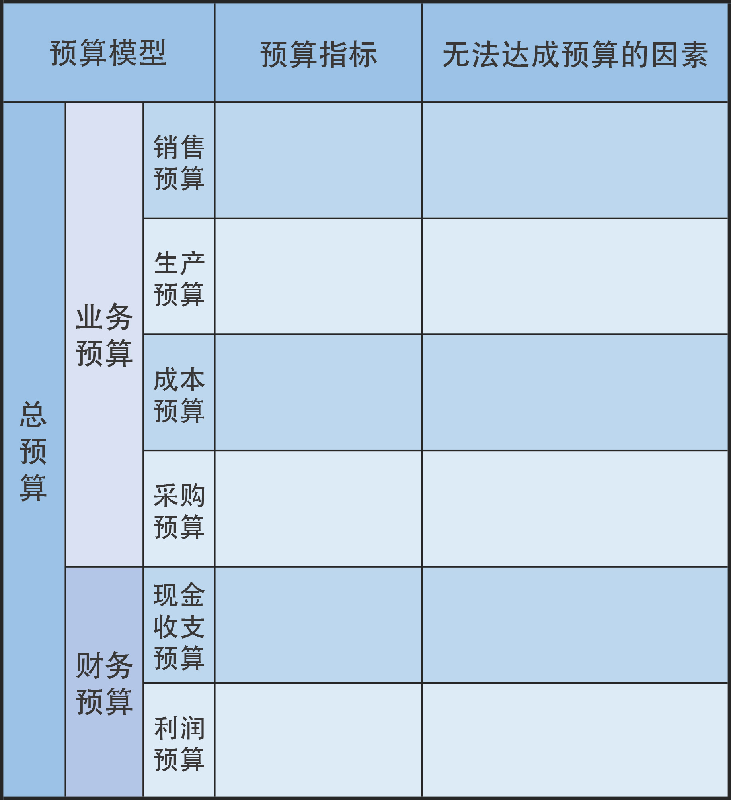

# 宁向东的清华管理课

> Notes of [宁向东清华管理课](https://www.dedao.cn/course/article?id=vWbYRP1mxqd2VG1xnXQjM096EBkr85)

- [宁向东的清华管理课](#宁向东的清华管理课)
  - [前言](#前言)
  - [01 导论：破局的智慧](#01-导论破局的智慧)
    - [效率破局：科学管理](#效率破局科学管理)
    - [借势破局：识别机会窗口](#借势破局识别机会窗口)
    - [无法破掉的局：涟漪效应](#无法破掉的局涟漪效应)
  - [02: 人与行为](#02-人与行为)
    - [人的认知](#人的认知)
    - [了解自我](#了解自我)
    - [了解他人](#了解他人)
    - [人的观念](#人的观念)
  - [09 竞争战略](#09-竞争战略)
  - [10 计划与变化](#10-计划与变化)
    - [最简单的计划：7行表单](#最简单的计划7行表单)
    - [三轮模型](#三轮模型)
    - [预算](#预算)
    - [创业者的计划：现金平衡和利润平衡](#创业者的计划现金平衡和利润平衡)
    - [创新者的计划](#创新者的计划)
  - [推荐阅读](#推荐阅读)

## 前言

德鲁克有本书，叫《卓有成效的管理者》，是当代最伟大的管理学著作之一。在这本书里，德鲁克提出了每个人都可以追问自己的三个问题：

1. 不做当下这件事，又会怎样？
2. 这件事，别人做，会不会更好？
3. 有哪些事情，就是交给别人做，也毫无意义？

你有没有想过，解答了这三个问题，你的生活会大不一样？

哈佛商学院现在最贵的教授是克里斯滕森，他最擅长的工作，是教人通过“颠覆性创新”来实现弯道超车，挣到大钱。在克里斯滕森的管理课中，他总是请学生思考这样的问题：

1. 如何乐在工作？
2. 如何与家人朋友长保幸福？
3. 如何坚持原则、保持正直？

## [01 导论：破局的智慧](https://www.dedao.cn/course/article?id=Ay7GQpR6ndOgX6BNeX8eBvPzMN4lwE)

- 局：**完成目标**过程中，资源相互作用的关系
  - 身边包围的所有资源，都跟你有了关系。有些资源是支持你的，你可以支配，我把它叫做“正资源”；有些资源是阻拦你的，不能为你所用，我把它叫做“负资源”。
- “破局” ，本质上就是调整资源的性质，正的变成负的，负的变成正的，然后变换资源和你之间的相互关系，让自己能够走得通。
  - 人之所以被困在一个局里，就是拦着你的负资源太多，你冲不出去，就没有办法达到预定的目标。所以要想办法把负资源移开，让自己冲出去，这就是“**破局**”。
  故意给他人设置负资源，让他过不去，或者让他必须按照你的意思，绕着弯走，这就是“**做局**”。

管理学是一个分析、权衡和决策的学问，分析、权衡和选择的目的是什么？就是要破局而出。破局，其实就是解决问题。课程里面隐含了一个重要的概念：目标。**没有目标，其实就没有管理学存在的意义**。所以，有时会被问题所困，因为不知道你想要什么，也就不知道该怎样找寻方法。所以，请大家记住，要想有效地使用管理学的智慧，**首先，要建立清晰的目标**。

破局的三种思路

1. 寻找那些先前没有进入你视野的资源，我把它叫做“无关资源”，然后通过正负资源和无关资源的整合、加减，就可以完成对负资源的转化，给自己找到路
2. 就是对 “资源” 进行重新定义，找到新的出路。
   1. 711和“7家银行”
3. 重新定义自我，敢于把自己碎掉。（变革）
   1. 很多负资源实际是搬不走的，但是它有缝隙，所以，只有敢于把自己碎掉，化整为零，你才能用很细小的力量从负资源的缝隙里钻出去，出去之后再重新聚合，成为新的自我

### 效率破局：科学管理

在100年前企业主要办个工厂，买来设备，请来工人，完全不知道该怎么管，产品一天能生产多少，该生产多少，完全没有概念。这是当时所有企业主共同面对的一个困局。

破掉100年前困局的是两个人——福特和泰罗（Taylor，一译泰勒）。。那福特和泰罗做了什么呢？就是提出了今天所谓的“科学管理”。科学管理听着艰深，其实核心就两条：

1. 把要管理的事情按照作业链条分成若干个程序上的细节；
2. 把每一个细节的效率提到最高。

科学管理的出现，是在两条平行线上同时展开的：一个是福特，他考虑的是做一辆车需要多少个环节；另一个是泰罗，他研究的是在每个生产环节里，工人应该通过多少个规范动作，才能最大效率地完成作业活动。

福特和泰罗的共同努力，最后都体现在福特工厂的装配线上。一条生产线让工人实现了彻底的分工。每个人都以最有效的方法从事他的工作任务，不用连续的弯腰，不用做任何无关的动作，不用关注旁边的人。工人甚至不用思考，只需要凭下意识就可以工作了，这样的工作形式，必然促使效率的大幅提高。所以在19年的时间里，福特公司的T型车在美国销售了1550万辆，仅福特一家厂的总产量就占了全世界轿车总产量的一半。

后来有学者研究，因为科学管理的出现，生产一辆汽车的工作时间减少了三分之二，而且质量还有保障。

*新的困局：脑力劳动者的管理*

德鲁克说，脑力劳动者，或者知识工人的生产效率在20世纪不仅没有改善，反而还下降了，这将是21世纪管理学最重大的问题之一。

这就是我们今天创业为什么会面临更加困难的管理问题，生产线的出现，把人变成了机器的一部分，机器运行的速度和节奏代表了一种强制性的力量，由此可以管人、控制人、提升管理的效率、提升工人工作的效率。人类通过关注效率把100年前不知道怎么管理工人的局破了，但是，在现在这个时代，人的创造力在企业产出中占的比例大了，而对人的创造力的管理用秒表是没用的，所以如果你丧失了人心，机器、流水线可以提高效率，但是效率会从另外一方面偷偷地损失掉。

，在新的时代，每一个管理者都需要寻求一种效率上的平衡，就是来自于人心的效率和来自于外部强制力的效率这两者之间的平衡，这需要更高的管理境界，值得每一个人去思考。

### 借势破局：识别机会窗口

1. 为什么要借势：同样的资源，如果配合上不同的外部环境，也就是不同的趋势，你是逆流而上，还是顺势而为，结果相差太大了。能做大事的人和成功的企业都不会只靠自己的蛮力，而都善于借助外部的力量。
2. 如何借势：
   1. Walmart的“区域组织网”：沃尔玛已经能够在单独的一家店里使用条形码技术来管理库存和物流了，这些都是借势破局所必需的“正资源”，但是如果没有办法把分散在各个店里的条形码系统联系起来，就没有办法破局。用我们熟悉的一句话，就是万事俱备、只欠东风。而卫星技术的应用，就是这一股东风。沃尔玛率先看到了东风，也抓住了东风。沃尔玛对自己作了个新定义：沃尔玛从此去镇上开店，而且不再是一个个分散的“单店”，而是一个按区域组织的“商店网”。新的“商店网”的概念下，沃尔玛还实现了单店的盈利，这是为什么呢？因为占领了镇一级的市场之后，总顾客规模一下子大了很多，从上游进货可以进行更大规模的商品采购，和供应商谈判能力的加强，就大大降低了采购成本，低价折扣的力度就可以更大。
   2. 有了100家店，物流和仓储网络就可以重新规划。原来的店面比较少，距离远，运输效率常常比较低。现在店面多了，物流配送的路线图就可以更加优化，比如送货的时候满车怎样走，回来的时候空车又可以顺路进货等等。毫无疑问，这些因素都可以让物流更加高效，随之而来的就是成本的大幅下降。
3. 如何把握趋势
   1. 关键在四个词：**审视、准备、辨识和行动**。
      1. 先审视局势，然后做准备，辨识“机会窗口”，最后再行动。要抓到最佳的时机，讲求的是准和快。前面都先蓄积力量，然后静静地等待，在最好的时点上出手，抓住机会、有效切入，最后取得成功
   2. 最经典的例子就是乔布斯，乔布斯重回苹果之后，他先是扭转了公司业绩下降的颓势，但之后的几年，他一直处于一种蛰伏的状态。有人问乔布斯为什么没有动作？乔布斯回答说，我在等机会做下一件大事，现在时机不到。这就是等待“机会窗口”的来临。所以，乘势而起、破局而出，关键是要赶对节奏。在机会窗口出现时，要能够把所有的资源都恰到好处地利用起来，及时出击、一举成功。

### 无法破掉的局：涟漪效应

费孝通先生，他是上世纪一位大社会学家。费老最有名的一本书叫做《乡土中国》，在这本书里他把中国人的社会关系比作一种“涟漪效应”。费孝通先生认为，中国人的社会关系，就是这样一圈圈围绕着一个中心展开的。所以，这种现象就叫 “ 涟漪效应 ” 。而位于中心点上的，就是每一个活生生的人。从某种意义上说，中国人是一人一涟漪。中国人想事情都是以自己为中心的，考虑一切事情的出发点都是自己。所以，每个人都是引发涟漪效应的中心，每个人都有自己的涟漪，有自己远近不同的圈子。远近不同，也就意味着亲疏关系不同。我们有时候讲，“亲戚有远近，朋友有厚薄”，说的就是这个意思。总之，涟漪效应是对中国人关系一个很好的概括。

在中国人的组织里，下属会强调领导对你好不好，领导也会格外去辨别哪些是亲信，哪些是外人。

这会导致两种情况：

- 上级对下属的评价会因为是不是亲信而有所区分。就像我们常常说的：说你行，不行也行；说不行，行也不行。为什么评价会差异化？就是因为亲疏不同；
- 在用人和分配资源上，信得过的人和信不过的人在机会和待遇上是不一样的。亲信通常会被分配到更多、更好的资源。

比如，你问一个经理人，企业里如果到处都是亲情关系，对企业的长远发展是不是有利？回答一定是否定的，他会说当然不利，企业就应该任人唯贤，而不能任人唯亲。但在实际行动中，每个人都会倾向于选择自己比较熟悉和信任的人。因为用所谓的“亲信”做事，会有更好的感受，从某种意义上来说就是一种安全感。所以很多头一天自己做下属时还非常反感的事情，第二天自己做了上级又都会立刻亲手去做。

这就是我们的关系文化导致的结果。这种关系文化，为领导者和老板设置了一个非常难以破掉的困局

那么，怎么破掉这个局呢？有一位西方管理学者总结说，要识别和防止出现三种非常有害的亲信。

1. 叫做“应声虫”下属。这种下属会不断去揣摩上意，然后事事呼应你，你稍稍有点想法，他马上就歌功颂德，让你感觉自己很了不起。
2. 叫做“隔离者”下属。他会有意让你脱离群众，把你和下面的真相隔离开。你只能听到那些对他有利的信息，而所有对他不利的东西，他都不希望传到你的耳朵里，也就是说，你能得到的信息是被他过滤过的。
3。 叫做“夺权者”下属。这样的下属，目标是夺权，他看着是在执行你的命令，但暗中却在培养自己的亲信，一方面讨好你，一方面在拉拢别人，然后等待时机、夺取权力。

那如何防止出现这三种下属呢？我不像西方管理者这么乐观，我的建议是尽量树立 “ 业绩文化 ” ，来对冲掉 “ 关系文化 ” 。因为**关系文化也不是毫无价值，它在某种程度上，能帮助你提高信任度，提高组织的效率。**当然也会形成很多问题，怎么处理这些问题？可能最有效的方法就是多一点业绩文化。

## 02: [人与行为](https://www.dedao.cn/course/article?id=Ay7GQpR6ndOgX6BNeX8eBvPzMN4lwE)

### [人的认知](https://www.dedao.cn/course/article?id=WqavDm012GolV7BaqKxPjEy8zdk73Q)

人际关系理论：人是关键（人是管理的中心）

- *霍桑实验*：正式组织的共同利益，才是决定生产效率最核心的东西，而不是每个人的能力和组织事先定下的目标。
- 第一，企业内部更有影响力的，是非正式的职场关系；
    - 技术上真正有一套的人，在现场往往也就有更多的话语权。
- 第二，员工的情绪，是会被带入到他们的工作过程中影响效率的。
- 如果把这两条结论合在一起，就会有一个推论：负面情绪可能会通过一个看不见的渠道快速传染，并且影响整个组织的工作质量和工作效率。
    - 领导的行为不检点，有时是非常可怕的。领导者很多时候就像一粒火种，当你要点燃组织，给予组织正能量的时候，你要借助于一个所谓的正当渠道。但是，这种正当渠道往往比较慢热。但是如果你有一个**不当行为传递出负能量的时候，它往往会先点燃一个非正式组织**，而且会燃烧得很彻底，让非正式组织的每一个成员都深深地浸染在负能量之中，然后它会迅速的向其他非正式的组织传递。这种非正式组织的特点，决定了它的传播力很强大，搞不好，分分钟就会把整个组织攻陷。
- 争取员工支持，比解决什么股权重组和银行债务豁免等问题重要得多

认知不协调：人的复杂性

- 有“知”不一定有“行”
  - 有认知，但却没有外界公认的应该有的行为。要求别人做到自己却做不到，但自己并不觉得自己没做到，他们会认为自己做到了，而且做得相当好，这就属于认知不协调，
- 不一定靠改变认知才能改变行为，其实先改变行为也可以反过来改变认知。
  - 第二种认知不协调是1976年学者们在研究选举的时候发现的。他们发现：相对于投票前的选民，投票后的选民更倾向于相信他们所投票的候选人会取得胜利。道理很简单，就是因为他有了行为，先投了票，投了票之后他就把希望当成了胜算，这种认知不协调，在学术上叫**决策后的认知不协调**，我们身边常常有这种现象，比如你买了一只股票，因为你买了这支股票，你看这支股票的眼光就不客观了，你总是希望它涨，因为你希望它涨，所以你就不能用理性的心态去考虑什么时候把它卖掉。
- 管理学用途
  - 不要考核认知，考核行为，行为改变认知
  - 先建立认知，再干预行为
    - **面试**：
      - 面试官最开始建立起了对你的好印象，那接下来他就会自己去寻找证据来支撑他的最初印象，所以你一定要让面试官先对你有好印象，让他发生这样的一个行为，这是要点，因为一旦他有了这个行为之后，他再听你讲话的时候就会寻找支撑他这个判断的证据。
      - 面试第一个环节都是自我介绍，很多人用自我介绍来热身，你就需要在这个上面做文章，建议你先研究一下这个组织的模范人物，特别是当下最受欢迎的人物，看看他们身上哪些品质是你也有的，再研究一下这个组织最近领导讲话提倡过什么东西、有哪些也是你身上具备的，然后再把这两样东西放在一起好好包装一下，揉进你的个人介绍里去。并且很重要的是，要让面试官意识到这一点。
      - 所以面试的最优策略是先讲价值观，后半段的时候再强调你的能力。

**心理学、认知科学，脑科学，神经科学和生理学（基因学）研究**：，了解人性和人的行为，有点像剥洋葱。管理学剥掉了一层，经济学剥掉了一层，心理学剥掉了一层，神经科学、脑科学和基因科学现在还在一层一层地往里剥。

- 76秒的冲动。个人看到好东西后形成的购买冲动，只会持续76秒，如果在76秒钟内不能完成有效的购买，冲动就会消失。
- 阈下意识。
  - 比视觉亮度阈值稍微低一点的亮度，我们肉眼已经看不到了，但我们的阈下意识是可以感受到的，于是商人们就利用这一点来做手脚。第二个可以做手脚的地方就是画面跟画面之间的空隙。商人通过闪烁的信号来做文章，比如很快地打出一个图像信号，快到你以为你没看到，但你的阈下意识已经感受到了。
  - 美国人写了一本书，专门提出一个概念，叫做“阈下诱惑”。作者提到了一些厂商利用人的阈下意识多卖产品的方法，比如，乐之饼干的表面隐藏着一个SEX的字样，人虽然不能用肉眼看到这个字样，但是阈下意识是可以感受到的。作者说，至少这样可以让乐之饼干更招人喜欢，而且男女通吃。
- 你的冲动水平是由基因决定
  - 个人出生以后，脑子里都会分泌一种平衡性的化学物质，防止你多巴胺分泌过多。科学家们在研究这个平衡机制的时候发现，不同的人平衡点是不同的，而这个平衡点的高低取决于基因的差异。影响这个平衡点水平的基因就叫“D4基因”，大约会有20%的人在这个基因上出现突变。“D4基因”的突变就会改变人分泌神经物质的机制，也会改变人对于新鲜感的判断，更直接地说，他们的冲动水平会不同，所以“D4基因”也被称为“新鲜感基因”。
  - 经典心理学是个概率科学，只要在概率上多数人的选择呈现出某种规律，心理学上就接受这个规律。但是基因科学和脑科学的研究进展改变了经典心理学的研究方法，学者有机会用更现代的方法研究那些喜欢搏一下的人，结果就发现，喜欢搏一下很可能跟他的基因有关，当然，也还会存在其他影响因素。
  - 未来的管理学，一定是建立在能够更加洞察人性的基础上。
- 环境和人的理性
  - 人为什么会慌张？有三个关键词：情境、意识、慌张。情境让你产生意识，意识导致你的内分泌系统发生了变化，然后表现在你的行为上就是慌张，这是一个传导关系
    - 第一，是你遭遇了某种急迫的情境
    - 第二，这种情境刺激你的意识系统发生了变化，你的身体里面开始分泌大量的“去甲肾上腺素”，简称“去甲”
    - 第三，去甲分泌太多后你的身体会发生变化，反应在你的行为上就是慌张。
  - 方法一：情感注入。身体注入某一种感觉，这种感觉的注入，就可以冲淡原有情境，改变神经物质分泌和发生作用的环境。
    - 帕瓦罗蒂和钉子
    - 有的人靠不吃东西，用饥饿感来冲淡紧张感。据说还有的人靠憋尿的感觉来冲淡慌张感。总之，都是用另外的“情感注入”来改变意识形成的环境，
  - 方法二：理性注入
    - 事先给你自己设定的目标是不是合适的？
    - 你的准备对于达到那个目标是不是已经充分了？
    - 一种情况是，你已经准备得很充分了，胸有成竹到没有慌张的理由，比如当时我把学生叫出去聊，就是帮她理清，她的研究成果做到这个份上，还有什么好慌的？另外一种情况就是理性分析后你发现你准备不足，或者自己无法完全掌控。如果是后者，那就听天由命吧，赵本山说得好，“爱咋咋地”。人一旦“爱咋咋地”了，也就不慌了，说不定还会有更好的效果。

### [了解自我](https://www.dedao.cn/course/article?id=RQLYWyjMZoa0J1WOrKp4wvzDbO26Bq)

- **了解自我是一切管理工作的前提**: 我们的本能常常不由自主地会让我们去找别人的问题，去找客观原因，而很少会花力气反思自己，即使反思了，往往也不够深刻，很多时候避重就轻，没办法，这就是人的局限性。所以我们要去做一个测试，就是尽量客观地看到灯下黑的部分，而不是只根据自己的感觉来了解自己。
- MBTI测试（迈尔斯-布里格斯类型指标）
  - 外向（E）或内向（I）：从哪里获得精力——从自身以外（外向型E），还是从自身内部（内向型I）。
  - 感觉（S）或直觉（N）：关注你如何搜集周围世界的信息——直陈性地、有序地（感觉型S），还是比喻性地、随机地（直觉型N）。
  - 思考（T）或情感（F）：喜欢如何作出决定——客观地、不涉人情地（思考型T），还是主观地、顾念人情地（情感型F）。
  - 判断（J）或感知（P）：关注你每天的生活方式——你喜欢事先决定、照计划过得井井有条（判断型J），还是宁愿灵活应变、在生活中顺其自然（感知型P）。
- “内控性”与“外控性”人格
  - 内控性人格”的人，特点是他一旦遇到事情，会觉得所出现的事情，都是个人能力和处世方式造成的，他的直觉会让他觉得：只要努力，事情就可以掌控。如果你是一个有“外控性”特质的人，在找工作的时候，就应该寻找那些环境比较稳定的工作和岗位。比较清晰的工作指南、任务标准来作为你行动的支撑
    - 有内控性特质的人一旦对工作内容、工作方式、对同事，甚至是对上级不满意，他们就会不加隐晦地去努力改变这一切，他们有时甚至会声称自己要离职，但他们的离职意愿似乎不一定会转化成离职行动，这一点，有统计数据来支持。但是，在他改变周围环境的过程中，往往会得罪很多人，即使没有离职，后边的日子一般也不好过
    - 内控性特质的人，大多喜欢凭本事吃饭，他们的天性决定他们不太注意维系同事关系。所以，这种人在遇到问题时，如果能够及时关闭“本能”回路、开启“思考”回路，注意他人的感受，也就是说他改变周围环境的时候，不要有意地去得罪那么多人，那就厉害了。
    - 一旦内控性特质的人对于薪酬和晋升有所不满的时候，他们将离职意愿转化成离职行动的比例就会特别高.
  - “外控性人格”的人，思考问题的方式刚好相反。他们一旦遇到事情，往往认为事情的出现都是超乎自己掌控的，是周围环境太过复杂导致的。如果你是有“内控性”特质的人，你就应该寻找一些有挑战性的工作
- 达克效应：能力越低的人，越容易产生对自己过高的评价，至少会把自己的能力评价在平均水平以上；而能力较高的人，则会倾向于低估自己的能力。
  - 产生的原因：每一个人在自我评价的时候，首先调出来的是自我信息，也就是先想“自己怎么样”，然后再用自我信息作为基准去评判他人，评价“别人怎么样”，所以评判基准的不同，就容易产生出自己能力很强的错觉。
    - 从另外一个角度说，**每个人在自己相对比较低能的领域里，对别人的真正能力是缺少信息的**，因为你能力低，你就不容易了解比你能力高的人，所以很多别人厉害的地方你也认识不到，而且进行评价时，最容易唤起的往往是你的长项，而你去比较的是别人的短项，这么一比就容易比出自信。
  - 人在辨识他人情绪方面的敏感性，自以为的能力水平和实际水平，相关性极其微弱，甚至就是完全不相关。也就是说，与其他方面能力认知上的达克效应相比，在情商领域里如果存在“达克效应”的话，差异会更加显著
  - 当任务难度发生变化时，人们有时会用先前的标准也就是错误的评价标准来判断和衡量自己的能力。
  - 那些能力低的人，当你用相对简单的任务来考验他的时候，他会觉得大材小用；相反，当你换成复杂一点的事情，他又特别容易直接缴枪，士气低落到一塌糊涂。
  - 那么该如何解决自视甚高的问题呢？最有效的办法，就是努力从他人的眼睛里看到自己的影子。
    - 邀请10-12个人，他们可以是老师、家人、朋友，也可以是同事和客户。请他们来描述你的3个优点和3个缺点，并尽量写出具体的事例，以及当时的情境，然后，通过分析这些描述和事例来获得自己在他人眼中的印象。
- 情绪是第一生产力
  - 一位神经科学的专家，他的名字叫达马西奥。1994年，他出版了一本书——《笛卡尔的错误》。达马西奥推断，情绪与决策如影随形，人是不能脱离情绪，来进行所谓理性决策的，人的所有决策，都是情绪参与的结果。
  - 第一，情绪的产生，是大脑运行的自然过程，不存在只有好情绪、没有坏情绪的可能性。产生好情绪和产生坏情绪，都是一个自然的过程。而情绪又会参与到我们的决策和判断之中。
  - 第二，情绪管理的本质，就是要控制自己产生好情绪和产生坏情绪的比例。有一门学问叫“**积极心理学**”，学者们建议大家掌握这个比例，最好是3:1。好情绪占三，坏情绪占一。
    - 那么，该如何保有积极情绪呢？学术界目前没有答案。我的亲身体验告诉我，多接触积极的人、积极的观念和积极的事物，也许是一个可行的办法。
  - 第三，管理者需要格外注意：情绪，才是第一生产力。**管理者首先需要把自己的情绪变得更加积极，同时还要学会有意识地将这种情绪传递给员工。**
    - 把达马西奥的观点翻译成管理学的语言就是：一个人情绪差的时候，他的工作表现一定差；而一个人情绪饱满的时候，他的创造力一定超强。
- 认知能力和注意力管理
  - 当我们注意到一件事情，对它进行**分析、判断，乃至于记忆的时候**，都是需要花费心力的。认知能量，通俗来理解，就是“心力”。人的心力是有限的，所以，我们会下意识地节省心力，心理学家创造了一个词叫 “认知吝啬”
  - 从两个方面锻炼你的心力：
    - 把你的电池容量在原有的基础上尽可能地增大。
      - 坚持禅修，提高自己的心力
      - 卡巴金是MIT（麻省理工学院）的分子生物学博士，后来在麻省大学医学中心工作。1979年，他开始运用禅修的方法帮助人们治疗慢性疼痛。后来，他又发表了关于“正念减压”的文章来传播他的理念。巴金看来， “ 正念” 是心力配置的最佳状态。卡巴金最忧虑的事，就是我们每天被各种电子产品包围，因为这会让很多人做事情的时候分心。
      - 自我评估
        - 请你留意一下，你有多少时间是处于一种专注状态的？什么是专注状态呢？就是不知不觉中，你突然发现“怎么就到了吃饭的时间了”。
        - 如果评估完对自己的现状不满意，你就要想办法努力创造一个能够进入到这种专注状态的机会。最直接的一个办法就是：给自己找一个环境，让自己能够在指定时间里、在这个环境中完成特定的任务。
        - 管理者要格外注意：**尽量减少员工被打断的情况**。因为人的工作状态，最开始的时候效率低，它需要一个启动，启动完会达到一个较高的状态，在较高的状态上维持一段时间后，人就会累，效率就会降低。如果这个过程中间被打断，就需要不断地重新启动。
    - 更重要的一点，是要学习怎么样去使用它，让它的使用效率变得更高。
      - **聪明人只在最重要的事情上不放弃、不轻率，反复权衡，不怕浪费心力**，而在那些小事情上，并不是太计较，这其实就是我们本能地在进行成本和收益的比较。

### [了解他人](https://www.dedao.cn/course/article?id=ml9WNdP1QvaeKYa32KAzx82Dyog0BZ)

状态自尊：管理他人的切入点

- 状态自尊
  - 管理他人，最高明的应该是基于每个人 “**状态自尊**” 的基础上去建立管理架构。在定义“自尊”这个词的时候，学者们之间也充满了争议。有学者把自尊定义为一种情绪状态，也就是说它是由好的结果，或坏的结果刺激出来的**一种感受**。到了90年代，学者们开始把这种自尊明确地定义为“状态自尊”。
  - 当员工的积极情绪增加，同时他的消极情绪也增加的时候，他们就会更多地关注自己，会以一种专注和警觉的心态对待他们的工作任务。但如果积极情绪增加的同时，消极的情绪是在下降的，员工就会冲破他们自己固有的工作角色，更多地关注工作环境和他们的工作同伴。表现出来的行为就是更多地帮助同事，做出自愿加班等超越自我的工作行为。
  - 职场上的绝大多数人所追求的，主要是受到尊重的需求和自我实现的需求。这些需求，其实都和“状态自尊”的感觉有关。**”状态自尊”的情绪，对于员工的工作业绩和工作行为一定是有积极影响的。**
- 员工在前，管理在后: 有效的管理者的一个重要法宝就是：在充分尊重员工感受的情况下来建立管理制度，通过一些管理工具，让员工的自身努力和上级的有效管理之间形成平衡。
  - 要让员工主动分享领导的角色，在这个基础上，领导者再去保持权威；
  - 要给予员工发挥主动性的天地，在这个基础上，领导者再去**控制达成目标的节奏**；
  - 要在员工具有足够操作弹性的前提下，管理者再去建立标准化的程序。
- 真正的管理，应该是努力帮助他人改变工作情境、创造好的情绪、激发员工的动力，控制员工的惰性。
  - 第一关是人员选拔。因为“状态自尊”的人往往格外自律，让这些人发挥创造力，看似散沙一盘，报酬又特别高，但实际上节省的管理费用很大。
  - 其次是要学习建立“倒金字塔型”组织。把组织的金字塔倒过来，有决策权的是员工，而管理者只对一线员工和客户负责。
  - 是公司文化必须要颠覆，这个要跟公司结构相匹配。
  
愿望与能力：了解他人的线索

- 任何人在工作中的业绩表现，都可以归因于两样东西：一是能力，二是愿望。
- 愿望的背后，有一个核心概念，在管理学上叫动机。马斯洛关于人的五个层次需求，每个需求都可以成为人们的工作动机。也就是说，当一种需求成为人采取某种行为的决定因素的时候，这种需求，就是**动机**。
- 三种动机：要善于观察和判断每一个下属的动机，用各种方法帮助他们去建立和形成愿望。
  - “获得成就的动机”。有这种动机的人，特别希望自己能够达到优秀的标准，并且在竞争的环境中能够获胜，也就是我们通常讲的“特别有好胜心，特别希望出人头地”。
  - “获得权力的动机”。权力，就是影响他人的能力，也是一个人满足自己受到社会承认、自尊、自我实现需求的一个标志
    - 管理学家把人的权力动机，又细分成“个人性的权力动机”和“社会性的权力动机”。
    - 什么是个人性的权力动机？就是拥有权力的人，他时时、处处都想利用权力来解决问题，注重那种大权在握的感觉。
    - 而具有社会性权力动机的人，他会知道掌握权力的目的，是为了团结大家，共同完成组织的目标。
  - “获得归属感的动机”。
    - 有的人虽然个人能力不强，业绩不是那么好，但是他归属能力强，觉得自己是这个圈子里的，他的心理感受会很好，也会有安全感。
    - 有的人能力很强，但主观意愿上不屑于归属于某一个圈子，特别不在意他人的感受，所以即使业绩好，也会被大家排斥。

### 人的观念

## 09 [竞争战略](https://www.dedao.cn/course/article?id=BQe6EGjvO7zRKZ2MRKnDrkMLPgAp9y)

## 10 [计划与变化](https://www.dedao.cn/course/article?id=rykaNlMY5gn3Jq6lMX7EAROW0DLjev)

当一个企业确立了战略发展的基本方向之后，有效地制订计划，是保证战略实施的必要手段。

通过计划过程，企业一般要解决三个问题：

1. 就是要把已经确定的经营战略转化成一个可以创造价值的、详细的行动方案；
2。 企业需要评估，是否有足够的资源来实施既定的战略计划。我们这一周讲了预算，预算做得好，对资源统筹安排就要事先地考虑。一个计划要可行，就必须要有足够的资源保障，进行这个方面的研究，也是核实一个战略是否可行的过程。对于资源上缺乏保证的计划，企业必须要进行相应的调整，否则计划很有可能会失败；
3. 通过计划可以将战略实施过程体系化，将关键的投入指标、过程指标和产出指标体现为**业绩目标**。

### 最简单的计划：7行表单

计划不是告诉你明天做什么，而是告诉你今天做什么。有了一个详细的计划，你才知道那个目标是不是一个真目标，你每天的行动是不是朝向这个目标努力，向这个目标前行。计划不是靠一个数字，显示着一个终极目标；相反，计划是一连串数字，要显示出你每一天的行动和结果。

计划管理的背后逻辑是什么呢？我用三个概念来概括这个逻辑：

- 一种预想力；
- 一种反推力；
- 一种数字力。

最简单的六步计划法。请你注意，这只是一个基本的例子，复杂企业里的计划涉及到方方面面，绝不局限在这样几个环节上。

- 第一步，需要确立一组明确的目标。
  - “快速确定”并且“斩钉截铁地提出”目标，倒是最重要的，因为提出目标，反映了领导者的决心。
  - 决断力里面还包含着一种补救力。所以，老大在制定目标时，拍脑袋拍得如果非常狠，那么，以后就一定要有及时调整的准备和办法
  - 组织决定效率，效率决定数字。当一个**组织在数字上没有达到预想目标的时候，反思出数字背后组织上的深层原因** （复盘），是一个关键动作。
- 第二步，就是根据目标数字，先建立业务计划。
  - 最简单的四象限图。这个四象限图中，一个维度是客户，分为原有客户和新客户；一个维度是业务，分为原有业务和新业务。这个四象限图，可以帮助你在制定业务计划的时候，把事情想得更细致、更清楚。
- 第三步，就是要根据业务计划，来考虑“利润计划”。因为利润等于收入减去成本费用。
  - 在做“利润计划”的时候，其实，“成本费用计划”也就随之完成了，“成本费用计划”是利润计划的一个副产品。
  - 成本费用计划，是企业发展中非常重要的计划，很多企业现在都讲求成本节约，但一些企业都是在现有的成本费用数字上加百分比生砍，他们不能根据企业发展的实际情况去做文章，不能动态性地处理收入和成本费用之间的关系，所以，成本费用的计划不能做得更科学、更合理。说到底，这是利润计划和业务计划没有做好。
- 第四步，是非常重要的，就是在利润计划已经有了大致眉目之后，需要做“投资计划”
  - 有一个辨证关系。是先赚到了钱，再花钱；还是先把钱花了，最后再赚到钱。做过企业的人都知道，这是一个比较难掌握的问题，处理不好，企业就会亏损，甚至现金流会断。
  - 所以，有一个比较良好的利润计划，是非常重要的。当你盘算清楚了可以赚多少钱的时候，其实你就知道该花多少钱了。而且在一个动态的过程中，能够处理好花钱和赚钱的平衡问题。
  - 你一定要有一个非常好的利润计划，这非常重要。这个利润计划做得越好，你不仅越容易赚钱，你也越敢去花钱，甚至你也敢去融资。
- 第五个重要的计划“融资计划”。
  - 你是为了创造利润而去花钱，而不是有了利润才去花钱。
  - 们在融资的时候，需要给投资者讲清楚的是什么？本质上，就是将来的利润是多少，利润是以怎样的节奏被我们赚到。
- 最后一行，是关于组织、人员的发展和变革计划，一个具体行动的计划。
  - 比如，根据上面的计划，在市场上面，我们需要对客户做哪些动作，在几月份做，达到什么效果，有怎样的业绩指标来表明我们达到了预期的目的？
  - 同时，我们该进行怎样的员工发展，招聘什么样的员工，招聘哪些岗位上的新员工，该如何去组织这些员工？

### 三轮模型

回报轮

- 保证随着企业规模不断做大的同时，还能得到源源不断的投资，最基本的逻辑就是能够用好这些资金，把它们都配置到合理的位置上，然后获得经营利润，要保证**经营利润大于资本成本**。
- 经营利润不能满足投资者的回报要求，也就是无法保证股东权益的时候，就没有人愿意再投你
- 企业由小到大，每天做的事情很多，但根子上就是要解决回报轮的问题。

利润轮

- 企业要有一个经营目标，这个目标最后就是要体现在销售额上，销售额扣除成本费用，就是“利润”。取得利润之后，利润有两个流向，一个是用于**再投资**；还有一个就是给股东分红。
- 绝大多数的管理者，都是“利润中心”的负责人。对于这样一些企业，或者业务单元来说，考核的最核心的内容，就是利润。
- 企业的计划类型可以有几十种，什么生产计划、采购计划、人力资源计划、销售计划等等。不过，这些纷繁复杂的计划，都涉及局部问题，只有**利润计划才是牵一发而动全身的核心**，是考核管理者的最后底线。

现金轮

- 在三轮模型中，如果利润轮是钟表上的时针，那么，现金轮就是钟表上的秒针。你记住一句话，企业可以不盈利，但现金绝不能断。现金就相当于水对于生命。饭可以几天不吃，但如果人几天不喝水，那必死无疑。
- 企业的现金流出问题，主要是两大原因：第一，就是企业的**产品卖不出去**，所有的经营现金全部都变成“库存”了；第二，就是企业的产品卖出去了，但是**钱都没收回来**，变成“应收账款”了。
  - 接过财务报表，就会下意识地先看应收账款和存货这两项，看看它们的增长率如何
- 管理者要时时判断自己的经营计划，预判着**现金流会不会出现断流的风险**，如果发现现金流有问题，就要提前考虑融资安排。

### 预算

- 预算的目的，是为了让一个人的生命在多数时间里处于一种说得清的稳定状态。这样，人才会有精力去对付那些少数的、突发的意外。一个人的行动边界才会大。
- 有助于通过财务数字的变化，推断出行动，进而看到数字背后的行为。“好的财务人员，是能够通过财务数字，看到一线市场的硝烟，听到战场炮火的人”，就是这个道理。

预算，可以说，就是一种数字化、精细化的计划。预算过程，就是一种计划过程。预算提供了非常详细的指标体系，规定了什么时候要花多少钱，能挣多少钱。由于预算在很多时候都伴随着大量的财务数字，包括收入预算、支出预算、重大投资预算等等，所以，很多人一提预算，想到的往往都是财务预算。但实际上，**预算还应包括对于各项投入资源的全面预算。**

，越大型的组织，预算体系越重要，预算越是一个有效的工具，可以让多部门、复杂结构的组织中各个单元都有效地运作起来。预算体系，实际上扮演了分配资源、指导业务工作，进而实现组织目标的指南针。

**预算的问题**

在很多大型跨国公司里面，预算的时间可能会花费大半年，甚至有些公司全年都在进行滚动的预算。预算在组织的各个层级依次展开，实现计划的功能。不仅如此，在很多大型公司里，预算是一项重要的管理活动，预算的结果形成了整个企业的财务结构和财经纪律。只要没有列入预算的事情，都没有相应的资源来支持，也是大家不愿意去想、去做的事。于是，这样就形成了一个双刃剑。

- 一方面，有很多事情，企业应该做，但却没有列入预算。
- 而另外一方面，很多事情在原来该做，但是因为环境变化了，事实上已经不该做了，但企业却还有资源去做。而且，预算做起来几上几下，耗费心力，所以，很多管理者都不喜欢财务预算的过程。在他们看来，预算非常地消耗时间，一旦定下来，就非常不灵活，而且有时候会带来低效率。

所以，很长时间以来，关于如何**改进预算的方式，让预算更有针对性**，很多企业都在探索，并形成了一些经验。如果你的公司预算活动还没有开展，或者预算水平偏低，有这样几招也许值得你去试一试：

- 多做**部门间的沟通**，通过沟通可以解决部门预算之间的矛盾和冲突，优化预算过程；
- 追求预算的灵活性和针对性。在一些环境变化比较快的公司，每月、每周的计划会议，会根据具体情况进行调整，以保证**预算指标与实际情况相吻合。**

利润来自于变化的管理，而不是来自于僵化的预算。

**三种预算方法**

最后，我和你讨论一下预算目标的拍脑袋问题。由于预算的本质，是关于未来的计划。所以，有多种制定预算的方式，很难说哪一种更有效，或者更有道理。因为每一种方式，都有它成功的案例，从理性上，我们也能发现它有价值的地方。

1. 第一种预算方式，可以叫“粗暴式预算”，完全就是最高领导者拍脑袋。在市场环境是靠着一种勇气，就有可能取得优势的大背景下，这种不要命的拍脑袋方式，说不定是一种好方式。
2. 第二种方式，教科书上的正式说法叫做“**参与式预算**”。就是在预算的过程中，下边的人有更多的机会参与到编制预算的过程中。毫无疑问，当基层对于市场情况更了解，也拥有比较多的信息的时候，参与式预算就会有比较好的效果。但是，参与式预算的问题，是在给了下属参与权利和机会的同时，如何解决参与的质量问题。
3. 第三种方式，就是现在大型公司普遍采用的“几上几下、反复沟通”的预算方式。大型公司一般都处于一个**相对稳定、各方竞争势力比较均衡**的市场上，这个时候，企业就有可能用一种从容的心态，按照行业研究的结果，**对于一个行业未来发展进行比较科学的成长预估**，然后由此来确定预算的目标。

最后，我要强调一下今天课程中一个隐藏着的观念，就是“数字的力量”。这里面有一个逻辑，企业的发展规划需要一种“预见力”，但是，我们不能通过预见力来打仗，我们需要让预见力越具体越好，唯一的办法就是把**它转化为数字。**

### 创业者的计划：现金平衡和利润平衡

1. 利润=销售收入-总固定成本-总变动成本
   1. 这是一切企业经营的逻辑。我们关于黎明和天亮的底线思维，都是来自于这个公式。所谓“**天亮**”，就是这个公式可以得到正的利润
2. 销量=固定成本/单位边际贡献
   1. 这时候所获得的利润就是“净利”。如果我们再假定当期所生产出来的产品全部都卖出去的话，产量等于销量，而所谓“**黎明**”（销售收入可以和当期的所有变动成本和费用打平），就是单位售价一定要等于单位变动成本，企业运营不能亏现金。

黎明之前

- 你最担心的就是现金流不要断了，所以，要不断地储备资金、储备力量进行押注。这时，企业的战略判断和具体的运营计划就变得非常之重要。
- 在这个黑暗的阶段，创业者一方面要不断通过试错，以最小成本换取最大战果；另一方面，也要把十二万分注意力都放在企业的现金控制上，防止在黎明到来之前倒下。

黎明之后，天亮之前

- 业务稳定，在企业经营中，是一个转折点到来的重要标志。与之相伴的，你已经有本钱来做我们前面所说的业务规划、利润规划了
- 越过了这个点，可以说，你的创业就算初战告捷了。不过，这个时候还不是天亮，因为你的固定性投资还拿不回来。不过，没问题。这时你基本已经进入到安全区了。从特征上说，**你的产品可能被一批稳定的客户所接受，你的市场势力也逐渐形成，你的业务基本稳定了。**
- 早期企业和业务稳定了的企业，在做业务考核的时候，关注的重点应该完全不同。在我看来，创业还没有稳定的企业，是没有本钱来做业务计划的，因为你还处于一种混战期，最需要的素质是企业的反应能力和反应速度。而当企业的业务稳定了，你的经营计划才变得更重要，也才有必要性。
- 形成了一批忠诚的客户，有了稳定销售量的产品和服务，业务开始稳定，是一个重要的转折点。这时，配合财务上的数据，除了达到现金平衡，还可以达到利润平衡。如果现金平衡，我们称之为黎明的话，利润平衡可以被称之为天亮。

### 创新者的计划

案例：微软

- 1975年退学创办的公司，1981年开发出IBM兼容机的DOS系统，1985年Windows1.0版本上市，1995年发布Windows95，掀起一场世界范围的计算机操作浪潮。微软在90年代的发展非常之猛，很像今天的谷歌或者苹果，一直到新世纪的前几年，比尔•盖茨都是能见度极高的新企业家的代表。
- 2005年之后，微软在高科技行业的领先优势一点点在丧失，危机逐渐积累。在网络高速发展的时代里，微软的速度逐渐放缓。最令我震惊的是，2012年7月，微软公布了第二季度的财务报告，公司成立30多年来，第一次单季度巨亏，亏损额高达5亿美元。当时亏损的原因很简单，就是2007年微软收购了一家网络公司，一共亏了62亿美元，在这个季度的报表中一次性注销了这个亏损。
- 微软的主业营业收入在这一年仍是保持在很高水平的，在微软主营业务操作系统和浏览器之外，它在网络业务上的一系列投资都以亏损结束。在很多领域，微软都是起了一个大早，却赶了个晚集。
- 在微软主营业务操作系统和浏览器之外，它在网络业务上的一系列投资都以亏损结束。在很多领域，微软都是起了一个大早，却赶了个晚集。
  - 微软在1998年进入搜索引擎，成立了MSN部门，同年Google成立，但是谷歌今天如日中天，但MSN却早已关门
  - 1998年，也是微软最早进入的电子书阅读器领域的一年，时间甚至比Amazon的Kindle早了9年，但是，后来的几大电子书都使用Google的Android系统，而没有用微软的操作系统。
  - 1998年，微软同样布局的还有车用电脑领域，推出车用电脑操作系统AutoPC，但是，在今天自动驾驶的未来大市场里，微软能处于什么样的地位，你想都想象得出。
  - 电视、平板电脑和手机，这些大家都要争夺的三块屏，也是微软战略布局的重点。微软在2000年开始正式进入智能电视领域；2002年开始正式进入智能手机的操作系统领域，比Android系统早了5年，后来微软甚至收购了诺基亚的手机部门。2002年，也是微软进入平板电脑系统的元年。这个时间比苹果的iPad整整早了8年，但是，今天大家都看到了竞争的结果。
  - 其它的线上领域，微软的动作也是非常早的。2004年，微软开始进入到网络电影领域，这比YouTube早了一年。而在社交平台领域，微软是一个跟随者，它在2005年Facebook推出一年之后，建立了Wallop网站。但是，3年之后，Wallop业务停止运营。

有技术方面的原因，但更大程度上，在于微软的管理控制体制，它的运行逻辑已经不适合管理创业型企业，它缺少必要的灵活性。微软的很多竞争对手都是从“车库”创业的年轻人，与这些对手的灵活性比起来，微软就略显僵化。

- 微软公司建立了一个“market intelligence”部门。这个部门负责在全球进行市场调查和数字分析，大市场一年四次，小市场一年两次。这个部门的工作之细，连一个业务人员的客户满意度下降，它都可以通过数字发现出来，然后，公司的计划部门就用这些数字来制订计划，按照财务年度设定目标，然后与业绩考核、激励政策紧密挂钩
- 微软的经理人们会按照月度、季度、半年度、年度收到业绩考核报告。厚厚的几页纸、十几页纸，甚至几十页纸，密密麻麻全部都是各项计划指标、目标已经完成情况的数据。大指标被拆解为小指标，不合格的指标在报告上会显示为红色，就像医院的体检报告是一样的。如果完成了指标，下面会有更高的目标在等待你去突破，如果严重完不成指标，就要走人。
- 你不仅要靠工作、靠指标说话，你还要面对面地向高层去解释工作，就是每一个团队的主要负责人在财务年度结束后都要去西雅图述职。述职的过程就像学校的学生答辩。完成工作，还要讲出为什么完成了工作，是不是可以干得更好。有时候，虽然某某人完成了计划指标，但被总部判断为还可以干得更好，你就被认定是不合适的，就只能走人了。你只要看看最近十年来，微软中国的主要负责人，从吴士宏开始，到现在换了多少人，你大约就能理解我说的话了。

面提到的那些企业，有些是微软自己创立的，有些是从外面并购进入微软的。但是，它们在微软的管理“高墙”之下，常常被微软的管理方式捆住手脚，因为微软考核的，都不是个性化的指标，而是成型公司的指标逻辑，而经理人也在意计划部门的人员怎么看企业，判断企业。

对于创新性企业的考核和规划

- 对于在新的行业，有创业性质的企业，打法多数都没有成型，在这个时候，计划性就比不上适应性更重要。团队需要更关注市场变化，关注商业模式创新，关注对于客户的理解。这需要一整套的与传统战略方式、传统计划方式不同的管理哲学和运作方式。
- 对于创新型企业来说，不要过度重视销售额，关注利润这些传统的财务指标，而应该把重心放在另外两个方面：
  - 是满足客户需求的状况是不是显著改善；
  - 就是公司现金流的状况是不是稳定并且处于健康状态。
- 另外，对于创新型企业来说，很多重要的指标是非财务的，如果进行计划管理，一定要想办法把非财务指标明确化。

## 推荐阅读

- 《时机问题》是一位美国专家的开创性著作，后面我会向大家推荐这本书。每个人借什么势，情况会不同。但是，使用方法去辨别机会窗口是重要的，管理学就是要教给大家这样的思考。《时机问题》是2014年的新书，反映了管理学界最新的研究水平。

George Elton Mayo

Frederick Winslow Taylor
