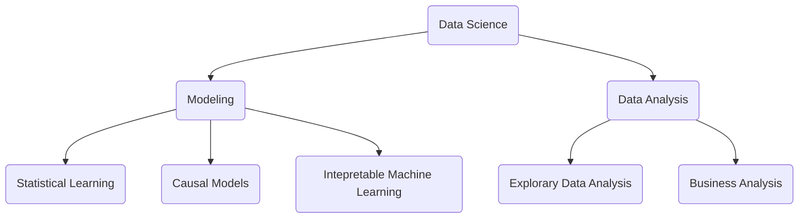

# 数据思维实战 
> By 狗熊会

## Chap3 MOdel

- PCA
  - 用于指标构建和指标体系
- K Means, Hirechical Clustering
  - 用于数据结构发现，数据分类
- Linear Regression
  - F-Test
  - Diagonostic Plots
  

## Questions

1. 指标体系构建方法
2. 读书 体系化 reading list

