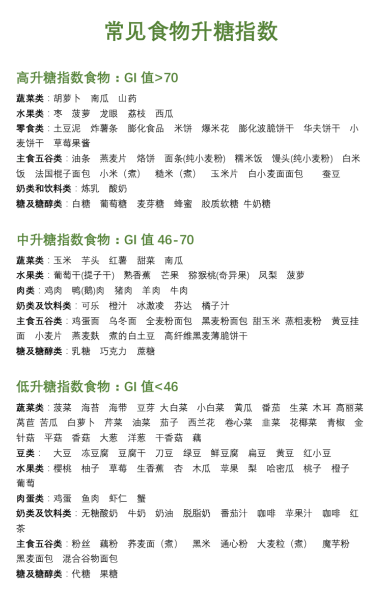

# 科学减肥课-笔记

> Notes of [冯雪-科学减肥16讲](https://www.dedao.cn/course/article?id=5Mr9mzb36pP4JL5LQrXkWqB2EYNegL)
> 
> - 作者是北京阜外医院心脏病科康复中心主任，国家心血管病中心阜外医院心脏康复中心的创始人和负责人，也是罗振宇的减肥教练
> - 课程内容基于2020年近十年国际期刊和医学研究成果，及作者实践经验

- [科学减肥课-笔记](#科学减肥课-笔记)
  - [减肥最重要难点：心理建设和树立目标](#减肥最重要难点心理建设和树立目标)
  - [第一模块：基本原理](#第一模块基本原理)
    - [目标设立](#目标设立)
    - [热量缺口](#热量缺口)
    - [生活方式干预](#生活方式干预)
  - [第二模块，减肥方案](#第二模块减肥方案)
    - [饮食调整](#饮食调整)
    - [高效运动](#高效运动)
    - [心理因素管理](#心理因素管理)
      - [科学管理压力](#科学管理压力)
      - [睡眠管理](#睡眠管理)
    - [同伴行动](#同伴行动)
  - [第三模块，医学干预](#第三模块医学干预)
  - [第四模块，重要议题](#第四模块重要议题)
    - [代餐](#代餐)
    - [青少年减肥](#青少年减肥)
  - [结语和加餐](#结语和加餐)

## 减肥最重要难点：心理建设和树立目标

三个要点

- 第一， 减肥的动机，是为了健康，更是为了提高你的魅力，提高社会竞争力。
- 第二， 减肥的实质，**是改变生活方式**，换一种新的人生。
- 第三， 只有跟一群志同道合的人一起走，才能走得更远，最终减肥成功

## 第一模块：基本原理

### 目标设立

不要以体重作为目标：

- 一旦体重降下去会导致目标丧失，改变已经养成的生活习惯，造成反弹
- 可能为体重目标丢失健康（脱发，无力，腹泻，etc）

科学减肥的“三体目标”

- 体重：以BMI作为参考
- 体脂率：男性体脂率应该在15%-18%之间，女性是20%-25%之间，随年龄增加可以适当放宽
- 体型：正常来说，中国男性的腰围应该小于85cm，腰臀比小于0.9；女性腰围应该小于80cm，腰臀比小于0.8。
  - 内脏脂肪不仅会导致肝脏和胃肠功能受损，还会大大增加糖尿病、冠心病、中风的概率。所以在医学上，健康的腰臀比意味着一定比例的皮下脂肪和很少的内脏脂肪。

### 热量缺口

> 减肥的第一性原理

- 方向一：加大出水量，增加能量消耗。
  - 提升基础代谢：基础代谢和体重成正比，比较难以提升。每增加一公斤肌肉，多消耗13卡的热量，但为了增加一公斤肌肉，至少需要狂练两三个月。
  - 人体消化食物和产热/排汗消耗的热量都比较难干预
  - 睡眠
    - 熬夜又会让人的交感神经过度激活，增加一系列和食欲相关的激素分泌，让人吃得更多
    - 人体分解脂肪的活动，需要在胰岛素浓度最低的时候，也就是晚上进行。换句话说，熬夜不睡，你的身体连脂肪都没法分解。
  - **运动和日常体力活动：唯一可以控制的变量**
- 方向二：减小入水量，减少能量摄入
  - 碳水化合物
    - 第一，适当少吃一些主食，把碳水这个水龙头关小；
    - 第二，多吃蔬菜，补充不可吸收的碳水化合物，也就是纤维素。
  - 脂肪
    - 每克脂肪携带9大卡的能量，是每克糖或蛋白质的2倍多，可以说就是能量炸弹。而且，脂肪的吸收转化率是最高的，可以达到96%。一旦吃进去，只要消耗不掉，基本都会储存起来。
    - 脂肪的消耗还特别难。只有在体内的**糖分被消耗完后，人体才会动用脂肪**。
    - **脂肪的代谢特点是“快进慢出”，最适合能量堆积，是我们减肥路上最正面的敌人。**想要减肥，就要严格控制脂肪的总量摄入，把这个水龙头关到很小很小。
  - 蛋白质
    - 它是维持细胞组织生长和修复最重要的物质，所以我们的身体**一般不会把蛋白质作为能量储存**，而是当成工具来利用。我们长肌肉，需要蛋白质；燃烧脂肪，也得有蛋白质参与才行。
    - 所以即使是在减肥期间，蛋白质这个水龙头不仅不能关掉，而且还要多补充，**每公斤体重每天要补充1-1.5g的蛋白质**。

### 生活方式干预

> 减肥是个系统工程，怎么吃、怎么动、怎么管理压力，都会影响减肥效果。只关注其中某个因素，注定事倍功半。

减肥最有效的方法：生活方式干预（实证唯一有效的方法，其他方法都必须配合生活方式的干预）

1. 饮食干越
2. 运动干预
3. 心理干预

循序渐进

- 健康生活方式的养成并不难，它就始于你的行为。可以渐进式改进
- 健康的生活方式就是在满足你个人社会化属性的前提下，让你生活得更加健康的各种行为的总和。（根据工作等留有一定自由度）
- 戒掉垃圾食品，最开始你可能很不习惯。但一次次克制后，你的味觉神经和肠道菌群都会发生改变。要不了多久，再吃到不健康的食物时，你的身体反而会不适应、不舒服，你也会下意识地选择健康食品。

## 第二模块，减肥方案

### 饮食调整

- 热量缺口
  - 第一步，就是看标签/软件计算热量
  - 第二步，饮食拍照
    - 第一二步在开始减肥前做三次就行。一天选在工作日，一天选在周末，还有一天选在出差、聚会、倒夜班这样的特殊日子。三天正常吃，全部记录下来
  - 第三步，制定每日菜单
    - 做减法，减出500-750kCal能量缺口。可以先减夜宵，再减含糖饮料，然后再减零食，如果加起来还不够设定好的能量缺口，那就要去减正餐
  - 按照500-750大卡的能量缺口，你的体重应该每周会稳定下降0.5-1kg。
- 饮食选择
  - 准则一：食材越少加工越好
    - 正餐最好不要吃深加工的成品食物。选一些新鲜食材，简单烹饪就好。凉拌、蒸、煮，都不错，配上小米辣、酱油或者芥末，淋上一些油，香油、橄榄油、蚝油或者花椒油。
    - 火锅比炒菜好，炒菜比油煎好，油煎比油炸好。是的，火锅是我推荐的。不过锅底别选牛油，调料别用麻酱，它们都有很多脂肪，不利于减肥。
    - **零食都是深加工食品**
    - 坚持新鲜食材21天，味觉就会慢慢恢复
  - 准则二：食物越完整越好。
    - 主要指各种蔬菜、水果和谷物
  - 准则三：脂肪要选择天然不饱和的。
    - 植物、海洋动物，因为不需要储存脂肪来抵御寒冷，所以大自然就把不容易储存的不饱和脂肪酸赐给了它们，而把容易固化、存储的饱和脂肪酸留给了陆地上的动物。
    - 使用植物油，油温不要太高。坚果限量摄入即可
  - 坚决不要吃人造的反式脂肪酸，碰都不能碰
    - 反式脂肪酸有三个不能容忍的恶性结果：第一，黏附在血管上，导致心脑血管疾病发生的概率增加50%；第二，黏附在内脏脂肪上，增加腹部肥胖；第三，无论怎么运动和少吃，依然堆积在体内，很不容易代谢出来。
    - 2018年，世界卫生组织就正式提出，要求全球的食品行业在未来5年消灭反式脂肪酸的添加。但这些反式脂肪酸，还是经常出现在加工食品，比如**蛋糕、面包、饼干、冰淇淋、油炸食物**
  - 准则四：蛋白质越纯越好。
    - 蛋白质很抗饿，建议在减肥的时候要多补充，每天每公斤体重至少要补充1克，如果能补到1.5克就更好了。也就是说，如果你是60公斤，每天的蛋白质要能达到90克就更好。
- 三餐安排
  - 第一，早饭一定要吃。科学发现，不吃早餐就意味着体重增加。
  - 第二，晚饭最迟不要超过9点。
- 搭配
  - 2-1-1的原则：
    - 四格餐盘的一半，放上蔬菜水果，可以堆起来放，大约是半斤各种颜色的蔬菜加4两水果；
    - 剩下一半的空间，1/2留给肉肉，摊开来，一层就好，大约二两瘦肉，可以加一两豆腐；
    - 最后1/2，留给全谷物主食，大约三两左右。**糙米、全麦面、土豆、山药、南瓜、玉米**，都算在这里。
    - 如果刚开始实在吃不饱，可以把肉加一点，主食对等的减一点。2周后，身体适应了，再试着把蔬菜加一点，主食减一点。

特殊饮食方案

- 低能量饮食
  - 虽然短期内效果惊人，但却经不起时间的检验。两年以后，不仅效果荡然无存，甚至大多数试验还出现了反弹的情况。
- “生酮饮食”/"极低碳水饮食"
  - 摄入的碳水化合物特别少，身体没有糖，就只好动员脂肪供给能量。但是，身体又不能直接利用脂肪，就需要把脂肪转化一下，先分解成各种酮体，再让这些酮体为我们供能。
  - 理论上说，生酮饮食是很理想的。你想，脂肪好比是储备粮库，不到万不得已，身体绝不会动用它。要不怎么减肥这么难呢？而生酮饮食恰恰是直接动用脂肪，就好比直接从储备粮库里取粮食，简单直接。而且，顿顿大鱼大肉，能量释放得慢，所以吃起来也不会觉得饿。
  - 实际效果怎么样呢？生酮饮食的头两周，体重下降特别快。虽然随后会稍有反弹，但坚持3个月，你的体重平均也会下降5-6kg。
  - 但，由于酮体的产生，你会口臭；没有蔬菜、水果的纤维素，你会便秘；因为只能利用酮体，连你大脑的反应速度都可能降低。还有，长期不吃碳水，你会对主食充满渴望，就像吸毒的戒断反应一样。3-6个月以后，这个成绩就很快被其他饮食方式追平了。超过3个月的生酮饮食，还可能引起胆固醇的升高。
- 低碳水饮食（碳水比例在10-25%之间）：可以吃大量的蔬菜、一部分含糖少的水果，还能吃一点主食。这是怎么回事呢？之间。
  - 最初6个月，确实比很多其他的营养模式都更有效，大约能减体重的10%，平均8kg以上。6个月内的短期减肥，低碳水饮食确实是一种很好的选择。当然，安全起见，要定期测量血脂水平。而且注意，如果胆固醇已经升高，或者有心脏病的风险，就不要选了。
  - 而且，由于吃的脂肪比较多，也能降低食欲，减少饥饿感。再加上碳水化合物的比例增高，也没有生酮饮食那么大的副作用了。
- 低脂饮食：
  - 30%的脂肪，顶多就是一天一个鸡蛋、一杯牛奶和二两瘦肉，不能再有其他荤腥了。这么艰难，效果怎么样呢？6个月，平均减重4-5kg，连低碳水饮食都比不上。而如果能坚持一年，恭喜你，平均减重8kg，和低碳水饮食持平了。但是，所有参与者都表示，太难坚持了，特别饿。
- 地中海饮食
  - 碳水化合物，包括主食、各种蔬菜、水果占据金字塔的底部，每天吃得最多；
  - 往上一层是各种豆制品、奶制品，也每天都要吃；
  - 再往上一层，量少一些，橄榄油、坚果，也是每天都要吃。
  - 再往上则是鱼肉、虾肉、鸡肉、鸭肉，每周最少吃两到三次；
  - 最上面是甜品、猪肉、牛羊肉，每周可以有一次。
  - 长远来看，却是一种最容易坚持、也最不容易反弹的方式。在涉及40多万人的8个研究中我们发现，如果碳水化合物在总能量中的比例低于40%或者高于70%，对于普通人群来说，死亡风险相对增加20%以上；而50-55%左右的中碳水比例，死亡风险是最低的。全世界最长寿的地区，碳水化合物的比例也都会在50%左右

### 高效运动

运动对减脂的影响

- 单纯的运动对体重的影响有限。不改变其他生活方式，只想通过运动来减肥，基本不可能
- 坚持每周运动200分钟以上的人，6个月平均能减重13.1kg；坚持每周运动150到200分钟的，平均减重8.5kg；而不到150分钟的，6个月下来只减了3.5kg。
  - 运动是形成新生活方式的原动力。运动时，大脑会分泌一种叫作“多巴胺”的奖励物质，让人产生欣快感。久而久之，运动就会像上瘾一样，成为我们的习惯。同时，每次完成运动后，我们对于自己能够改变行为、改变习惯的自信心，也会不断增强。这又会进一步促使我们改变原有的生活习惯，并把改变内化成新的生活方式。
  
运动选择

- 有氧
  - 燃烧脂肪是一个需要氧气参与的过程。而且氧气参与的比例越高，脂肪燃烧越充分。所以减肥，就要选择氧气参与度比较高的运动
- 运动强度
  - 有氧运动最佳心率 =（ 220 - 年龄 - 静息心率 ）X | 40%-60% | + 静息心率
- 运动时长
  - 前30分钟，消耗的60%也是肌肉里储存的糖。也就是说，想要燃烧脂肪，中等强度的有氧训练至少需要30分钟。
- HIIT
  - HIIT的燃脂效率确实很高。很多研究都显示，25分钟的HIIT燃烧的脂肪，中等强度的运动需要41分钟
  - 前科学减肥的权威指南推荐的最稳妥的方法，也不是HIIT，而是每周150分钟以上中等强度的有氧运动。
  - 美国国家体重控制登记中心的数据显示，在所有运动里，快走居然是减肥成功率最高的，比中等强度的慢跑、游泳、HIIT都高。

运动和塑形

- 有氧运动，比如说慢跑、游泳，已经可以很好的减少内脏脂肪。但这还不够，还有皮下脂肪呢。
- 为了减少腰部的皮下脂肪，还要结合一定的力量训练，做一些锻炼腰腹部肌肉的动作。像卷腹、臀桥、杠铃，瘦腰效果都不错。
- 想要改善腰臀比，光瘦腰还不够，还得增大臀围。这就需要锻炼臀大肌、臀中肌这些臀部肌肉，像深蹲、平板支撑、俯卧撑这样的复合性动作就很好。
- 臀部一翘，腿部的视觉效果会拉长5-10cm。

### 心理因素管理

心理因素，就是我们的能量场。心理因素管理得好，我们的内心就非常充盈、充满能量，“管住嘴，迈开腿”那都不是事；要是心理因素管理不好，马上就没了坚持下去的能量

#### 科学管理压力

- 人体内有一种叫作“皮质醇”的激素，研究发现，在响应压力的时候，人体内皮质醇的含量会逐渐提高。
  - 首先，它会影响人体对脂肪的分解，脂肪难以分解，
  - 其次，皮质醇会影响人体的水平衡，让人变得水肿。（体重上升）
- 除了皮质醇之外，也有研究发现，压力还会阻断瘦素对大脑释放信号。“瘦素”，就是增加代谢、让你变瘦的激素。阻断了瘦素，自然就降低了代谢
- 压力最可怕的是，它会改变我们的认知模式。
  - 面对体重秤上纹丝不动，甚至蹭蹭反弹的数字，我们常常会陷入“我没有减肥的希望”“我就是喝水也会胖的人”这样消极的暗示。这种自我暗示，除了削弱我们的自信心之外，还会引起我们对体重的担忧、对减不了肥的后果的担忧，一步步把我们拖进负向情绪的黑洞。

1. 首先，也是最重要的——转变思维。
   1. 我的心得是，为自己制定一个短期的小目标。不用太难，时间周期也不要太长，完成了就给自己一个奖励。比如，三天不喝奶茶，就奖励自己一块黑巧克力；今天运动30分钟，就给自己添一件运动装备……慢慢提升难度。在努力完成小目标的时候，你的关注点就又回到了当下，你就不那么焦虑了。
2. 第二个建议，是自我监测。
   1. 每天记录自己的体重，给饮食拍照，并且备注上自己的想法。你可能会觉得，每天称个体重、拍个照，就能把体重变轻了？还真是这样。因为称体重是个非常好的心理暗示，每一次上秤都会在潜意识里引发你对体重的思考，会不自觉地矫正自己的行为。
   2. 饮食拍照的好处
      1. 一是帮你分辨哪些情况可能导致自己做出不好的饮食选择，比如无聊的时候容易吃零食、难过的时候容易吃饭吃过量。明白了这些，以后就能有针对性的分散和缓解这种情况了。
      2. 第二个好处，则是帮你发现食物的隐患。比如，下午没忍住多吃了个冰淇淋，这本身不好。但晚上回去翻翻这些照片，看到自己吃了不健康的东西，下次就会很小心。
   3. 第三个建议，就是主动舒缓宣泄。
      1. 你可以尝试瑜伽、冥想、正念等一些有呼吸导引的舒缓运动，或者每天打上10-15分钟配合呼吸的太极，不仅帮你缓解压力，还能直接减肥。
      2. 学会宣泄也很有必要。可以和亲人朋友八卦、抱怨一下，也可以加入到减肥运动的社群里，心情不好时叨叨几句。不管是当面沟通还是线上交流，对缓解压力都有帮助。

#### 睡眠管理

1. 第一，睡眠要在6-8小时之间。
   1. 高质量的睡眠本身就能消耗能量。一段6-8小时的睡眠，可以消耗400-500大卡的能量，相当于跑了10公里。
   2. 如果睡眠不足6小时，身体就会分泌刺激食欲的激素，让你口不停，一熬夜就加餐。但是超过8小时也不行，不仅睡眠消耗的能量不会再增加了，反而还会导致白天消耗的能量减少。所以最好控制在6-8小时，不要多也不要少。
2. 第二，要有深度睡眠。
   1. 深度睡眠时，会有两件神奇的事情发生：第一，瘦素的分泌增加，刚才说了，瘦素是减肥的好朋友，会让代谢增加；第二，饥饿感减少，人自然就吃得少了。你看，都对减肥有利。
   2. 怎么保证深度睡眠呢？平时上班，不要压力那么大；白天争取出点汗，别老是坐着不动。总之，身体累一点，大脑松一点。而且要注意，睡前4个小时千万别吃东西，水果也不行。
3. 第三点，是睡眠要规律。
   1. ，睡眠时间要相对固定，不能今天10点睡、明天2点睡、后天通宵白天睡。否则人体夜间的激素分泌就会紊乱，包括指挥人体代谢的、分解脂肪的、合成蛋白质的，全都会乱套。身体感受到压力和潜在的危险，会主动储存更多的能量，以备不时之需。

### 同伴行动

> 如果你的朋友变胖了，你体重增加的概率是45%；如果你朋友的朋友变胖了，你变胖的概率是20%；如果你朋友的朋友的朋友变胖了，你变胖的概率还有10%。这就是著名的“三度影响力”。

找到环境中有利的因素，把它们组合在一起，建立起对减肥有利的社交小圈子。最简单的方法就是，在对自己影响最大的一度圈层树立减肥标杆。选择的标准很简单，要么是和你一样有迫切减肥需求的，要么是生活健康、体重保持得相当好的。只要满足这两个条件中的一个，就都行。

1. 首先要选择的，当然是离我们最近、最亲密的家人。
   1. 家庭对人的影响是最大的，尤其是在生活方式的养成上。比如前面说的饮食控制，这件事的成功，不仅取决于你在餐盘里如何选择食物，更取决于你家买菜做饭的人，是怎样在菜市场挑拣食材、讨价还价，如何在厨房里烹饪，甚至怎样在饭桌上唠叨你。
   2. 所以，这个标杆的选择非常重要。最合适，就是你的另一半；当然，生活在一起的父母也可以。如果他们不胖，恭喜你，顺利找到自己的第一个标杆；如果他们也胖，让他们也听听这一讲，和你一起减肥。证据显示，有家庭成员参与的减肥，可以多减3公斤。
2. 其次要选择的，是我们关系亲密的朋友。
   1. 这个朋友，可以是你的同屋、大学的好基友，也可以是你最好的同事、一起逛街的闺蜜、约饭的饭搭子。从这些人中找到两个以上，当自己的标杆。
   2. 你们可以一起约饭，但一定都不介意把饭吃成减肥餐，还会在席间交流减肥心得；可以一起去健身房，有个人督促，总好过自己犹豫不决；可以相约早上上班在哪里碰面，然后一起快走到公司；也可以约定好，在同事拼单奶茶时一起拒绝。
3. 最后，可以继续拓展，主动寻找正在减肥的圈子。
   1. 找到减肥的社交圈子，十年前还不是很容易。那时候，我们只能依靠朋友、家人这些减肥小团体，或者是减肥俱乐部、训练营这种传统的线下模式。而今天，微信、微博、QQ这些社交软件的兴起，让我们寻找志同道合的减肥社群，比以往任何时候都更加容易。而我们在其中获得的，不仅仅是更加专业的减肥建议，也不仅仅是行为上的互相敦促，更有来自精神方面的支持和肯定。
   2. 如果你的一度圈层，也就是家人和朋友的减肥陪伴不够充分、不够坚定，你就可以考虑选择网络社群。它可以是专业减肥的App，也可以是你微信上三五好友的减肥群，总之，把它们纳入你的减肥社交圈里。

利用社交圈的方式

1. 一是浸染，足够充分的浸染。
   1. 凡是和减肥有关的事情，比如说吃、动、睡、压力宣泄等，就尽可能多的和你的圈层标杆泡在一起。放下原有的生活观念，去感受，去接纳。在这个过程中，你几乎不用做任何事情，所有的改变都是下意识的。
2. 第二就是，主动输出。
   1. 输出什么呢？输出个人的分享。分享你减肥的心得、减肥的进展、减肥的失败，甚至昨天达标的运动、吃的饮食、搞不清楚的问题……凡是和减肥相关的，都可以在圈子里和人分享。

## 第三模块，医学干预

减肥药

- 目前最强效的减肥药效果也远远比不上生活方式管理
- BMI大于等于27，并且至少合并了一种肥胖并发的疾病，比如2型糖尿病、高血压、高血脂等；或者虽然没有合并什么疾病，但BMI大于等于30，那在尝试生活方式治疗无效后，可以考虑药物治疗。
- 所有的药物减肥，包括奥利司他，都是长期治疗方案。
- 在服用减肥药的同时，必须执行饮食和运动相结合的生活方式改变。即便减肥成功后，也要一直坚持。

手术

- 抽脂术几乎完全是为了局部塑型，是为了美丽而发明的，它既不能减肥，也不能让人收获健康。所以在医学上，抽脂术属于整形外科，也就是医疗美容的范畴
  - 首先，抽脂术抽掉的只是皮下脂肪，并不能减少内脏上的脂肪。前面说过，皮下脂肪还是很有用的，真正危害健康的是内脏上的脂肪。只有**减掉内脏上的脂肪**，才算真正成功减肥。这一点，抽脂术做不到。
  - 其次，如果不改变生活方式，抽掉的脂肪大概只需要三个月，就会重新长回来。而且更可能成为内脏脂肪
- 真正的减肥手术真的就是通过不同的方法把胃变小。
  - 胃旁路手术，切胃，放入气球等
  - 傻瓜式”的减肥手术，居然荣登2013年全美医学创新的榜首，并在2015年成为十年内医学创新的第三位。减肥手术后，医生对患者进行了10年的跟踪观察，发现他们中90%的糖尿病都神奇地消失了。真的就是“治愈”了，医学上叫作“疾病的临床缓解”
  - 胃的容积变小，食物从胃到小肠的时间变短，这就人为地造成了消化吸收不良，使我们吸收的热量变少
  - 人体内的化学激素会发生一系列神奇的变化
    - 一方面，一种叫作“胆汁酸”的激素会增加。它会影响我们的肠道菌群，而肠道菌群的改变，又会改变我们的味觉系统，让我们不那么喜欢糖和脂肪，反而更接受蔬菜、水果。
    - 另一方面，由肠道分泌的一种叫作“胰高血糖样肽”的激素会增多。它能减缓我们胃的排空速度，减少饥饿感，还会促进胰岛素的分泌，改善胰岛β细胞的敏感性，这可不就能缓解糖尿病吗
  - 不管是胃肠道的菌群，还是上面提到的激素，最终都会通过神经将信号传递给大脑，降低人的食欲，从而减少能量摄入，最终达到减肥降糖的效果。

轻断食

- 医学证实，这绝对是一个被大大低估了的减肥手段。
- 医学上的轻断食，是一种医学饮食治疗，它不仅对断食的频率、断食的时间有要求，还对断食那天的能量摄入有严格的规定。只有严格按照这套规定来，才算真正的轻断食。
- 数十篇顶级医学期刊的最新研究成果，把轻断食的好处分成了三类——帮助减肥、治疗疾病和延年益寿。
  - 除了减肥之外，轻断食还可以治疗疾病。研究发现，轻断食既可以控制血糖，逆转糖尿病前期，又能降低血压，还能减少哮喘、关节炎的急性发作。而且，除了身体层面的变化，轻断食居然还能提高记忆力，改善认知功能，对预防和治疗阿尔茨海默病、帕金森都有一定的作用。至于延长寿命，目前还没有人体的实验证据，但已经获得了动物实验的确证。
  - 断食8-12个小时后，饥饿会启动第一波代谢改变。这时候，身体里的糖已经消耗完了。没有了糖作为第一手能源，身体只能分解脂肪，把分解出的酮体作为能源物质；紧接着，这些酮体会启动神经内分泌传导信号，告诉我们的细胞核，“身体没有能量了，快想办法”；细胞核收到信号后，会启动一系列的自我保护效应，包括降低蛋白质合成、提高胰岛素敏感性、增加坏细胞的自我清除等等。
  - 在轻断食期间，为了适应环境改变的压力，我们身体的每一个细胞都会进行系统性修复，把自己的损伤修复好；而在轻断食结束、进入恢复期之后，正常的进食、良好的睡眠，又会把身体带入一个细胞生长、功能性组织重建的全新状态。这样往返交替，最终就达到了修复和新生的效果
  - 如果没有饥饿，我们的细胞都吃得饱饱的，它们在做什么呢？“温饱而思淫欲”，对，它们在忙着繁殖。毕竟对于生命来说，繁殖和传承永远是最重要的任务。但是，如果总是忙着繁殖，细胞就会忽略对自身的修复。损伤得不到修复，慢慢积累得越来越多，人也就不健康了。

轻断食实践

- 第一步，就是判断吃什么。
  - 需要把摄入的热量控制在一个很低的范围内，一般是500-700大卡。男性可以适当多一点，女性可以少一点。摄入一定的热量，不仅能帮助人体修复损伤的细胞，还能让你在第二天控制住暴饮暴食的冲动。
  - 首先，选择升糖指数低的食物，让自己饿得慢一点。
    - 
  - 其次，保证每公斤体重1g以上的蛋白质摄入。
  - 最后，保证维生素和纤维素的补充。
- 第二个问题——什么时候吃？
  - 这500-700大卡的食物，要在6-8小时之内吃完。只有这样，才能保证我们的细胞充分感受饥饿，启动修复和新生的程序。至于这8小时，是从早上8点到下午4点，还是中午11点到晚上7点，你都可以自由选择
  - 两种方案
    - 一种是轮替方案，也就是轮着来，今天轻断食，明天正常饮食，每周轻断食不超过3天。
    - 另一种是“5+2”方案，一周当中任意两天轻断食，其余五天正常。可以是连续断两天，也可以是间隔断两天，都行，都有效
- 每天摄入能量250大卡以下、每周连续断食两天以上，又或者每周断食超过4天等，要么是不能减肥，要么是有很大风险，又或者是还没有医学上的研究证据。
- 循序渐进，以六个月方案为例
  - 第一个月，每周只有1天轻断食，这一天可以吃到1000大卡食物，从早8点到晚6点，10个小时内吃完。这个月不难吧？
  - 第二个月，我们每周增加一天，2天轻断食，每天还是1000大卡，进食时间减少到8个小时。其他日子里正常吃。
  - 第三个月，还是每周两天，每天减少到750大卡，进食时间缩减到6个小时。
  - 第四个月，每周两天，每天再少吃一点，减少到500大卡，进食时间还是6个小时

医学减肥

> 由WHO、美国、欧洲、中国最权威的医学组织制定的肥胖管理指南。虽然顶级减肥中心的设施略有不同，但大都奉行同一套流程。

1. 判断减肥需要
   1. BMI超过30 必须减肥
2. 生活方式评估
   1. 了解生活习惯，减肥历史，失败原因等
3. 制定计划
   1. 如果BMI小于等于35，最好**6个月内减少现在体重的5%-10%**；如果BMI超过35，可以6个月减少体重的10%-15%。6个月后，再设定下一轮计划。
   2. 这么设定有三个好处：第一，难度适中，努力能达到；第二，健康，即使6个月后还没达到“三体目标”，也大大降低了患各种疾病的风险；第三，不容易反弹
   3. 反弹循环对身体的伤害更大。与其瘦了再胖，还不如一直胖着。
4. 确定方案和展开治疗
   1. 包括饮食、运动和心理三个方面。
   2. 饮食包括代餐，基础代谢评估，营养方案等
   3. 运动包括最佳心率测定，运动计划等
   4. 心理包括心理和正念治疗
5. 如果目标不能完成
   1. 更加严格的行为干预，比如合并代餐、封闭式的训练营、特殊的医学饮食治疗等。

## 第四模块，重要议题

### 代餐

- 全世界关于代餐的研究有好几千个，结论非常一致——**代餐真的能减肥**，而且效果还很不错。
  - LOOK AHAED的代餐研究非常有名。研究者对5145名患者进行了长达十年的研究后发现，让肥胖的人坚持吃1年代餐，1年后，体重比不吃代餐的平均减少7.7kg；2年后，依然能保持5.2kg的差距；而到4年后，还有3.4kg的减肥效果。你看，长期有效不反弹。
  - 代餐还可以塑形，也就是降低体脂率、减小腰围。
- 不仅没有严重的副作用，甚至在维生素和矿物质方面，代餐还更健康。什么意思呢？很多试验都发现，相比较代餐减肥，让人们自己选择减肥食物的，一年下来会有9种矿物质和维生素出现缺乏。
  
代餐，医学上有个简单的定义，它是为了减肥或者保持减肥后的效果而开发的，要代替一天中一顿或者两顿饭的食物产品。（如果你一天三顿都吃代餐，那它就超出了代餐的范围，变成一种医疗级产品了，专业名字叫“全配方”代餐RCD。）

代餐的标准

1. 首先，一个好的减肥代餐，必须含有一定的能量。
   1. 150-350大卡，否则连身体最基本的代谢都不能保证，健康就更别谈了。
   2. 很多把纯酵素或者一块15g的小饼干当代餐的，又或者是宣称能提供一小时饱腹感的代餐棒，都不要选。因为它们的能量不达标，吃完很快就饿了，很容易让人再去吃其他东西，结果反而摄入更多能量。
2. 除了含有能量之外，代餐里的能量物质还得按一定的比例搭配。
   1. 具体来说，碳水化合物，要减到40%以内。前面说过，碳水化合物是“快进快出”，吃太多很容易饿。蛋白质，要占到20%-30%。高比例的蛋白质，不仅扛饿，也能在减重的同时，让肌肉的损失量最小。而脂肪，要控制在30%以内。
3. 在各种维生素和微量元素上，不同的代餐差别可就大了。
   1. 维生素ABCDEK、钙、铁、锌、纤维素都有。研究表明，吃代餐的人容易缺乏维生素B族，从而出现脱发、口腔黏膜溃疡等问题。所以注意一下配料表，**含有维生素B1、B2、B6、烟酸、泛酸这些的，就是更好的选择**

效果

- 如果只是代餐，1年后比饮食限制的人也就多减重1.44kg；但如果代餐加上营养管理，可以多减3.87kg；如果再加上运动管理，差距可以达到6.13kg。而且，如果不是和饮食限制的人相比，而是和普通想减肥的人比较，这个效果能达到7.7kg。

### 青少年减肥

>[WHO BMI with age](https://www.who.int/toolkits/child-growth-standards/standards/body-mass-index-for-age-bmi-for-age)

孩子太胖的后果

- 第一，就是不长个。
  - 脂肪细胞的过度增加会引发内分泌失调，从而导致孩子过早发育，骨骺线提早闭合。骨骺线闭合后，孩子就没法长个了。所以，想让孩子长高，就别让他长胖
- 第二，就是一胖一辈子。
  - 肥胖的儿童在成年后，有42%-63%的概率会继续肥胖；肥胖的青少年在成年后，继续肥胖的概率更是高达70%-80%。请注意，这种小时候体重过高对未来肥胖的预测，发生在胎儿期、婴儿期、儿童期和青少年时期。也就是说，贯穿一个孩子从娘胎到18岁的所有人生阶段。说得更直白一点**，只要18岁之前胖，后半辈子大概率也会继续胖。**根本没有什么所谓的“青春肥”“婴儿肥”，小时候胖不是很多人以为的长身体，它多半会变成真的胖。
  - 在我们漫长的一生中，脂肪细胞的生长发育期只有一个，就是在成年之前。从婴幼儿时期，脂肪细胞就开始大量繁殖；到青春期的时候，数量达到顶峰。从此以后，脂肪细胞的数量就不会再变了。是的，成年后脂肪细胞的数量就固定了，不会变多也不会变少。不管是胖了还是瘦了，变化的都不是脂肪细胞的数量，而是它们的大小。所以可想而知，如果一个孩子小时候营养过剩，脂肪细胞的数量比别人多，那他长大后当然就比其他人更容易胖。
  - 除了有固定的生长期之外，脂肪细胞居然还有“记忆”。如果一个人在成年之前，也就是在脂肪细胞生长发育的阶段，受到了营养刺激，比如长时间的饥饿、经常吃得特别撑、短时间吃进去很多能量特别高的食物等，不管是营养不良还是营养过剩，接受到任何一种刺激后，身体都会向脂肪细胞发出过度生长的信号。脂肪细胞会长期“记住”这个信号，在此后的一辈子里，都更倾向于囤积能量、拼命生长。这样的人，可不就是**易胖体质，比别人更容易胖**嘛。
- 肥胖的第三个影响，也是最隐蔽的危害，则是影响孩子的心理健康。
  - 肥胖的孩子更容易被戏弄，被欺负，让孩子显得不合群。而父母往往不会把孩子的体重和他们的孤僻行为联系在一起，总是一味地抱怨孩子不够主动，不和人交往，这又会加剧孩子的心理损伤。
  - 心理损伤的孩子，只能从喜欢的食物中获得慰藉，体重又进一步恶化，进入身体和心理受伤的恶性循环

如何避免孩子肥胖

|  十大要点 &nbsp; &nbsp; &nbsp; &nbsp; |  &nbsp; &nbsp; &nbsp; &nbsp; &nbsp; &nbsp; |
|---|---|
| 1. 统一战线，确保家里每个人都知道肥胖对孩子的危害。  |  |
| 2. 第二招，管好自己的体重再生娃。  | 研究显示，父母双方都胖的，孩子也胖的风险是父母双方体重都正常的孩子的4倍；如果父亲一方胖，就是3.1倍；仅有母亲一方胖的，是2.7倍。怀孕前，你戒烟戒酒，封山育林，现在再加一条——把体重减到正常，**尤其是当爸爸的。**  |
| 3. 第三招，新生儿体重不能走两端。  | 新生儿出生时的体重，正常范围是2.5到4公斤。医学发现，不管是出生时体重是高于4公斤，还是低于2.5公斤，孩子成年后变胖，以及患上肥胖相关疾病的概率都会明显增加。   |
| 4. 第四招，母乳喂养，至少到孩子1周岁。 | 从20世纪90年代开始，WHO就一直建议母乳喂养。因为相比奶粉喂养来说，母乳喂养时，婴儿摄入的能量比较低，所以体重更轻，成长速度更合理。即便有时候孩子吃得特别多，也不用担心，母乳是有自己的调节机制的。孩子吃得多，母乳的产量大，它的能量密度就会下降，算下来，孩子吃进去的能量相差不多。大多数观察性研究都发现，母乳喂养的学龄期儿童肥胖风险会降低15%-20%。而且，母乳喂养还与成年后慢性病的风险降低相关，也就是说更健康。  |
| 5. 第五招，果汁饮料每天要有封顶。  | 大多数家长都认为，果汁的营养价值就等于水果本身，甚至更容易被吸收。不就是水果榨汁吗？还是纯天然无添加的，有什么不好呢？但事实上，果汁恰恰是孩子肥胖的重灾区。杯240毫升的苹果汁和一个苹果的分量差不多，但需要3到4个苹果才能榨成。孩子喝这么一杯果汁，不到2分钟就下肚了，但让他吃三四个大苹果，他吃不完吧？吃一个小肚子就饱饱的了。而且，每个苹果都含有大约3.75克的膳食纤维，能促进肠子蠕动，连便秘问题都解决了。根据美国儿科学会推荐，1-3岁的孩子每天最多喝120毫升果汁，也就是半杯；4-6岁每天120-180毫升；6岁后可以达到每天240毫升，也就是一杯。  |
| 6. 第六招，三餐让孩子自己吃，没吃饱也不给零食。 |  自己吃饭有助于培养孩子的专注力，让他更好地感知自己吃饱了没有，而不是慌着去玩，一不小心就吃多了。注意，千万不能养成一会吃一点、一会吃一点这种“牛羊放牧式”的进食习惯。如果孩子忙着玩，正餐没吃饱，也不要给他零食。他饿了，下一顿自然会好好吃。 |
| 7. 第七招，三分饥与寒，少穿一件衣服。 | 人体其实有两个类型的脂肪组织——白色脂肪组织和棕色脂肪组织。其中，棕色脂肪组织与BMI呈负相关。也就是说，棕色脂肪组织越多，体重就越低。而适度的寒冷，会促进棕色脂肪细胞的增长。  |
| 8. 第八招，让孩子和你一起做饭。  | 从准备食材到烹饪再到饭后整理，在参与的过程中，孩子能切身体会到——什么样的食材新鲜有营养？什么菜最真实的味道是什么样？什么菜要如何烧才会既好吃，又不让营养流失……潜移默化中，就会影响孩子的口味和对食物的选择。而这些从小建立起来的对饮食和生活方式的认知，会影响孩子一生。  |
| 9. 第九招，限制孩子玩电子产品，每天不超过1小时。 |  孩子天性是好动的，只要限制他玩手机、平板的时间，他的运动时间就会自然而然的大大提高。对青少年来说，每天20分钟到一个小时中度强度的有氧运动，不仅能预防肥胖，也能帮小胖墩们减肥。 |
| 10. 第十招，全家11点前熄灯，让孩子睡足10个小时。  | 1-2岁的小宝贝，每天要睡13-14小时；2-4岁，要睡够12个小时；4-7岁，大概是11小时；到了学龄期和青春期，也就是7-15岁，每天要睡足8-11小时。《庄子·天道》说：“语之所贵者意也，意有所随。意之所随者，不可以言传也。”说的就是，言传不如身教。所以，以身作则，和孩子一起养成规律睡眠的好习惯。  |

## 结语和加餐

胖子”这个词在今天已经被污名化了，常常和“贪吃”“不自律”“没有自我管理能力”等负面印象联系在一起。那些肥胖的人，一方面要同自己的身体抗争，应对肥胖带来的一系列不适，甚至是疾病；另一方面，又要应对来自周围人的压力，忍受“不自律”这样的负面非议。很少有人思考过，肥胖真的完全是个人问题吗？真的就是因为个人“不自律”“不会管理”吗？只要稍微分析一下你就会明白，事情远没有那么简单。

- 首先，从生物演化的角度来说，肥胖可能是根植于人类基因之中的。
- 其次，商业社会在满足人们需求的同时，也在客观上加剧了肥胖问题。
  - 千百万年的进化结果使我们喜欢高油高糖的食物；商家为了赚钱就会迎合人们的口味，生产这种超级加工食品；而长期接触这些不健康的食品，又会改变人们的饮食偏好，让人们更喜欢这种味道；这就又刺激商家生产更多……如此循环，把越来越多的人卷进了肥胖的泥潭。
- 2020年的3月初，一个由36位国际专家组成的多学科小组在全球顶级的科学杂志《NATURE》上，发表了消除肥胖歧视的科学声明。他们认为，只有消除偏见，产生新的公共认知，才可能缓解全球肥胖的问题。

对于个人来说

- 我们每多买一份减肥餐，每少买一瓶含糖饮料，每少吃一份炸鸡薯条……，都相当于在跷跷板的一边加上一块石子，都会刺激商家提供更多的健康食品。久而久之，当我们都行动起来，随着加入的石子越来越多，跷跷板的位置就会反转。
- 生活方式虽然很小，却决定了你是什么样的人，以及你能走多远。
- 整个社会、整个公共卫生系统也能发挥更大的作用。目前，社会已经意识到了肥胖的危害，把肥胖定义为一种疾病了
  - 首先是政府，各国政府可以通过制定国家政策对抗肥胖。
    - 中国也和很多国家一样，都采取了一种非常有效的手段——食品标签。你会发现，从2013年开始，我们国家就强制要求所有的成品包装食物标明营养物质比例和配料成分。这在很大程度上，也能帮我们正确地选择食物。
    - 各国政府还有更多可以考虑的政策。比如，对不健康的食物征税、禁止向儿童售卖高糖饮料、组织学校为学生提供更多营养课程……
  - 学校在孩子的成长中扮演了重要的角色，它也能做得更多。
    - 《助推》这本书里就有一个有趣的试验：学校只是把食堂橱窗里甜点的位置，从与视线平齐的高度，换到弯腰才能拿到的地方，就会大大减少学生吃甜点的几率。这就是一个简单而有效的改变。
    - 学校里更多的改变肯定会在不远的将来发生。未来，学校应该开发更多与食物和健康相关的课程，教孩子阅读食品标签，正确挑选食品；每天至少1小时的运动类课程，保证孩子达到目标心率的运动不少于30分钟；对于超重的孩子，还要提供和家庭一起的减重管理课程，以及指导手册。这些应该都在路上。
  - 当然，专业的减肥机构也是少不了的。
    - 有专业机构参与的减肥，效果更好，更安全，体重反弹的比例也大幅度下降。在这些减肥机构里，商业的，也就是营利性的机构占90%，公立医院不到10%。
    - 目前中国，既不缺大批的减肥机构，也不缺懂减肥的医学专业人才，我们缺少的恰恰是中间的桥梁。没法让医学的专业技术走出医院，为更多的减肥机构赋能，从而服务更多的人。

减肥没有黄道吉日。今天，就是开始减肥的最好的日子
