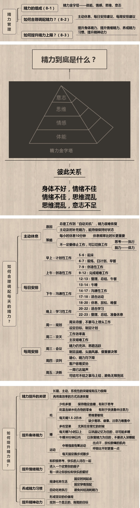

# Time Management

Time Period | Clock | Activities
---------|----------|---------
 Morning | 6:00-7:00 | Warm-up, prepare, planning
 Morning | 7:00 - 10:00 | [Creative] Coding Tasks/Tests/Writing
 Morning | 10:00 - 13:00 | [Output] Coding Tasks/Reports, etc
 Noon | 13:00 - 14:00 | [Break]
 Afternoon | 14:00-18:00 | [Commnunication] Meetings, Plan Writing, Report Writing
 Afternoon | 18:00-19:30 | [Break] Exercise / Break, Reading
 Evenining | 19:30 - 22:00 | [Learning] Learning/Make Notes/Reading

## Reference

